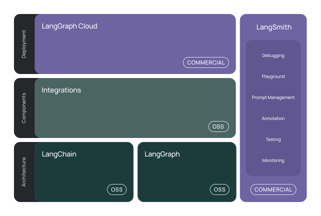
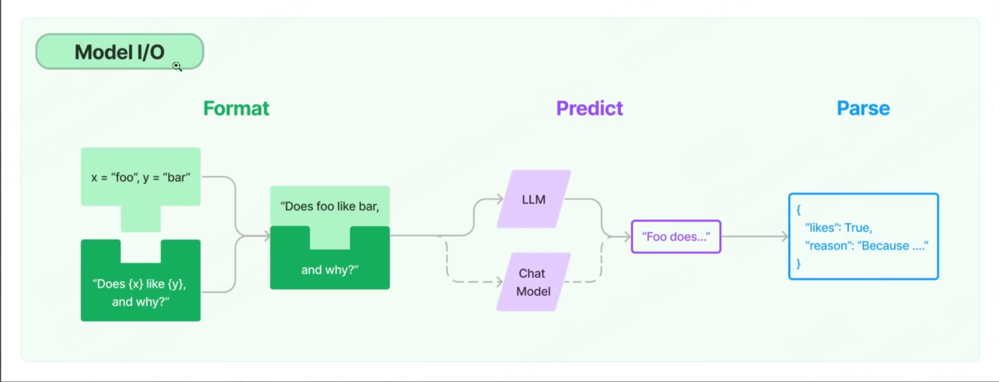

Date 2025.5.23

# LangChain

## 基本概念

LangChain 是一个用于开发基于大语言模型（LLM）用于构建端到端语言模型应用的框架。它为开发者提供了丰富的工具和模块，帮助快速构建、组合和管理与大模型相关的各类应用。

[LangChain 官网（English）](https://www.langchain.com/)｜ [LangChain 中文文档（社区版）](https://www.langchain.com.cn/)

LangChain 的核心思想是将大模型与外部数据、工具、工作流等进行结合，从而实现更强大、更实用的智能应用。

LangChain简化了LLM应用程序生命周期的每个阶段
- 开发： 使用LangChain的开源构建模块、组件和第三方集成构建您的应用程序，使用**langGraph**构建具有一流流式处理和人机协作的有状态代理
- 生产化：使用**langSmith**检查、监控和评估您的链路，以便持续优化和部署
- 部署：将LangGraph/LangServe应用程序转变为生产就绪的API和助手，使用LangGraph Could

 

具体有以下组件库组成：
- langchain-core：基础抽象和LangChain表达式（LCEL），提供核心接口定义和基础功能实现
- langchain-community：第三方集成，包含各种社区贡献的集成方案和工具
- 合作伙伴库：官方维护的轻量级集成库，如Langchain-openai、langchain-anthropic等，仅依赖于langchain-core
- langchain：完整的应用程序框架，包含链、代理和检索策略等高级功能
- LangGraph：基于图的工作流引擎，支持构建复杂的有状态应用，可与LangChain无缝集成
- LangServe：API部署工具，将LangChain应用转换为REST API服务
- langSmith：开发者平台，提供调试、测试、评估和监控等全生命周期管理功能

## 主要用途

1. **对话机器人**：快速搭建基于大模型的智能对话系统。
2. **智能问答**：结合外部知识库，实现基于文档、数据库等的问答系统。
3. **自动化工作流**：通过链式结构，将多个模型调用、工具操作、数据处理等步骤串联起来，实现复杂的自动化任务。
4. **智能代理（Agent）**：让大模型具备自主决策和调用外部工具的能力，完成更复杂的任务。
5. **多模态应用**：支持文本、图片等多种数据类型的处理和集成。

LangChain 适合需要将大模型能力与实际业务场景深度结合的开发者和企业。


## LangChain核心
**核心组件：**
- 模型(Models)：提供与各大语言模型的统一接口，包括模型调用、参数配置和输出处理，支持多种模型格式和输出解析方式
- 提示模版(Prompts)：提供灵活的提示词模板系统，支持变量注入、条件判断和格式化，帮助开发者更好地控制模型输出
- 数据检索(Indexes)：实现高效的文档索引和检索系统，支持向量化存储、相似度搜索和文档分块，便于构建本地知识库
- 记忆(Memory)：提供短期和长期记忆管理机制，支持对话历史记录、上下文管理和状态持久化，使对话系统更智能
- 链(Chains)：将多个组件组合成可复用的工作流，支持条件分支、并行处理和错误处理，实现复杂的业务逻辑
- 代理(Agent)：实现智能决策和执行系统，能够自主选择工具、规划步骤、执行任务，并处理异常情况

**核心模块及功能：**

1. **模型I/O封装**
   - LLMs：大语言模型，提供基础的文本生成能力，支持单次文本生成和补全
   - ChatModels：基于LLMs的对话模型，专门用于处理对话场景，支持多轮对话
   - Message：聊天模型的消息内容，消息类型包括：
     - HumanMessage：用户输入的消息
     - AIMessage：AI助手的回复消息
     - SystemMessage：系统设置和指令消息
     - FunctionMessage：函数调用的消息
     - ToolMessage：工具执行的消息
     - ChatMessage：通用聊天消息，可以指定角色
     - GenericMessage：通用消息类型，支持自定义内容
     - BaseMessage：所有消息类型的基类
   - Prompt：提示模板，用于构建结构化的提示信息，提高模型输出质量
   - OutputParser：输出解析器，用于将模型的原始输出转换为结构化数据，支持多种格式的解析和验证
   - Callbacks：回调函数，用于监控和记录模型调用过程，支持日志记录、性能监控等
   - Streaming：流式输出支持，实现实时响应和渐进式生成
   - Model Configuration：模型配置管理，包括温度、最大长度等参数设置
   - Retry Logic：重试机制，处理模型调用失败的情况
   - Rate Limiting：速率限制，控制API调用频率
   - Caching：缓存机制，优化重复请求的响应速度

2. **Retrieval 数据连接与向量检索封装**
   - Retriever：向量检索器，用于从向量数据库中检索相似内容
   - Document Loader：文档加载器，支持加载各种格式的文件（PDF、Word、TXT等）
   - Embedding Model：嵌入模型，将文本转换为向量表示，用于相似度计算
   - Verctor Store：向量存储，用于存储和管理文本的向量表示
   - Text Splitting：文本分割，将长文本切分成适合处理的片段

3. **Agents 智能代理封装**
   - tools：工具函数，用于调用外部功能，如 API、数据库、文件操作等，Agents 可以通过这些工具实现特定功能，
   - toolkits：工具集，针对特定软件或服务的一组工具集合，如数据库操作、邮件处理等，便于扩展和复用，
   - reasoning engine：推理引擎，使用大语言模型作为推理引擎，根据当前情境自动规划和决策执行步骤，
   - traceability：可追溯性，所有操作步骤均可追溯，便于调试和理解代理行为，
   - customizability：自定义能力，支持自定义代理类型、工具和行为，灵活适配不同场景，
   - interactivity：交互性，可以与用户实时交互，根据输入动态调整行为，
   - memory：记忆能力，具备记忆历史交互和状态的能力，提升连续性和智能性，
   - agent executor：代理执行器，负责协调代理的决策和实际工具的执行，实现自动化流程，
   - agent types：代理类型，支持多种代理实现方式，如 ReAct、Plan-and-Execute 等，适配不同任务需求，

4. **Chains 链式处理封装**
   - Simple Chain：基础链，用于简单的顺序处理
   - Sequential Chain：顺序链，处理多个步骤的串行执行
   - Router Chain：路由链，根据条件选择不同的处理路径
   - Transform Chain：转换链，用于数据转换和处理
   - Custom Chain：自定义链，支持开发者创建特定的处理流程

## 模型I/O

LangChain 将模型的使用过程拆分为三个核心步骤：提示词构建(Format)、模型推理(Predict)和输出解析(Parse)。这种模块化的设计使得模型调用更加灵活和可控。

<div align="center">

</div>

### 1. 提示词构建 (Format)
- 提示模版：支持变量注入和格式化
- 消息格式化：支持多种消息类型（Human、AI、System等）
- 实现方式：
  - 使用 `PromptTemplate` 类创建基础提示模板
  - 通过 `ChatPromptTemplate` 处理对话格式
  - 使用 `FewShotPromptTemplate` 处理示例学习
- 代码示例：
  ```python
  # 创建对话提示模板
  prompt = ChatPromptTemplate.from_messages([
      ("system", "你是一个助手"),
      ("human", "{input}")
  ])
  ```

### 2. 模型推理 (Predict)
- 统一的模型调用接口
- 支持同步/异步调用
- 内置流式输出和错误处理
- 实现方式：
  - 通过 `LLM` 和 `ChatModel` 类提供统一接口
  - 支持 `OpenAI`、`Anthropic` 等具体模型实现
  - 提供错误处理和重试机制
- 代码示例：
  ```python
  # 初始化模型并调用
  model = ChatOpenAI()
  response = model.invoke(prompt)
  ```

### 3. 输出解析 (Parse)
- 结构化数据解析
- 支持多种输出格式（JSON/YAML等）
- 错误处理和验证
- 实现方式：
  - 使用 `OutputParser` 类进行输出解析
  - 支持 `StrOutputParser`、`JSONOutputParser` 等具体解析器
  - 提供输出验证和错误处理机制
- 代码示例：
  ```python
  # 解析模型输出
  parser = JSONOutputParser()
  result = parser.parse(response)
  ```

这种模块化设计让开发者可以灵活组合组件，轻松实现复杂的模型调用流程。


## Langchain 常用Chain

**1. create_stuff_documents_chain 文档链：**

将获取文档列表并将他们全部格式化为指定结构，常用于RAG（检索增强生成）场景，将检索到的文档统一整理后输入给大模型。
```python
from langchain.chains.combine_documents import create_stuff_documents_chain
from langchain_core.prompts import ChatPromptTemplate
from langchain_openai import ChatOpenAI

# 假设已加载文档列表 docs
prompt = ChatPromptTemplate.from_messages([
    ("system", "你是一个文档总结助手"),
    ("human", "请总结以下文档内容：{context}")
])
llm = ChatOpenAI()
doc_chain = create_stuff_documents_chain(llm, prompt)
result = doc_chain.invoke(docs)
print(result)
```

**2. create_sql_query_chain 文档链：**

用于将自然语言问题自动转换为SQL查询语句，常用于数据库问答、数据分析等场景。
```python
from langchain.chains import create_sql_query_chain
# 假设 llm 是已初始化的大模型对象，db 是数据库连接对象
sql_chain = create_sql_query_chain(llm, db)
result = sql_chain.invoke({"question": "查询2023年销售额最高的产品"})
print(result["sql_query"])
print(result["result"])
```

> 你可以根据实际场景选择合适的链类型，并灵活组合实现复杂的业务逻辑。


## LangChain实现RAG
**1. Document loaders 文档加载模块：**
LancChain封装了一系列类型的文档加载模块，如：PDF、CSV、HTML、JSON、Markdowm、File等.
e.g: PDF


## Demo
[06-1.LangChain_chatModels](./Demo/06-1.LangChain_chatModels.py)

[06-2.LangChain_outputParsers](./Demo/06-2.LangChain_outputParsers.py)

[06-3.LangChain_faiss](./Demo/06-3.LangChain_faiss.py)

[06-4.LangChain_rag](./Demo/06-4.LangChain_rag.py)

[06-5.LangChain_agent](./Demo/06-5.LangChain_agent.py)

[06-6.LangChain_template](./Demo/06-6.LangChain_template.py)

[06-7.LangChain_embedding](./Demo/06-7.LangChain_embedding.py)

[06-8.LangChain_parser](./Demo/06-8.LangChain_parser.py)

[06-9.LangChain_openaiFunc](./Demo/06-9.LangChain_openaiFunc.py)

[06-10.LangChain_chainDemo](./Demo/06-10.LangChain_chainDemo.py)