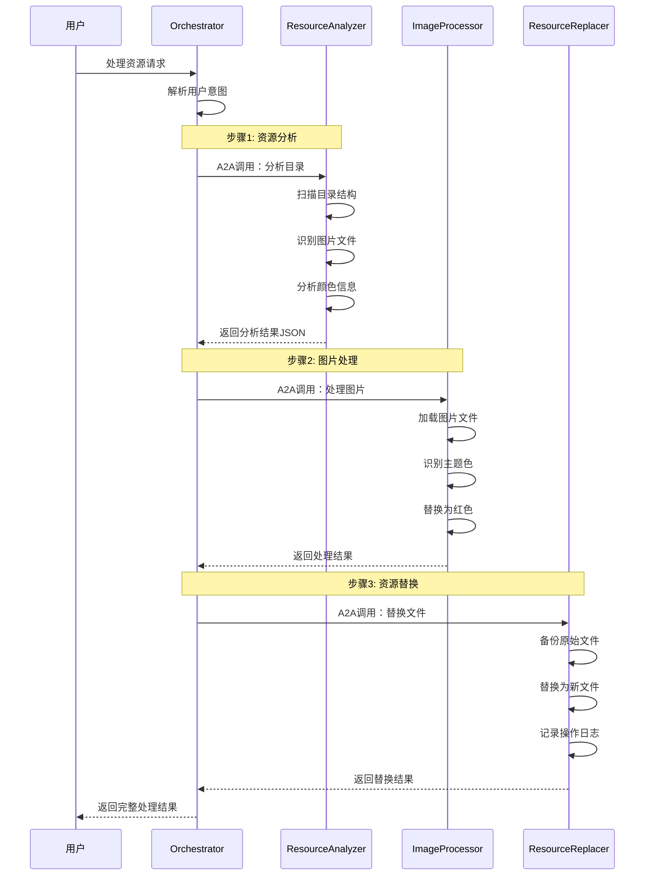

# A2A Resource Processor - 多Agent资源处理系统

基于Google官方A2A SDK的多Agent资源处理系统，实现目录资源分析、图片主题色替换的完整工作流。

## 🎯 项目目标

实现用户输入："帮我分析一下xxx目录中的所有资源，并替换所有资源图片的主题色为红色"的完整自动化处理流程。

## 🏗️ 系统架构

### 4个独立Agent

```
A2A-Resource-Processor/
├── orchestrator/           # 编排Agent (端口:8000)
│   ├── app/
│   ├── pyproject.toml
│   ├── README.md
│   └── test_client.py
├── resource-analyzer/      # 资源分析Agent (端口:8001)
│   ├── app/
│   ├── pyproject.toml
│   ├── README.md
│   └── test_client.py
├── image-processor/        # 图片处理Agent (端口:8002)
│   ├── app/
│   ├── pyproject.toml
│   ├── README.md
│   └── test_client.py
└── resource-replacer/      # 资源替换Agent (端口:8003)
    ├── app/
    ├── pyproject.toml
    ├── README.md
    └── test_client.py
```

### Agent职责分工

1. **🎭 Orchestrator Agent** (端口:8000) - 工作流编排器
   - 协调整个资源处理流程
   - 管理Agent间A2A通信
   - 提供用户统一入口
   - 工作流状态管理

2. **🔍 ResourceAnalyzer Agent** (端口:8001) - 资源分析器
   - 递归扫描目录结构
   - 识别图片文件格式
   - 分析颜色信息和元数据
   - 生成资源清单JSON

3. **🎨 ImageProcessor Agent** (端口:8002) - 图片处理器
   - 图片主题色识别
   - 颜色替换处理
   - 批量图片操作
   - AI图片生成(可选)

4. **📁 ResourceReplacer Agent** (端口:8003) - 资源替换器
   - 原始文件备份
   - 安全文件替换
   - 操作日志记录
   - 回滚支持

## 🚀 快速开始

### 方式1: 启动单个Agent

每个Agent都可以独立运行：

```bash
# 启动编排器
cd orchestrator && uv run app --port 8000

# 启动资源分析器
cd resource-analyzer && uv run app --port 8001

# 启动图片处理器  
cd image-processor && uv run app --port 8002

# 启动资源替换器
cd resource-replacer && uv run app --port 8003
```

### 方式2: 启动完整系统

```bash
# 启动所有Agent (需要4个终端)
./start-all.sh

# 或使用Docker Compose
docker-compose up
```

### 测试系统

```bash
# 测试单个Agent
cd orchestrator && uv run test_client.py

# 测试完整工作流
python test_workflow.py --message "帮我分析一下 ./test_images 目录中的所有资源，并替换所有资源图片的主题色为红色"
```

## 🔄 工作流程



## 🛠️ 技术栈

### 核心依赖
- **a2a-sdk>=0.2.6** - Google官方A2A SDK
- **uvicorn>=0.34.2** - ASGI服务器
- **httpx>=0.28.1** - HTTP客户端
- **pydantic>=2.11.4** - 数据验证

### 专业工具
- **Pillow>=10.0.0** - 图片处理库
- **opencv-python>=4.8.0** - 计算机视觉
- **numpy>=1.24.0** - 数值计算

## 📝 开发指南

### 添加新Agent

1. **创建Agent目录**
```bash
mkdir my-agent
cd my-agent
```

2. **创建项目配置**
```toml
# pyproject.toml
[project]
name = "my-agent"
version = "0.1.0"
dependencies = ["a2a-sdk>=0.2.6", "uvicorn>=0.34.2"]
```

3. **实现Agent逻辑**
```python
# app/__main__.py
from a2a.server.agent_execution import AgentExecutor, RequestContext
from a2a.server.events import EventQueue

class MyAgentExecutor(AgentExecutor):
    async def execute(self, context: RequestContext, event_queue: EventQueue):
        # 实现你的Agent逻辑
        pass
```

### 测试Agent

每个Agent都有独立的测试客户端：

```python
# test_client.py
import asyncio
from a2a.client import A2ACardResolver, A2AClient

async def test_my_agent():
    # 测试Agent功能
    pass

if __name__ == "__main__":
    asyncio.run(test_my_agent())
```

## 🔧 配置说明

### 环境变量

```bash
# 通用配置
A2A_HOST=localhost
A2A_PORT=8000
A2A_DEBUG=false

# Agent特定配置
RESOURCE_ANALYZER_URL=http://localhost:8001
IMAGE_PROCESSOR_URL=http://localhost:8002
RESOURCE_REPLACER_URL=http://localhost:8003

# 可选：AI服务配置
OPENAI_API_KEY=your_key_here
GOOGLE_API_KEY=your_key_here
```

### Agent注册

Orchestrator会自动发现和注册其他Agent：

```python
# 在orchestrator/app/config.py中配置
AGENT_REGISTRY = {
    "resource_analyzer": "http://localhost:8001",
    "image_processor": "http://localhost:8002", 
    "resource_replacer": "http://localhost:8003"
}
```

## 📋 API文档

### Agent Card示例

每个Agent都暴露标准的AgentCard：

```bash
# 获取Agent信息
curl http://localhost:8001/.well-known/agent.json
```

### A2A消息格式

```json
{
  "jsonrpc": "2.0",
  "id": "uuid-here",
  "method": "message/send",
  "params": {
    "message": {
      "role": "user",
      "parts": [{"kind": "text", "text": "用户消息"}],
      "messageId": "uuid-here"
    },
    "sessionId": "session-uuid"
  }
}
```

## 🚢 部署

### Docker部署

每个Agent都有独立的Containerfile：

```bash
# 构建所有Agent镜像
docker-compose build

# 启动完整系统
docker-compose up -d
```

### Kubernetes部署

```bash
# 部署到k8s集群
kubectl apply -f k8s/
```

## 🤝 贡献指南

1. Fork本项目
2. 创建特性分支 (`git checkout -b feature/new-agent`)
3. 提交更改 (`git commit -m 'Add new agent'`)
4. 推送到分支 (`git push origin feature/new-agent`)
5. 创建Pull Request

## 📄 许可证

MIT License - 查看 [LICENSE](LICENSE) 文件了解详情

## ⚠️ 免责声明

本示例代码仅用于演示A2A协议的机制。在生产环境中使用时，请确保适当的安全措施和错误处理。 