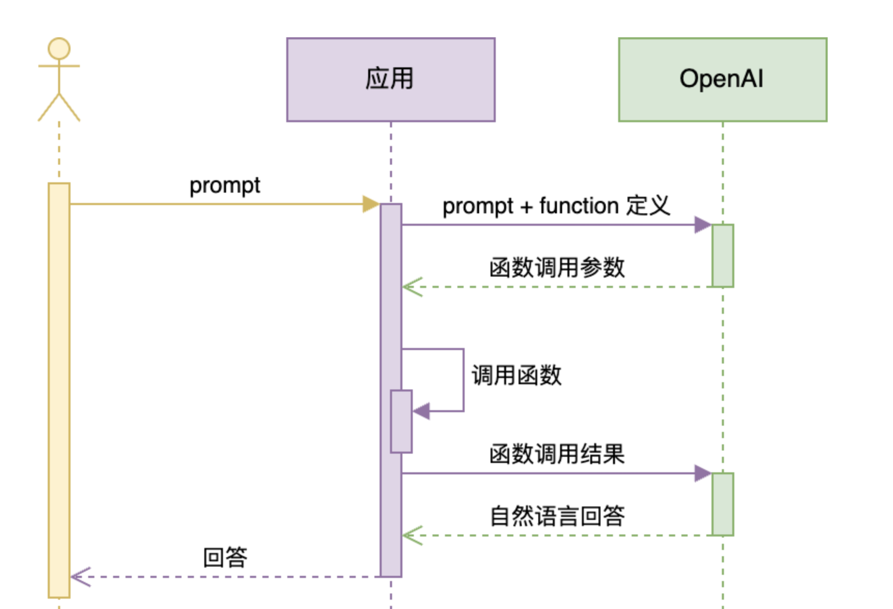

Date 2025.5.24
# Function Calling

前言：
大模型虽然在自然语言处理等领域表现出色，但也存在一些缺陷和局限性：

1. 训练数据有限：大模型的知识来源于已有的训练数据，无法涵盖所有垂直领域、非公开或最新的信息。
2. 推理方式有限：大模型依赖于对训练文本的统计规律进行推理，而非真正的逻辑推理，因此结果具有不确定性，对于需要精确和确定答案的领域（如数学等）并不适用。
3. 推理能力有限：在多步推理、因果关系分析等复杂任务上，模型容易出现逻辑漏洞或推理错误。
4. 事实更新滞后：模型无法实时获取最新信息，对于时效性强的领域可能给出过时或错误的答案。
5. 生成内容不可控：有时会生成虚假、不合适或有害的信息，难以完全保证输出的安全性和准确性。
6. 资源消耗大：训练和推理过程需要大量计算资源，部署和维护成本较高。
7. 缺乏常识与世界知识：在常识判断和现实世界知识方面仍有不足，容易出现常识性错误。
8. 难以解释和追溯：决策过程不透明，难以解释输出原因，对于需要可解释性的场景存在局限。

## Function Calling 解决的问题

Function Calling（函数调用）主要是为了解决大模型在实际应用中"只会说不会做"的问题。具体来说，它的核心目的是：

1. 让大模型具备"动手能力"：传统大模型只能生成文本，无法主动与外部系统、数据库、工具等进行交互。Function Calling 机制允许大模型根据用户意图，自动调用后端的API、函数或工具，完成实际的操作任务。
2. 实现"问答+执行"一体化：用户不仅可以向大模型提问，还可以让模型帮忙完成具体操作，比如查天气、订机票、查询数据库、自动生成报表等。模型会根据对话内容，判断何时需要调用哪个函数，并自动填充参数，实现"说了就能做"。
3. 降低人工干预和开发门槛：开发者只需定义好可调用的函数接口，模型就能根据自然语言理解自动匹配和调用，无需手动编写复杂的业务逻辑，大大提升了智能体的自动化和扩展能力。

**一句话总结：**
Function Calling 让大模型不仅能"理解和表达"，还能"行动和执行"，实现从"智能问答"到"智能助理"的跨越。

 

### Demo: 

[04.FunctionCallDemo](./Demo/04.FunctionCallDemo.py)