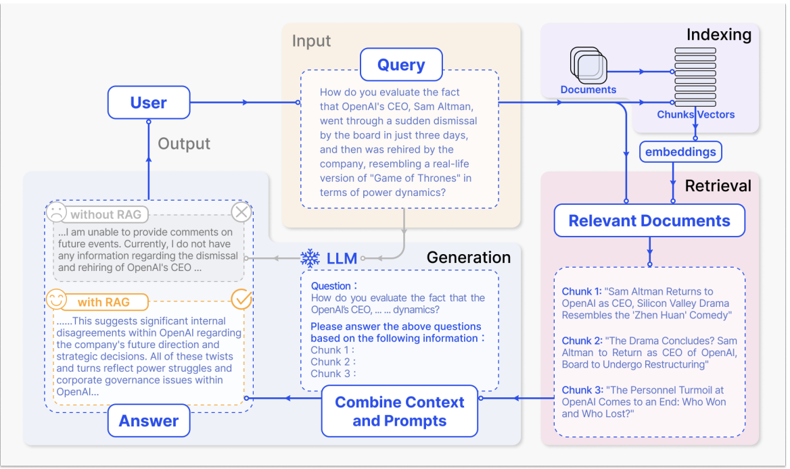

Date 2025.5.26

# RAG

RAG（Retrieval Augmented Generation，检索增强生成）是一种将外部知识检索与大模型生成能力结合的方法，能够提升模型对最新信息的获取能力，弥补LLM知识更新不及时、事实性不足等问题。
论文：
- RAG原始论文： [Retrieval-Augmented Generation for Knowledge-Intensive NLP Tasks (arXiv:2005.11401)](https://arxiv.org/abs/2005.11401)  
- RAG最新综述论文： [Retrieval-Augmented Generation for Large Language Models: A Survey (arXiv:2312.10997)](https://arxiv.org/abs/2312.10997) 

为什么会用到RAG？
1. 提高准确性：通过检索相关信息，RAG可以提高生成文本的准确性。
2. 减少训练成本：与需要大量数据来训练训练相比，RAG可以通过检索机制来减少所需训练的数据量，从而降低训练成本。
3. 适应性强：RAG模型可以适应新的或不断变化的数据。由于他们能够检索最新的信息，隐私在新数据和事件出现时，它能够快速适应并生成相关文本。

**RAG 流程图：** 

 

RAG的典型流程如下：

1. **用户输入（User → Query）**：用户提出一个具体问题或查询（Query），如"你如何评价OpenAI CEO Sam Altman被解雇又复职的事件？"

2. **文档索引与切分（Indexing）**：系统将外部知识库中的文档进行切分（Chunks），并通过嵌入（embeddings）将其向量化，建立索引，便于后续检索。

3. **检索相关文档（Retrieval）**：检索模块根据用户的查询，从知识库中找到最相关的文档片段（Relevant Documents），如与Sam Altman事件相关的新闻摘要。

4. **上下文拼接与提示词构建（Combine Context and Prompts）**：将检索到的相关文档片段与用户的原始问题拼接，构建成新的提示（Prompt），如"请基于以下信息回答上述问题：Chunk 1... Chunk 2... Chunk 3...

5. **大语言模型生成（LLM Generation）**：拼接后的内容输入到大语言模型（LLM），模型基于这些上下文信息生成最终答案。

6. **输出结果（Output）**：系统将生成的答案返回给用户。
   - **without RAG**：模型可能因缺乏最新知识而无法作答或给出模糊回答。
   - **with RAG**：模型能结合检索到的最新信息，给出更准确、具体、有事实依据的答案。

RAG通过引入外部知识检索，极大提升了大模型的事实性和时效性，实现了"检索+生成"的闭环。

## RAG内部具体流程：

加载文件 -> 读取文本 -> 文本分割 -> 文本向量化 -> 输入问题向量化 -> 文本向量中匹配出问题向量最相似的TopK -> 匹配出的文本最为上下文和问题一起添加到prompt中 -> 提交给LLM生成回答

## Embedding（向量化）：

Embedding是指 把文本、图片、音频等非结构化数据，通过模型（如大语言模型、Embedding模型）转换成一个高维度的、稠密的数字向量（如[0.12, -0.98, ...]）.

可以使用**余弦相似度、欧式距离**等方法比较两个向量的相似度、在向量数据库里，可以用这些向量做高效的相似度检索

- **余弦相似度：** 衡量两个向量在空间中的"夹角"，夹角越小，余弦值越接近1，表示越相似；夹角越大，余弦值越接近-1，表示越不相似；0表示无关（取值范围[-1, 1]）

- **欧式距离：** 衡量两个向量在空间中的"直线距离"，距离越小表示越相似，0则代表完全相同（取值范围[0, +∞]

## 向量数据库：

向量数据库是一种专门用于存储、管理和检索高纬向量数据的数据库、与传统的关系型数据库不同，向量数据库能够高效的处理大规模的向量（如文本、图片、音频等经过模型编码后的向量表示），支持基于向量相似度的高效检索、常见的向量数据库有Milvus、Pinecone、FAISS、Weaviate等。

在RAG系统中，向量数据库用于存储知识库中所有文本片段的向量表示，便于后续通过相似度检索快速找到与用户问题最相关的内容。

## 向量检索：

向量检索是指通过计算向量之间的相似度（如余弦相似度、欧氏距离等），在大规模向量集合中查找与目标向量最接近的Top-K向量的过程。在RAG中，用户问题会被编码为向量，然后在向量数据库中检索出与之最相似的文本片段，作为生成模型的上下文输入。

向量检索相比关键词检索，能够更好地捕捉语义相似性，提升检索的相关性和智能化水平，是RAG等现代AI系统的核心技术之一。

## RAG VS Fine-tuning

RAG（检索增强生成）和 Fine-tuning（微调）都是提升大语言模型能力的常用方法，但它们的原理和适用场景有所不同：

| 对比项         | RAG（检索增强生成）                                                                 | Fine-tuning（微调）                                      |
| -------------- | ---------------------------------------------------------------------------------- | -------------------------------------------------------- |
| 原理           | 结合外部检索系统，实时获取相关知识，辅助生成答案                                   | 在原有模型基础上，用特定领域数据继续训练模型参数         |
| 数据需求       | 依赖高质量的检索库，训练数据需求相对较少                                           | 需要大量高质量的标注数据                                 |
| 知识更新       | 检索库可随时更新，模型可实时获取最新信息                                           | 需要重新收集数据并训练，知识更新周期长                   |
| 适应性         | 对新领域、新知识适应快，只需更新检索库                                             | 适应新领域需重新微调，成本较高                           |
| 生成准确性     | 依赖检索结果的相关性和质量，能提升事实性                                           | 依赖训练数据的覆盖面和质量，容易过拟合                   |
| 计算资源消耗   | 推理时需检索，可能增加延迟                                                         | 推理速度快，但训练资源消耗大                             |
| 典型应用场景   | 需要实时、最新知识的问答、企业知识库、法律、医疗等                                 | 特定领域、特定风格的文本生成，如法律合同、医疗报告等     |

## 总结：
- RAG适合知识更新快、需要高事实性和适应性的场景。
- Fine-tuning适合数据充足、领域明确、对生成风格有特殊要求的场景。
- 实际应用中，二者也可以结合使用：先微调模型，再用RAG增强事实性和实时性。

### RAG在使用中的痛点与对应解决思路（摘自综述论文）

下表总结了RAG在实际应用中的主要痛点及论文中提出的典型解决方案，便于对照理解：

| 痛点 | 典型解决思路 |
| :--- | :--- |
| 检索相关性与召回率不足 | 优化索引结构、细粒度切分、Embedding微调、多检索策略融合、查询重写与扩展 |
| 生成阶段幻觉与不一致 | 检索后内容再排序/压缩/过滤、LLM自评筛选、retriever与generator对齐 |
| 上下文整合与冗余 | 信息融合、摘要、去重、动态权重机制 |
| 噪声与错误信息干扰 | 噪声鲁棒性评测、对抗训练、敏感信息过滤 |
| 上下文窗口与信息过载 | 长文本压缩、摘要、分步检索、专用排序器 |
| 多模态与结构化数据支持不足 | 多模态检索与融合、结构化数据专用模块 |
| 系统鲁棒性与安全性 | 对抗训练、鲁棒性评测、合规性审查 |
| 工程落地与效率挑战 | 高效向量数据库、分布式检索、缓存、流程简化、模块化设计 |
| 评估体系不完善 | 多维度评测体系、自动化评测工具、可追溯性机制 |

> 以上内容参考自[《Retrieval-Augmented Generation for Large Language Models: A Survey》（arXiv:2312.10997）](https://arxiv.org/abs/2312.10997)。

## RAGAS 检索增强生成评估评分
RAGAS 的全称是 Retrieval-Augmented Generation Assessment Score，中文常译为"检索增强生成评估评分"或"RAG自动化评测体系"。

### RAGAS 典型评测流程

RAGAS 的评测流程一般包括以下几个主要步骤：

1. **准备评测数据集**：通常为一组问答对（问题、参考答案），以及RAG系统生成的回答和检索到的上下文。
    数据集格式：
    - question：作为RAG输入的用户查询
    - answer：从RAG生成的答案。
    - contexts：回答question外部知识源中检索的上下文
    - ground_truths：question的事实性答案（人工注释信息）

2. **配置评测指标**
   - 选择需要评测的维度，如上下文相关性（Context Relevance）、答案忠实性（Faithfulness）、答案相关性（Answer Relevance）等。

3. **自动化打分**
   - 使用RAGAS工具（如Python包）对每条样本进行自动化评测。
   - 工具会调用大模型或内置算法，对每个维度进行打分。

4. **结果汇总与分析**
   - 汇总各项指标的得分，输出整体评测报告。
   - 可对比不同RAG方案、不同参数下的效果。

5. **可选：人工复核**
   - 对部分样本进行人工抽查，辅助验证自动化评测的准确性。

#### 典型代码示例（伪代码）
```python
from ragas import evaluate
# 假设 data 为包含问题、参考答案、检索内容、生成答案的数据集
results = evaluate(data, metrics=["faithfulness", "context_relevance", "answer_relevance"])
print(results.summary())
```

> 详细用法和参数配置可参考 [RAGAS 官方文档](https://github.com/explodinggradients/ragas)。

### Demo: 
[05-1.RAGDemo](./Demo/05-1.RAGDemo.py)

[05-2.RAGASDemo](./Demo/05-2.RAGASDemo.py)


