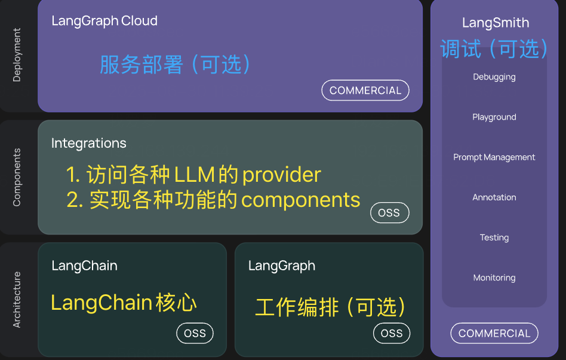

# LangGraph

langGraph是一个功能非常强大的大语言模型本地应用构建框架，布置包含饿了各种基于大模型构建本地应用的工具，更重要的是，他积累了非常多使用大语言模型构建本地应用的经验，并且将这些经验总结成非常多的案例，让大家直接使用

但是LangGraph并不是一个独立的框架，他是LangChain框架的一个生态组件。

## LangGraph是干什么的？

LangChain中不仅有LangChain还有LangGraph、LangSmith等一系列的生态组件
 

其中LangChain是生态的基础，LangSmith主要是针对LangChain的应用测试，监控和分析的平台，LangGraph则是基于LangChain的应用程序开发框架，他可以帮助开发者更方便地构建个管理复杂的应用程序。

[LangGraph官网](https://langchain-ai.github.io/langgraph/)

主要流程：
1. 构建Agent： 构建Agent，这里LangGraph的基础
2. langGraph Framework：构建LangGraph应用。主要以Graph图的方式将多个Agent整合成一个整体，这也是LangGraph最核心的部分
3. LangGraph Paltform：通过LangGraph Platform 平台部署应用，这是一个商业化的平台，可以标准化的形式部署LangGraph应用，并提供测试、监控、分析等功能

这里的Agent智能体，其实本职上是将大语言模型的各种功能，封装成独立的整体。Agent构建完成后，未来我们有什么问题，直接交给Agent处理就行了，不用过多的关注Agent的细节。
大模型交互，LangChain框架已经实现了非常多的核心功能， 这一部分也是和LangChain联系非常紧密的一部分

## 快速体验LangChain和LangGraph

Demo: [12-1.LangGraphDemo](../Demo/12-1.LangGraphDemo.py)

## Agent

Agent智能体是LangGraph中的一个核心概念，LangGraph中Agent的形象是可以类比一个员工，懂得听从安排又能够及时反馈和请示，可以独立完成一系列基于大模型的构建任务。Agent五要素：Benchmark、LLM、prompt、Tool、Memory

## 增加Tools调用

Tools工具机制是LLM中的一个重要机制，他可以让大模型调用外部工具，从而实现更加复杂的功能，完整流程如下
1. 客户端定义工具类，实现工具类
2. 客户端请求LLM，带上问题及Tool的描述信息
3. LLM综合判断问题，并决定是否调用工具
4. 如果LLM判断需要使用工具，就会向客户端返回一个带有tool_calls工具调用信息的AiMessage
5. 客户端根据工具调用信息，调用工具，并将结果返回给LLM
6. LLM根据工具调用结果，生成最终回答

使用LangChain我们需要实现完整流程，而使用langGraph后，工具成了Agent的标配。只需要定义工具类，Agent中会自行完成工具调用的流程

在langGraph中只需要将函数传进去就行 不需要@tool去添加注解

参数：
return_direct 结果直接返回 

 ToolNode ：对工具结果的一个调用链

## 消息记忆
对大模型增加消息记忆多轮对话

[userMessage AiMessage systenMessage]

在LangChain中，我们需要自定义chatMessageHistory，并自行保存每一轮对话消息，然后再调用LLM作为参数传入

在LangGraph中 实现消息记录的流程也封装到了Agent中

LangGraph将消息记忆分为了短期记忆与长期记忆
- 短期记忆：Agent内部的记忆，用于当前对话中的历史记忆消息。LangGraph将其封装为 `CheckPoint`
- 长期记忆：Agent外部的记忆，用于第三方存储，长久保存用户级别或应用级别的聊天信息，LangGraph将其封装为 `Store`

     

如果短期记忆如果上下文太长，则进行压缩，否则会导致LLM的理解成本变高

   

### 短期记忆：
在LangGraph的Agent中，只需要指定checkpoint属性，就可以实现短期记忆，具体传入的属性需要是BaseCheckpointSaver的子类

LangGraph 中默认提供了InMemorySaver, 用于将短期记忆信息保存在内存中，当然，也可以采用radis SQLite等第三方存储来实现长期记忆，

使用checkpoint需要单独thread_id来区分不同的对话

LangGraph中管理短期记忆的方法主要两种
- Summarization：总结，用大模型的方式，对短期记忆进行总结，然后再把总结的结果作为新的短期记忆
- Trimming： 删除，直接把短期记忆中最旧的消息删除掉

### 长期记忆

长期记忆通常认为是比较充足的记忆空间，因此使用时，可以比短期记忆更加粗犷，不太需要实时关注内存空间的大小

和短期记忆差不多，主要通过Agent和stores属性指定一个实现类

与短期记忆最大的区别在于 短期记忆通过thread_id来区分不同的对话，而长期记忆则通过namespace来区分不同的命名空间

## Human-in-the-loop人类监督

在Agent工作过程中，有一个问题非常致命，就是Agent可以添加Tools工具，但是要不要调用工具，却完全有Agent自己决定的，这就会导致Agent在面对一些问题时，可能会出现错误的判断，为了解决这个问题，LangGraph提供了Human-in-the-loop的功能，在Agent进行工具调用的过程中允许用户进行监督，这样需要中断当前的执行任务，等待用户输入后，在进行恢复任务

 

在实现时，LangGraph提供了`interruput`方法添加人类的监督，监督时需要中断当前任务，所以通常和stream方式结合使用

Demo: [12-3.LangGraph-interruput](../Demo/12-3.LangGraph-interruput.py)

## LangGraph的Agent总结：
Agent,是LangGraph后续构建Graph图额基础，Agent并不是LangGraph独有的，甚至不是一种技术，只是一种理想的大模型工作模式。
