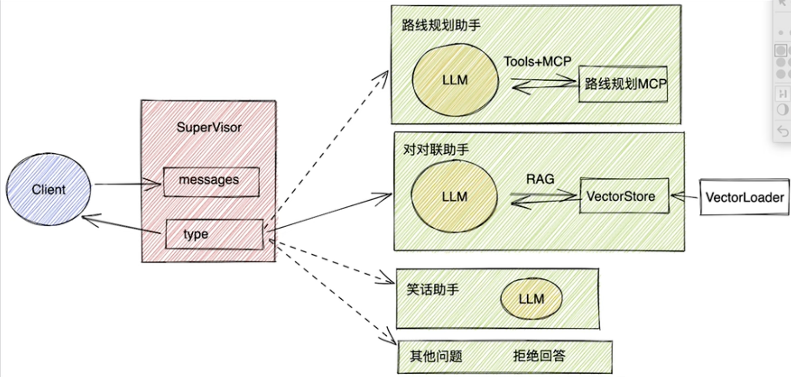

# LangGraph

langGraph是一个功能非常强大的大语言模型本地应用构建框架，布置包含饿了各种基于大模型构建本地应用的工具，更重要的是，他积累了非常多使用大语言模型构建本地应用的经验，并且将这些经验总结成非常多的案例，让大家直接使用

但是LangGraph并不是一个独立的框架，他是LangChain框架的一个生态组件。

## LangGraph是干什么的？

LangChain中不仅有LangChain还有LangGraph、LangSmith等一系列的生态组件
 

其中LangChain是生态的基础，LangSmith主要是针对LangChain的应用测试，监控和分析的平台，LangGraph则是基于LangChain的应用程序开发框架，他可以帮助开发者更方便地构建个管理复杂的应用程序。

[LangGraph官网](https://langchain-ai.github.io/langgraph/)

主要流程：
1. 构建Agent： 构建Agent，这里LangGraph的基础
2. langGraph Framework：构建LangGraph应用。主要以Graph图的方式将多个Agent整合成一个整体，这也是LangGraph最核心的部分
3. LangGraph Paltform：通过LangGraph Platform 平台部署应用，这是一个商业化的平台，可以标准化的形式部署LangGraph应用，并提供测试、监控、分析等功能

这里的Agent智能体，其实本职上是将大语言模型的各种功能，封装成独立的整体。Agent构建完成后，未来我们有什么问题，直接交给Agent处理就行了，不用过多的关注Agent的细节。
大模型交互，LangChain框架已经实现了非常多的核心功能， 这一部分也是和LangChain联系非常紧密的一部分

## 快速体验LangChain和LangGraph

Demo: [12-1.LangGraphDemo](../Demo/12-1.LangGraphDemo.py)

## Agent

Agent智能体是LangGraph中的一个核心概念，LangGraph中Agent的形象是可以类比一个员工，懂得听从安排又能够及时反馈和请示，可以独立完成一系列基于大模型的构建任务。Agent五要素：Benchmark、LLM、prompt、Tool、Memory


## 增加Tools调用

Tools工具机制是LLM中的一个重要机制，他可以让大模型调用外部工具，从而实现更加复杂的功能，完整流程如下
1. 客户端定义工具类，实现工具类
2. 客户端请求LLM，带上问题及Tool的描述信息
3. LLM综合判断问题，并决定是否调用工具
4. 如果LLM判断需要使用工具，就会向客户端返回一个带有tool_calls工具调用信息的AiMessage
5. 客户端根据工具调用信息，调用工具，并将结果返回给LLM
6. LLM根据工具调用结果，生成最终回答

使用LangChain我们需要实现完整流程，而使用langGraph后，工具成了Agent的标配。只需要定义工具类，Agent中会自行完成工具调用的流程

在langGraph中只需要将函数传进去就行 不需要@tool去添加注解

参数：
return_direct 结果直接返回 

 ToolNode ：对工具结果的一个调用链


## 消息记忆
对大模型增加消息记忆多轮对话

[userMessage AiMessage systenMessage]


在LangChain中，我们需要自定义chatMessageHistory，并自行保存每一轮对话消息，然后再调用LLM作为参数传入

在LangGraph中 实现消息记录的流程也封装到了Agent中

LangGraph将消息记忆分为了短期记忆与长期记忆
- 短期记忆：Agent内部的记忆，用于当前对话中的历史记忆消息。LangGraph将其封装为 `CheckPoint`
- 长期记忆：Agent外部的记忆，用于第三方存储，长久保存用户级别或应用级别的聊天信息，LangGraph将其封装为 `Store`

     

如果短期记忆如果上下文太长，则进行压缩，否则会导致LLM的理解成本变高

   

### 短期记忆：
在LangGraph的Agent中，只需要指定checkpoint属性，就可以实现短期记忆，具体传入的属性需要是BaseCheckpointSaver的子类

LangGraph 中默认提供了InMemorySaver, 用于将短期记忆信息保存在内存中，当然，也可以采用radis SQLite等第三方存储来实现长期记忆，

使用checkpoint需要单独thread_id来区分不同的对话

LangGraph中管理短期记忆的方法主要两种
- Summarization：总结，用大模型的方式，对短期记忆进行总结，然后再把总结的结果作为新的短期记忆
- Trimming： 删除，直接把短期记忆中最旧的消息删除掉

### 长期记忆

长期记忆通常认为是比较充足的记忆空间，因此使用时，可以比短期记忆更加粗犷，不太需要实时关注内存空间的大小

和短期记忆差不多，主要通过Agent和stores属性指定一个实现类

与短期记忆最大的区别在于 短期记忆通过thread_id来区分不同的对话，而长期记忆则通过namespace来区分不同的命名空间


## Human-in-the-loop人类监督


在Agent工作过程中，有一个问题非常致命，就是Agent可以添加Tools工具，但是要不要调用工具，却完全有Agent自己决定的，这就会导致Agent在面对一些问题时，可能会出现错误的判断，为了解决这个问题，LangGraph提供了Human-in-the-loop的功能，在Agent进行工具调用的过程中允许用户进行监督，这样需要中断当前的执行任务，等待用户输入后，在进行恢复任务

 

在实现时，LangGraph提供了`interruput`方法添加人类的监督，监督时需要中断当前任务，所以通常和stream方式结合使用

Demo: [12-3.LangGraph-interruput](../Demo/12-3.LangGraph-interruput.py)

## LangGraph的Agent总结：
Agent,是LangGraph后续构建Graph图额基础，Agent并不是LangGraph独有的，甚至不是一种技术，只是一种理想的大模型工作模式。


## 使用LangGraph接入MCP

MCP有stadio和sse两种配置方式

SSE:  基于Http（无状态）协议实现的长连接，是一个单项长连接协议。仅支持 server->client 发送数据（有状态）

Stdio: 本质是客户端本地执行一个应用程序，Client和Server协议可以更加灵活一点，

## 深度理解LangGraph核心 - Graph
Graph是LangGraph的核心，他是一个有向无环图的方式维护多个Agent，构建复杂的Agent大模型应用，形成更复杂的工作流，并提供了很多产品级的特性，保证这些应用更稳定的高效执行

### 理解什么是Graph图
Graph是LangGraph的基本构建模块，他是一个有向无环图（DAG），用于描述任务之间的依赖关系
主要包含三个基本元素

- State：在整个应用当中的一种数据结构
- Node：一个处理数据的节点，LangGraph中通常是一个Python的函数，一Staye为输入，经过一些操作后返回更新后的State
- Edge：表示Node之前的依赖关系，LangGraph中通常也是一个Python Func，根据当前State来决定接下来执行那个Node

Demo: [12-4.LangGraph-Graph](../Demo/12-4.LangGraph-Graph.py)

### 1. state 状态

State是所有节点共享的状态，它是一个字典，包含了所有节点的状态。有几个需要注意的地方：
  
state 形式上 可以是TypedDict字典，也可以是Pydantic中的一个BaseModel。例如：

``` python
from pydantic import BaseModel
class OverallState(BaseModel):
    a: str 
```

这两种本质上没什么太多的区别

state中定义属性，通常不需要指定默认值，如果需要默认值，可以通过在START节点后，定义一个node来指定默认
``` python
def node(state: OverallState) -> OverallState:
    return {"a": "good"}
```
state中的属性，除了可以修改之外，也可以定义一些操作，来制定如何更新state中的值：
```python
from langgraph.graph.message import add_messages

class State(TypedDict):
    messages: Annotated[list[AnyMessage], add_messages]
    list_field: Annotated[list[int], add]
    extra_field: int
```
此时 如果有一个node，返回了State中更新的值，那么messages和list的值就会添加到原有的旧集合中，extra_field的值则会被替换
```python

# 消息传递
class State(TypedDict):
    messages: Annotated[list[AnyMessage], add_messages]
    list_field: Annotated[list[int], add]
    extra_field: int
def node1(state: State) -> State:
    new_message = AIMessage(content="Hello")
    return {"messages": [new_message], "list_field": [10], "extra_field": 10}
def node2(state: State) -> State:
    new_message = AIMessage(content="world!")
    return {"messages": [new_message], "list_field": [20], "extra_field": 20}
graph = (StateGraph(State)
         .add_node("node1", node1)
         .add_node("node2", node2)
         .add_edge(START, "node1")
         .add_edge("node1", "node2")
         .add_edge("node2", END).compile()
         )
input_message = {"role": "user", "content": "Hi"}
result = graph.invoke({"messages": [input_message], "list_field": [1, 2, 3]})
print(result)
```
在LangGraph的应用当中，state通常都会保存聊天消息，谓词，LangGraph中还提供了一个LangGraph.graph.MessagesState,可以用来快速保存消息
```python
class MessagesState(TypedDict):
    messages: Annotated[list[AnyMessage], add_messages]
```
然后对于Messages，它可以用序列化的方式来声明，例如下面两种方式
```python
{"messages": [HumanMessage(content="Hi")]}
{"messages": [{"type": "user", "content": "Hi"}]}
```
Demo: [12-4.LangGraph-Graph](../Demo/12-4.LangGraph-Graph.py)


### 2.Node 节点

Node是图中的一个处理数据的节点，
- 在LangGraph中，node通常是一个Python的函数，他接受一个State对象作为输入，返回一个State对象作为输出
- 每个Node都有一个唯一的名称，通常是一个字符串，如果没有提供名称，LangGraph会自动生成一个和函数名一样的名字
- 在具体实现时。通常包含两个具体的参数，1. State必选。 2. config 可选配置项，包含一些节点运行的配置参数
- LangGraph对每个Node提供了缓存机制，只要Node的传入参数相同，LangGraph就会优先从缓存当中获取Node的执行结果，从而提升Node的运行速度

```python
import time
from langgraph.types import CachePolicy
from langchain_core.runnables import RunnableConfig
from langgraph.cache.memory import InMemoryCache

class State(TypedDict):
    number: int
    user_id: str
    
class ConfigSchema(TypedDict):
    user_id: str
    
def node_1(state: State, config: RunnableConfig):
    time.sleep(3)
    user_id = config["configurable"]["user_id"]
    return {"number": state["number"] + 1, "user_id": user_id}


builder = StateGraph(State, config_schema=ConfigSchema)

builder.add_node("node_1", node_1, cache_policy=CachePolicy(ttl=5))

builder.add_edge(START, "node_1")
builder.add_edge("node_1", END)

graph = builder.compile(cache=InMemoryCache())

print("第一次调用（会执行3秒）：")
print(graph.invoke({"number": 5}, config={"configurable": {"user_id": "123"}}, stream_mode="updates"))

print("第二次调用（应该从缓存返回，瞬间完成）：")
print(graph.invoke({"number": 5}, config={"configurable": {"user_id": "123"}}, stream_mode="updates"))

print("第三次调用（不同user_id，瞬间完成，userid是123）：")
print(graph.invoke({"number": 5}, config={"configurable": {"user_id": "456"}}, stream_mode="updates"))

with open("graph_cache.png", "wb") as f:
    f.write(graph.get_graph().draw_mermaid_png())

```
Demo: [12-4.LangGraph-Graph](../Demo/12-4.LangGraph-Graph.py)

### 3. Edge 边
在Graph中，通过Edge把Node链接起来，从而决定State应该如何在Graph中传递，LangGraph中也提供了非常灵活的构建方式
- 普通Edge和EntryPoint， Edge通常是用来把两个Node链接起来，形成逻辑处理链路，例如graph.add_edge("node1", "node2"). LangGraph中提供了两个默认的Node，Start和end，用来作为Graph的入口和出口
  ``` python
  builder = StateGraph(State)
  builder.set_entry_point("node1")
  builder.set_finish_point("node2")
  ```


- 条件Edge和EntryPoint，我们也可以添加有条件判断的Edge和EntryPoint，用来动态构建更复杂的工作流程。具体实现时，可以指定一个函数，函数的返回值就可以是下一个Node的名称
```python
# Edges 边
print("\n" + "=" * 20 + "Edges 边" + "=" * 20 + "\n")

class State(TypedDict):
    number: int

def node_1(state: State) -> State:
    return {"number": state["number"] + 1}

builder = StateGraph(State)
builder.add_node("node1", node_1)

# def routing_func(state: State) -> str:
#     if state["number"] > 5:
#         return "node1"
#     else:
#         return END
def routing_func(state: State) -> bool:
    if state["number"] > 5:
        return True
    else:
        return False

# builder.add_edge("node1", END)

# builder.add_conditional_edges(START, routing_func)
builder.add_conditional_edges(START, routing_func, {True: "node1", False: END})

graph = builder.compile()

print(graph.invoke({"number": 4}))
print(graph.invoke({"number": 6}))
with open("graph_edges.png", "wb") as f:
    f.write(graph.get_graph().draw_mermaid_png())

```

如果我们需要多个Edge的判断就需要动态路由了
- Send动态路由： 在条件边种，如果希望一个Node后同时路由到多个Node，就可以返回Send动态路由的方式实现

Send对象可传入两个三处，第一个是下一个Node的名称，第二个是Node的输入

```python


from langgraph.types import Send
class State(TypedDict):
    message: Annotated[list[str], add]
    
class PrivateState(TypedDict):
    msg: str

def node_1(state: PrivateState) -> State:
    res = state["msg"] + "1"
    return {"message": [res]}

def routing_func(state: State):
    result = []
    for msg in state["message"]:
        result.append(Send(
            "node1",
            {"msg": msg}
        ))
    return result
    

builder = StateGraph(State)
builder.add_node("node1", node_1)

builder.add_conditional_edges(START, routing_func, ["node1"])
builder.add_edge("node1", END)

graph = builder.compile()

print(graph.invoke({"message": ["Hello", "World"]}))

```

- Command命令：
通常 Graph中一个典型的业务步骤是State进入一个Node处理，在Node中先更新状态，然后再通过Edges传递给下一个Node，如果希望将这两个步骤合并成一个命令，name还可以使用Command命令。

```python

from langgraph.types import Command
class State(TypedDict):
    message: Annotated[list[str], add]
    
def node_1(state: State) -> State:
    new_message = []
    for msg in state["message"]:
        new_message.append( msg + "!!!")
    return Command(
        goto=END,
        update={"message": new_message}
    )
    
builder = StateGraph(State)
builder.add_node("node1", node_1)
builder.add_edge(START, "node1")

graph = builder.compile()

print(graph.invoke({"message": ["Hello", "World"]}))

with open("graph_command.png", "wb") as f:
    f.write(graph.get_graph().draw_mermaid_png())
```

## 子图
在LangGraph中。一个Graph除了可以单独使用，还可以作为一个Node，嵌入到另一个Graph中，这种用法称之为子图。通过子图，我们可以更好的重用Graph，构建更复杂的工作流，尤其在构建多Agent的时候非常有用，在大模型项目中，通常由一个专门的团队开发Agent，在通过其他团队来将Agent整合

使用子图时，和使用Node没有太大的区别

唯一需要注意的是，当出发了SubGraph代表Node后，实际上相当于重新调用了一次subGraph.invoke(state)方法

```python

from langgraph.graph import MessagesState

class State(TypedDict):
    messages: Annotated[list[str], add]
    
def sub_node_1(state: State) -> MessagesState:
    return {"messages": ["hahah hahah haha"]}

sub_builder = StateGraph(State)
sub_builder.add_node("sub_node_1", sub_node_1)
sub_builder.add_edge(START, "sub_node_1")
sub_builder.add_edge("sub_node_1", END) 

sub_graph = sub_builder.compile()

builder = StateGraph(State)
builder.add_node("sub_graph", sub_graph)
builder.add_edge(START, "sub_graph")
builder.add_edge("sub_graph", END)

graph = builder.compile()

print(graph.invoke({"messages": ["Hello"]}))

with open("graph_subgraph.png", "wb") as f:
    f.write(graph.get_graph().draw_mermaid_png())
   
```

## 图的Stream支持

和调用大模型相似，Graph除了可以直接用invok调用外，还可以通过Stream()流式方式调用，大模型的流逝是以此返回响应的Token，而Graph流式输出则返回的是State的数据处理步骤。

Graph提供了stream()方法进行同步的流逝调用，也提供了astream()的方式进行异步流式调用
```python
    
print("\n" + "=" * 20 + "流式输出" + "=" * 20 + "\n")

for chunk in graph.stream({"messages": ["Hello"]}, stream_mode="updates"):
    print(chunk)

```

其中 stream_mode有以下几种状态：
1. values: 在图的每一步之后，流式输出状态的完整值
2. updates: 在图的每一步之后，将更新内容流式传输到状态，如果在同一步骤中多次更新（运行了多个节点）这些更新将分别进行流式传输。
3. custom: 从图节点内部流式输出自定义数据，通常用于调试
4. messages: 从任何调用大语言模型的图节点，流式输出二元组（LLM的Token，元数据）
5. debug: 在图执行的过程中，尽可能多的传输信息。

values, updates, debug输出模式，使用之前的案例验证，
message 需要依赖大模型
custom 可以自定义输出内容，在Node节点内或者Tools工具内，通过get_stream_writer()方法获取一个StreamWrite对象，然后使用write()方法将自定义数据写入流数据中
```python

from langgraph.config import get_stream_writer

class State(TypedDict):
    query: str
    answer: str
    
def node_1(state: State):
    writer = get_stream_writer()
    writer({"自定义Key":"在节点内返回自定义信息"})
    writer("直接返回字符串")
    return {"answer": "some data"}

graph = (StateGraph(State)
         .add_node("node1", node_1)
         .add_edge(START, "node1")
         .add_edge("node1", END)
         .compile()
         )

for chunk in graph.stream({"query": "Hello"}, stream_mode="custom"):
    print(chunk)

```


Demo: [12-4.LangGraph-Graph](../Demo/12-4.LangGraph-Graph.py)


## 使用LangGraph构建多智能体工作流

### 大模型消息持久化

和之前的LangGraph的Agent相似，Graph也支持消息的持久化数据，并且也支持checkpointer构建短期记忆，以store构建长期记忆

这里的短期记忆和长期记忆，都是可以通过内存挥着数据库进行持久化数据，不过短期记忆更倾向于对消息的短期存储，实现多轮对话的效果，而长期记忆则倾向于支持语义检测
``` python
llm = ChatOpenAI(
    model="gpt-4o",
    openai_api_key=anthropic_api_key,
    openai_api_base=anthropic_group_id
)

def call_model(state: MessagesState):
    res = llm.invoke(state["messages"])
    return {"messages": [res]}

checkpointer = InMemorySaver()

graph = (StateGraph(MessagesState)
         .add_node("call_model", call_model)
         .add_edge(START, "call_model")
         .add_edge("call_model", END)
         .compile(checkpointer=checkpointer)
         )

config = {
    "configurable": {
        "thread_id": "123"
    }
}

for chunk in graph.stream({"messages": [{"role": "user", "content": "湖南的省会是哪里？"}]}, config=config, stream_mode="values"):
    print(chunk["messages"][-1].pretty_print())

for chunk in graph.stream({"messages": [{"role": "user", "content": "湖北呢？"}]}, config=config, stream_mode="values"):
    print(chunk["messages"][-1].pretty_print())

for chunk in graph.stream({"messages": [{"role": "user", "content": "北京呢？"}]}, config=config, stream_mode="values"):
    print(chunk["messages"][-1].pretty_print())
```
### Human-In-Loop 人类干预

在LangGraph中也可以通过中断任务，等待确认的方式，来实现过程干预，这样能够更好的减少大语言模型的结果不稳定给任务带来的影响

在具体实现人类干预时，需要至于一下几点：
1. 必须制定一个checkpointer短期记忆，否则无法保存任务状态
2. 在执行Graph任务时，必须制定一个带有thread_id的配置项，指定线程ID，之后才能通过线程ID，恢复指定线程
3. 在任务执行的过程中，通过interrupt()方法，中断任务，等待确认
4. 在Human确认之后，使用Gtaph提交一个resume=True的指令，恢复任务，并继续进行

这种实现方式在之前介绍LangGraph构建单Agent已经介绍过，结合Graph的State，在多个Node之间进行复杂控制，这样更能体现出人类的监督价值


典型案例

 

```python

def call_model(state: MessagesState):
    res = llm.invoke(state["messages"])
    return {"messages": [res]}


def human_approval(state: MessagesState) -> Command[Literal["call_model", END]]:
    is_approved = interrupt(
        {
            "是否继续执行？"
        }
    )
    if is_approved:
        return Command(goto="call_model")
    else:
        return Command(goto=END)


checkpointer = InMemorySaver()

graph = (StateGraph(MessagesState)
         .add_node("call_model", call_model)
         .add_node("human_approval", human_approval)
         .add_edge(START, "human_approval")
         .compile(checkpointer=checkpointer)
         )

config = {
    "configurable": {
        "thread_id": "123"
    }
}

for chunk in graph.stream(
    {"messages": [{"role": "user", "content": "湖南的省会是哪里？"}]},
    config=config, 
    stream_mode="messages"
):
    print(chunk["messages"][-1].pretty_print())


for chunk in graph.stream(
    Command(resume=True),
    config=config,
    stream_mode="values"
):
    print(chunk["messages"][-1].pretty_print())


```
注意：
- 任务中断和恢复，需要保持相同的thread_id，通常应用当中都会生成一个随机的thread_id，保证唯一的同时，防止其他人物干扰
- interrupt()方法中断任务的时间不能太长，过长了之后就无法恢复任务了
- 任务确认时，command中传递的resume可以是简单的True/False，也可以是一个Map，通过Map可以进行更多的判断

 Demo: [12-5.LangGraph-Workflow](../Demo/12-5.LangGraph-Workflow.py)


### Time Travel 时间回溯

由于LLM的回答不确定性，基于LLM构建应用，也充满不确定性，所有有必要进行更近准的检查，当某个步骤出现问题，才能及时发现问题，并从发现问题的某个步骤进行重演，LangGraph提供了 Time Travel时间回溯功能，可以保证Graph在运行过程中可以手动的制定某个Node进行重演。

Tips:
1. 在进行Graph时，需要提供初始的输入数据
2. 运行时，指定thread_id, 并基于这个ID 在指定一个checkpoint检查点，执行后将每一个Node执行后生成一个check_point_id
3. 指定thread_id和check_point_id 进行任务重演，重演前，可以选择更新state 

```python

from typing_extensions import NotRequired
from typing import TypedDict
class State(TypedDict):
    author: NotRequired[str]
    joke: NotRequired[str]


def author_node(state: State):
    prompt = "帮我推荐一个收人环境的作家，只需要给出作家的名字即可"
    author = llm.invoke(prompt)
    return {"author": author}

def joke_node(state: State):
    prompt = f"用作家{state["author"]}的风格，写一个100字以内的笑话, 并带上他的名字"
    joke = llm.invoke(prompt)
    return {"joke": joke}

builder = StateGraph(State)
builder.add_node("author_node", author_node)
builder.add_node("joke_node", joke_node)

builder.add_edge(START, "author_node")
builder.add_edge("author_node", "joke_node")
builder.add_edge("joke_node", END)

checkpointer = InMemorySaver()

graph = builder.compile(checkpointer=checkpointer)

with open("graph_state.png", "wb") as f:
    f.write(graph.get_graph().draw_mermaid_png())

import uuid
config = {
    "configurable": {
        "thread_id": str(uuid.uuid4())
    }
}

state = graph.invoke({}, config=config)
print("\n" + "-" * 20 + "初始状态" + "-" * 20 + "\n")
print(state["author"])
print(state["joke"])


print("\n" + "-" * 20 + "状态历史" + "-" * 20 + "\n")
states = list(graph.get_state_history(config=config))
for state in states:
    print(state.next)
    print(state.config["configurable"]["checkpoint_id"])
    print("-" * 20)
    
print("\n" + "-" * 20 + "回溯状态" + "-" * 20 + "\n")
selected_state = states[1]
print(selected_state.next)
print(selected_state.values)

    
print("\n" + "-" * 20 + "回溯" + "-" * 20 + "\n")
new_config = graph.update_state(selected_state.config, values={"author": "郭德纲"})
print(new_config)
state = graph.invoke(None, config=new_config)
print(state["author"])
print(state["joke"])
```


实战案例

 


**DEMO:**
多智能体架构
[12-6.MultiAgent Demo](../Demo/12-6.MultiAgent/Director.py)