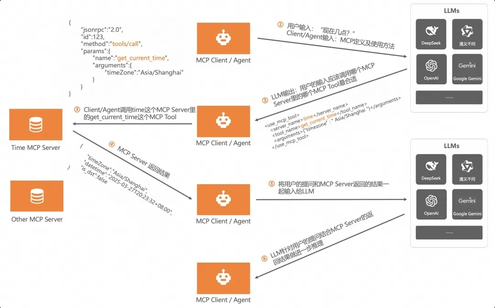

## AI 学习总觉

#### MCP 概念

MCP是一个针对于Agent管理规范的一个协议，有了它可以通过规范话的接口实现在代码层面对LLM以及Agent的管理和调用，它就像一个拓展坞，整理和规范后续的使用。


MCP有三个比较重要的概念
* MCP server， 是一个实现的程序
* MCP tools 实现一些功能的代码和方法
* MCP client 调用server的对象



在这个图中，LLM不负责直接生成请求答案，而是根据答案找到最合适的MCP server，由MCP server来计算出答案而后又交给LLM进行优化和推理。LLM做的是更高级的事情，而真正干活的是MCP Server

#### Agent
关于Agent，我的理解就是消费MCP server 的client， 根据上图可以看出来，agent会在LLM和MCP server之间发送请求，来确保最终得到准确的结果。


#### 通过Java代码实现 MCP 

```XML

		<dependency>
			<groupId>org.springframework.ai</groupId>
			<artifactId>spring-ai-openai-spring-boot-starter</artifactId>
		</dependency>

		<dependency>
			<groupId>org.springframework.ai</groupId>
			<artifactId>spring-ai-core</artifactId>
		</dependency>

		<dependency>
			<groupId>org.springframework.boot</groupId>
			<artifactId>spring-boot-starter-test</artifactId>
			<scope>test</scope>
		</dependency>

```

首先引入最关键的部分，那就是Spring ai， Spring ai的出现让Java也可以来做AI相关的项目，并且它整合了多个大模型，可以根据以下配置来接入不同的大模型，这里举了个例子是接入到了腾讯的混元，api key直接上腾讯混元官网生成即可
```properties
spring.ai.openai.api-key=your api key
spring.ai.openai.base-url=https://api.hunyuan.cloud.tencent.com
spring.ai.openai.chat.options.model=hunyuan-turbos-latest
spring.ai.openai.chat.options.temperature=0.7
```

这里先放两个tool 类，一个是number 相关的处理，另一个是时间相关的处理，这两个tool其实就是起到MCP中的MCP server的角色，并且可以看到，每个方法的都使用了@Tool的注解， 这个注解用来声明方法是一个可以被调用的工具，而且默认给了一些prompt，这样LLM在查找对应的方法时就可以匹配的到。

```java
package com.example.demo.tool;

import org.springframework.ai.tool.annotation.Tool;

import java.math.BigDecimal;
import java.math.RoundingMode;
import java.util.Arrays;
import java.util.stream.Stream;

public class NumTools {
    @Tool(description = "generate a random number")
    String getRandomNum() {
        long currentTimeMillis = System.currentTimeMillis();
        System.out.println("current time " + currentTimeMillis);
        return String.valueOf(currentTimeMillis);
    }

    @Tool(description = "Round to 2 decimal places")
    String getHalfUpNum(String num){
        BigDecimal newNum = new BigDecimal(num);
        BigDecimal roundNum = newNum.setScale(2, RoundingMode.HALF_UP);
        System.out.println("round number is" + roundNum);
        return roundNum.toString();
    }

    @Tool(description = "Compare the size of two numbers, which is bigger and which is smaller")
    String getCompareNum(String num1, String num2){
        BigDecimal newNum1 = new BigDecimal(num1);
        BigDecimal newNum2 = new BigDecimal(num2);
        int compared = newNum1.compareTo(newNum2);
        System.out.println("compare result is " + compared);
        if (compared > 0) {
            return num1 + " is bigger than " + num2;
        } else if (compared < 0) {
            return num1 + " is smaller than " + num2;
        } else {
            return num1 + " is equal to " + num2;
        }
    }

    @Tool(description = "Given a sent of numbers, please help me arrange the sizes in the specified order, from largest to smallest by default")
    BigDecimal [] getSortNum(String ... numbers){
        System.out.println("getSortNum");
        if(null == numbers || numbers.length == 0){
            return new BigDecimal[] {};
        }
        Stream<BigDecimal> stream = Arrays.stream(numbers).map(t -> new BigDecimal(t));
        BigDecimal[] sorted = stream.sorted(BigDecimal::compareTo).toArray(BigDecimal[]::new);
        return sorted;
    }
}
```

```java
package com.example.demo.tool;

import org.springframework.ai.tool.annotation.Tool;

public class DateTools {

    @Tool(description = "currently local time")
    String getTime() {
        return "The current time is " + java.time.LocalTime.now();
    }
}

```

再来看下这个接口类，其中最重要的要属ChatClient这个类，这个类就是Spring AI给我们提供的可以连接LLM的类，在第一个API中，可以看到传入prompt后可以通过chatCLient直接就返回了针对prompt的处理回复，一个智能AI助手就通过这个接口创建出来了，直接使用接口调用，非常方便和简单。

还有在第二个和第三个API中可以看到在tools()方法中传入了我们上面的tool类，这样的好处就是在调用接口时，LLM会根据tool中所传入的类去查找对应的方法来进行执行和计算。

``` java
package com.example.demo.controller;

import com.example.demo.tool.DateTools;
import com.example.demo.tool.NumTools;
import org.springframework.ai.chat.client.ChatClient;
import org.springframework.web.bind.annotation.RequestMapping;
import org.springframework.web.bind.annotation.RequestParam;
import org.springframework.web.bind.annotation.RestController;

@RestController
@RequestMapping("/api")
public class DemoController {

    private ChatClient chatClient;

    public DemoController(ChatClient.Builder chatClientBuilder) {
        this.chatClient = chatClientBuilder.build();
    }


    @RequestMapping("/ai/simple")
    public String getSimple(@RequestParam(value = "prompt") String prompt){
        return chatClient.prompt(prompt).call().content();
    }

    @RequestMapping("/ai/date")
    public String getDate(@RequestParam(value= "prompt", defaultValue = "get current date and time") String prompt){
        return chatClient.prompt(prompt).tools(new DateTools(), new NumTools()).call().content();
    }

    @RequestMapping("/ai/number/tool")
    public String getRandomNum(@RequestParam(value= "prompt") String prompt){
        return chatClient.prompt(prompt).tools(new NumTools()).call().content();
    }


}
```

在这个简单的例子中，API扮演者agent的角色，tool 扮演者MCP server的角色，ChatClient扮演者LLM的角色，简单并且清晰的实现了MCP协议。