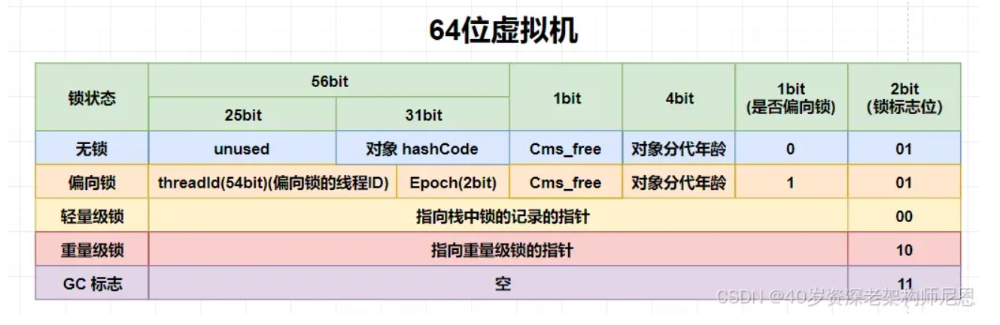

# 锁
是在并发case中保证数据一致性的手段，JAVA中都是悲观锁，只有Automatic，LongAdder这种原子类才实现了CAS，当然我们自己也可以实现

## 悲观锁
在处理数据前认为数据在我们执行的过程中是会被变掉的，所以在处理数据前就要通过锁把数据处理部分包裹住，保证只有一个线程进行访问。
Java中synchronized 和 Lock类，都是悲观锁。

## CAS && ABA
CAS 全程 Compare and swap(set)，在更新数据的时候先获取目标的当前值，接着处理具体数据后，再获取一下目标值，此时比较一下是否与刚才的“当前值”是一致的，如果一致的话才把处理好的数据更新，否则不更新。

CAS是乐观锁的实现方式，也被称为无锁编程，因为全程没有用到Java关键字和Lock类。

但是有一种case无法被CAS识别，那就是当A线程准备修改n的值，获取到当前n的值是1，然后对n进行处理。这时B线程快人一步将n修改成2，并提交。C线程也比A快又把n改成1并提交，当A修改n的时候，n已经被改了2此了，但是n的值其实是没变的，A也通过了CAS验证，对n进行更新。这就是ABA，想要解决这个问题就需要在CAS判断的时候需要额外加一个版本号。

## 乐观锁

在处理数据前，认为数据不会被修改，只有在提交的时候才会对值进行校验，不是真正意义上的加锁。

## 可重入锁

可重入锁也叫递归锁，一个方法中有锁的加持，线程在进入方法获取到锁后，又因为递归重新进入了锁，这个时候线程是可以直接执行被锁加持的代码的，不需要像另一个线程一样进行等待，Java中所有的锁都是可重入锁，这是因为对象头中会存锁的线程信息，存的就是当前的线程ID


## 自旋锁

自旋锁不是锁，而是形容锁的一种状态，当锁升级到轻量级锁的时候，其他线程没有抢到锁，就只能重复循环判断锁是否可以获取，这个动作叫自旋，而这个过程叫忙等(busy waiting)，这种情况是比较消耗CPU资源的，占用了CPU资源但是什么事情也没做。

> 锁升级：无锁 -> 偏向锁 -> 轻量锁 -> 重量锁
> synchronized 没有被执行 -> 单独线程执行了锁代码块 -> 多个线程对锁有了竞争，开始抢夺锁，这个时候锁就升级为了轻量锁 -> 线程抢占锁的次数会被记录，有些线程一直抢夺不上锁，直到达到 -XX:PreBlockSpin 的值时（默认是10次），或者超过CPU核数的一半，就会升级为重量锁

## 偏向锁

偏向某一个线程的锁就叫偏量锁，当锁代码块被线程执行后，对象头记录了线程id，那这个时候这个锁就成了偏向锁，偏向锁是发生在一个线程，没有竞争的时候，也是锁升级的第一个状态。

## 轻量锁

当线程之间对锁有了竞争，锁就会从偏向锁升级为轻量锁，只有一个线程会执行锁代码块中的代码，其余线程进行忙等。

## 重量锁

当某个线程一直没获取到锁，并且达到了阈值，那么它就会主动把对象的mark word改成重量锁，线程自身也会进行阻塞并加入到monitor的队列中等待唤醒，从而不消耗CPU资源。jdk1.6前都是没有轻量锁的概念，直接就到重量锁，性能不是很好。

## 公平锁/非公平锁

公平锁：先申请锁的线程先得到，公平获取
非公平锁：按照随机或其他优先级排序的获取锁的方式，java中默认都是非公平锁

ReentrantLock 类中默认是非公平锁，但是也可以通过有参构造去修改
```java
/**
 * Creates an instance of {@code ReentrantLock}.
 * This is equivalent to using {@code ReentrantLock(false)}.
 */
public ReentrantLock() {
    sync = new NonfairSync();
}

/**
 * Creates an instance of {@code ReentrantLock} with the
 * given fairness policy.
 *
 * @param fair {@code true} if this lock should use a fair ordering policy
 */
public ReentrantLock(boolean fair) {
    sync = fair ? new FairSync() : new NonfairSync();
}
```

## 可中断锁

在锁执行中可以通过另一个线程发送通知并结束，但是执行不会真正的结束，执行线程会自己决定什么时候结束。

synchronized不是可终断锁，但是Lock是
```java
/**
 * Acquires the lock unless the current thread is
* {@linkplain Thread#interrupt interrupted}.
*
* <p>Acquires the lock if it is available and returns immediately.
*
* <p>If the lock is not available then the current thread becomes
* disabled for thread scheduling purposes and lies dormant until
* one of two things happens:
*
* <ul>
* <li>The lock is acquired by the current thread; or
* <li>Some other thread {@linkplain Thread#interrupt interrupts} the
* current thread, and interruption of lock acquisition is supported.
* </ul>
*
* <p>If the current thread:
* <ul>
* <li>has its interrupted status set on entry to this method; or
* <li>is {@linkplain Thread#interrupt interrupted} while acquiring the
* lock, and interruption of lock acquisition is supported,
* </ul>
* then {@link InterruptedException} is thrown and the current thread's
* interrupted status is cleared.
*
* <p><b>Implementation Considerations</b>
*
* <p>The ability to interrupt a lock acquisition in some
* implementations may not be possible, and if possible may be an
* expensive operation.  The programmer should be aware that this
* may be the case. An implementation should document when this is
* the case.
*
* <p>An implementation can favor responding to an interrupt over
* normal method return.
*
* <p>A {@code Lock} implementation may be able to detect
* erroneous use of the lock, such as an invocation that would
* cause deadlock, and may throw an (unchecked) exception in such
* circumstances.  The circumstances and the exception type must
* be documented by that {@code Lock} implementation.
*
* @throws InterruptedException if the current thread is
*         interrupted while acquiring the lock (and interruption
*         of lock acquisition is supported)
*/
void lockInterruptibly() throws InterruptedException;
```

## 读/写锁

读写锁都是悲观锁的实现，只是根据需求来使用
```java

public interface ReadWriteLock {
    /**
     * Returns the lock used for reading.
     *
     * @return the lock used for reading
     */
    Lock readLock();

    /**
     * Returns the lock used for writing.
     *
     * @return the lock used for writing
     */
    Lock writeLock();
}
```

## 锁优化

1. 减小锁粒度：缩小锁的范围，尽量锁住关键代码，不要锁在多线程中没有影响的代码
2. 粗化锁：当出现代码中有多个代码块出现锁，要尽量把这些代码合并到同一个锁中，避免因过多的锁而导致的性能消耗
3. 关闭偏向锁：偏向锁是给一个线程时候用的锁，直接从无锁状态到轻量锁，会省去线程竞争到锁后的**撤消**操作，撤销需要暂停持有偏向锁的线程(stop the word)，使用-XX:-UseBiasedLocking 会关闭偏向锁，JDK15+后默认关闭