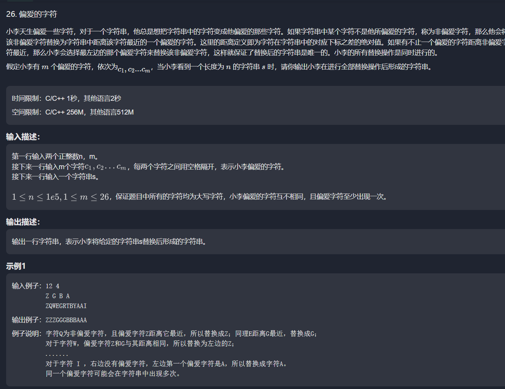

#  



```java
/**
 * <p>下面是算法的题：</p>
 * 
 *
 * 本地通过前缀和还有二分查找进行实现
 */
public class PreferredCharacters {
    public static void main(String[] args) {
        Scanner in = new Scanner(System.in);
        // 注意 hasNext 和 hasNextLine 的区别
        while (in.hasNext()) { // 注意 while 处理多个 case
            String lengthStr = in.nextLine();
            // 偏爱字符
            String preCharaStr = in.nextLine();
            // 目标字符串
            String targetStr = in.nextLine();

            String[] targetCharArray = targetStr.split("");

            // 通过前缀和，先找到偏爱字符所在的index位置都有哪些
            List<String> preChara = Arrays.stream(preCharaStr.split(" ")).collect(Collectors.toList());
            List<Integer> indexOfPreCharaInTarget = new ArrayList<>();
            for (int i = 0; i < targetCharArray.length; i++) {
                if(preChara.contains(String.valueOf(targetCharArray[i]))){
                    indexOfPreCharaInTarget.add(i);
                }
            }

            // 都存储index
//            List<Integer> xiaoyu  ; List<Integer> dayu;
            int xiaoyu = 0, dayu=0;
            for (int i = 0; i < targetCharArray.length; i++) {
                String target = String.valueOf(targetCharArray[i]);
                if(preChara.contains(target)){
                    continue;
                }
                char targetPreChara ;
                /*
                * 这是第二版的做法，在循环中找大于和小于的index位置，然后再通过减法算两段长度哪个更符合题目，这种其实是O(n²)的时间复杂度，
                * 要在每个循环中都去遍历两遍，很不友好，而且也通不过题目。
                *
                * 第一版的话就是纯暴力解法
                * */
//                xiaoyu = indexOfPreCharaInTarget.stream().filter(t -> t < finalI).collect(Collectors.toList());
//                dayu = indexOfPreCharaInTarget.stream().filter(t -> t > finalI).collect(Collectors.toList());

//
//                if(xiaoyu.isEmpty()) targetPreChara = targetStr.charAt(dayu.get(0));
//                else if(dayu.isEmpty()) targetPreChara = targetStr.charAt(xiaoyu.get(xiaoyu.size() - 1));
//                else {
//                    targetPreChara = dayu.get(0) - i <  i - xiaoyu.get(xiaoyu.size() - 1)
//                            ? targetStr.charAt(dayu.get(0))
//                            : targetStr.charAt(xiaoyu.get(xiaoyu.size() - 1));
//                }
                /*
                通过二分法来查找对应index插入的位置，由于题目的限制，indexOfPreCharaInTarget中必然是存放当的不是当前元素的位置，所以就比较好找
                可以直接通过二分查找来找到插入位置，注意一下这里二分查找如果不存在的话是会返回负数，通过取反再-1就能定位到我们目标元素需要插入到哪个位置
                但是又不是真的插入，定位出来的其实是大于我们target的元素位置。就可以直接当作大于我们target的且是最近的数来处理。
                 */
                int positoin = -Collections.binarySearch(indexOfPreCharaInTarget, i) - 1;
                if(positoin == 0 ) targetPreChara = targetStr.charAt(indexOfPreCharaInTarget.get(positoin));
                else if(positoin == indexOfPreCharaInTarget.size() ) targetPreChara = targetStr.charAt(indexOfPreCharaInTarget.get(positoin-1));
                else {
                    xiaoyu = indexOfPreCharaInTarget.get(positoin - 1);
                    dayu = indexOfPreCharaInTarget.get(positoin);
                    /*
                    可以想象成计算两段线段的长度，如果大于i且最近的数-i 的长度小于 i-小于i且最近的数，那么我们就要取大于的数，因为题目要求要取离的进的
                    再一个，如果等于的话，那就要取左边的，也就是小于i的那个最近的数
                     */
                    targetPreChara = dayu - i <  i - xiaoyu
                            ? targetStr.charAt(dayu)
                            : targetStr.charAt(xiaoyu);
                }
                targetCharArray[i] = String.valueOf(targetPreChara);
            }
            System.out.println(String.join("", targetCharArray));
        }
    }
}
```