# LangChain快速入门

## LangChain的定义

LangChain 是一个开源的开发框架，皆在帮助开发者快速构建基于大模型(LLM)的应用程序，它通过模块化设计简化了与大模型交互的复杂性,支持灵活集成外部工

具和数据源，使开发者能够高效实现复杂的AI应用逻辑。

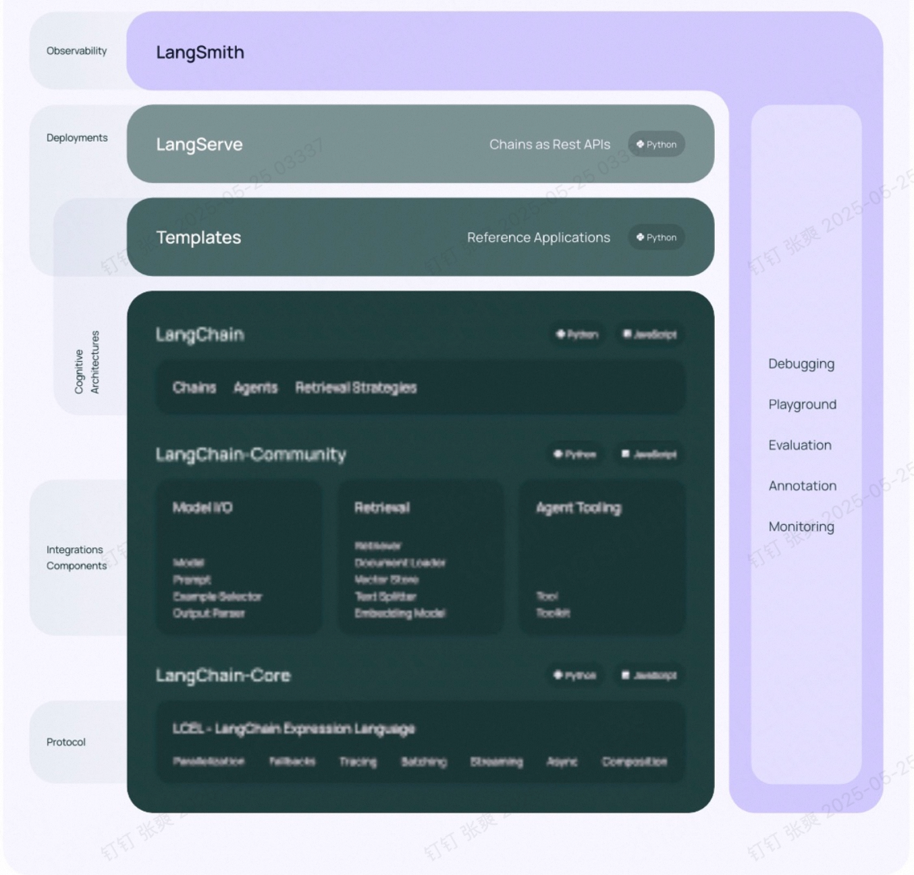

LangChain框架由几个部分组成，包括：

- LangChain库：Python和JavaScript库。包括接口和集成多种组件的运行基础，以及现成的链和代理的实现。
- LangChain模版：LangChain官方提供一些AI任务模版。
- LangServe：基于FastApi可以将LangChain定义链，发布称为REST API。
- LangSmith：开发平台，是个云服务，支持LangChain Debug、任务监控。

LangChain库（Libraries）：

LangChain库本身由几个不同的包组成：

- Langchain-core：基础抽象的LangChain表达语言。
- langchain-community：第三方继承。
  - 合作伙伴包（例如langchain-openai，langchain-anthropic等）：一些集成已进一步拆分为仅依赖于langchain-core的轻量级包。
- langchain：构建应用程序认知架构的链、代理和检索策略。

LangChain任务处理流程

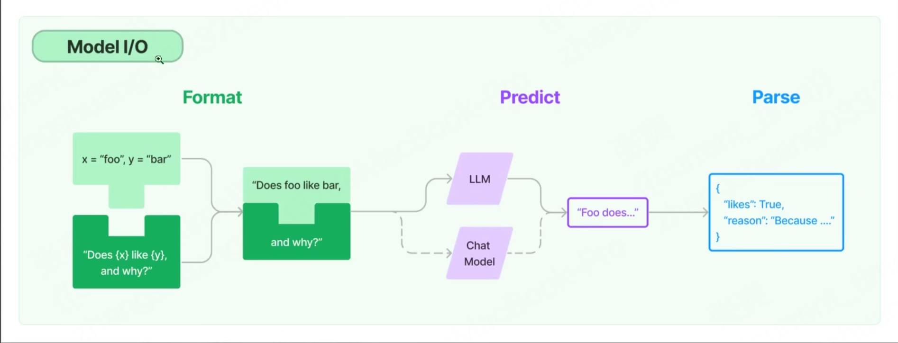

如上图，LangChain提供一套提示词模版管理工具，负责处理提示词，然后传递给大模型处理，最后处理大模型返回的结果。

LangChain对大模型的封装主要包括LLM和Chat Model两种类型：

- LLM-问答模型，模型接收一个文本输入，然后返回一个文本结果。
- Chat Model-对话模型，接收一组对话消息，然后返沪对话消息，类似聊天信息一样。

## 核心概念

1. LLMs

   LangChain封装的基础模型，模型接收一个文本输入，然后返回一个文本结果。

2. Chat Models（聊天模型）

   聊天类型，与LLMs不同，这些模型专为对话场景而设计，模型可以接收一组对话消息，然后返回对话消息，类似聊天消息一样。

3. 消息（Message）

   指的是聊天模型的消息内容，消息类型包括HumanMessage、ALMessgae、SystemMessage、FunctionMessage和ToolMessage等多种类型的消息。

4. 提示（prompts）

   LangChain封装了一组专门用于提示词（prompts）管理的工具类，方便我们格式化提示词内容。

5. 输出解析器（Output Parers）

   如上图介绍，LangChain接收大模型返回的文本内容之后，可以使用专门的输出解析器对文本内容进行格式化，例如解析Json、python对象。

6. Retrievers

   为方便我们将私有数据导入到大模型，提高模型回答问题的质量，LangChain封装了检索框架，方便我们加载文档、切割、存储和检索文档数据。

7. 向量存储（Vector stores）

   为支持私有数据的语义相似搜索，langchain支持多种向量数据库。

8. Agents

   智能体，通常指以大模型为决策引擎，根据用户输入的任务，自动调用外部系统、硬件设备共同完成用户任务，是一种以大模型为核心的应用设计模式。

## 核心功能

（1）模块集成（Models）

- 作用：统一接口对接多种大模型（如OpenAI GPT、Anthropic、Hugging Face等），避免厂商锁定。
- 示例：通过ChatOpenAI或CharAnthropic类快速切换不同模型，实现对话、文本生成等任务。

（2）模块化组件（Components）

- 提示模块（Prompts）：标准化提示词管理，支持变量注入和动态生成（如Few-shot Learning）
- 文档加载器（Document Loaders）：支持PDF、网页、数据库等数据源的加载与预处理。
- 文档分割器（Text Splitters）：将长文本切分以适应模型输入限制。
- 向量存储（Vector Stores）：集成FAISS、Chroma等工具，实现文本向量化与相似性检索。

（3）链式调用（Chains）

- 作用：将多个步骤组合成可重复的流程，处理复杂任务。
- 典型链：RetrievalQA（检索+生成）、SequentialChain（顺序执行多个模型调用）。
- 场景：构建问答系统时，先检索知识库，在生成回答。

（4）记忆机制（Memory）

- 作用：维护对话历史或上下文状态，支持多轮交互。
- 实现方式：通过ConversationBufferMemory或ConversationSummaryMemory存储和管理历史信息。

（5）代理与工具（Agents & Tools）

- 代理（Agents）：让LLM动态选择调用工具，实现智能决策（如“使用搜索API查询天气，再用计算器转化单位”）。
- 工具（Tools）：预置搜索引擎、Python REPL、API调用等工具，支持自定义扩展。

（6）数据增强（RAG）

- 作用：将外部数据（如文档、数据库）与LLM结合提升生成内容的准确性和相关性。
- 流程：加载数据->向量化->检索相关片段->注入提示词->生成最终回答。

## 典型应用场景

- 智能问答系统：结合RAG处理领域知识库。
- 对话机器人：支持多轮会话、个性化记忆。
- 文档分析：自动总结长文本，提取关键信息。
- 自动化流程：通过代理调用工具执行代码、发送邮件等操作。
- 代码生成：根据需要描述生成并验证代码片段。

## 快速入门

### 安装LangChain

```python
pip install langchain
```

### 初始化模型

在使用langchain之前，需要导入LangChain X OpenAI集成包，并设置API密钥作为环境变量或直接传递给OpenAI LLM类。

首先，获取OpenAI的api密钥，可以通过创建账户并访问链接获取，然后将API密钥设置为环境变量：

```
export OPENAI_API_KEY = ""
from langchain_openai import ChatOpenAI
llm = ChatOpenAI()
```

### 输出转化

LLM的输出通常是一条消息，为了更方便处理结果，可以将消息转化为字符串。

```python
from langchain_core.output_parsers import StrOutputParser
output_parser = StrOutputParser()
```

### 相关代码

```python
from langchain_core.output_parsers import StrOutputParser
from langchain_core.prompts import ChatPromptTemplate
from langchain_openai import ChatOpenAI

llm = ChatOpenAI(
    temperature=0,
    model="gpt-4o",
    base_url="********",
    api_key="********"
)

# 定义一个输出解析器
output_parser = StrOutputParser()

# 定义提示词
prompt = ChatPromptTemplate.from_messages([
    ("system", "你是一个数据库专家"),
    ("user", "{input}")
])

# 构建链
chain = prompt | llm | output_parser

result = chain.invoke({"input": "帮我写一篇技术文档，100字左右"})

print(result)
```

```
标题: 数据库优化技术概述

简介: 本文档旨在介绍数据库优化的基本技术，以提高数据库性能和效率。

内容:
1. 索引优化: 通过创建适当的索引来加速查询操作，减少数据检索时间。
2. 查询优化: 使用EXPLAIN分析查询执行计划，重构复杂查询以减少资源消耗。
3. 缓存机制: 实施缓存策略以减少数据库负载，提高数据访问速度。
4. 分区技术: 将大型表分区以提高查询性能和管理效率。
5. 连接池管理: 优化数据库连接池以减少连接开销，提高并发处理能力。

结论: 通过实施上述优化技术，可以显著提升数据库的性能和响应速度。
```

# LangChain提示词工程应用实践

## Prompt templates（提示词模版）

语言模型以文本作为输入 - 这个文本通常被称为提示词（prompt）。在开发过程中，对于提示词通常不能直接硬编码，不利于提示词管理，而是通过提示词模版

进行维护，类似开发过程中遇到的短信模版、邮件模版等等。


## 什么是提示词模版？

提示词模版本质上跟平时大家使用的邮件、短信模版没有什么区别，就是一个字符串模版，模版可以包含一组模版参数，通过模版参数可以替换模版对应的参数。

一个提示词模版可以包含以下内容：

- 发给大语言模型（LLM）的指令。
- 一组问答示例，以提醒AI以什么格式返回请求。
- 发给语言模型的问题。

## 创建一个提示词模版（prompt template）

可以使用PromptTemplate类创建简单的提示词。提示词模版可以内嵌任意数量的模版参数，然后通过参数值格式化模版内容。

```python
from langchain_core.prompts import PromptTemplate

prompt_template = PromptTemplate.from_template(
    "给我讲一个关于{content}的{adjective}笑话"
)

result = prompt_template.format(adjective="完整", content="猫")

print(result)
```

```
给我讲一个关于猫的完整笑话
```

## 聊天消息提示词模版(chat prompt template)

聊天模型（Chat Model）以聊天消息列表作为输入，这个聊天消息列表的消息内容也可以通过提示词模版进行管理。这些聊天消息与原始字符串不同，因为每个

消息都与“角色”相关联。

例如，在OpenAI的Chat Completion API中，OpenAi的聊天模型，给不同的聊天消息定义了三种角色类型分别是助手(assistant)、人类 (human)、系统 (system)

角色：

- 助手(assistant)消息指的是当前消息是AI回答的内容。
- 人类 (human)消息指的是你发给AI的内容。
- 系统 (system)消息通常是用来给AI身份进行描述。

```python
from langchain_core.prompts import ChatPromptTemplate
chat_prompt = ChatPromptTemplate.from_messages(
    [
        ("system", "你是一个人工智能助手，你的名字是{name}"),
        ("human", "你好"),
        ("assistant", "我很好，谢谢！"),
        ("human", "{user_input}")
    ]
)

messages = chat_prompt.format_messages(name="zs", user_input="你的名字是什么")

print(messages)
```

```
[SystemMessage(content='你是一个人工智能助手，你的名字是zs', additional_kwargs={}, response_metadata={}), HumanMessage(content='你好', additional_kwargs={}, response_metadata={}), AIMessage(content='我很好，谢谢！', additional_kwargs={}, response_metadata={}), HumanMessage(content='你的名字是什么', additional_kwargs={}, response_metadata={})]
```

另一种消息格式例子： 

```python
from langchain_core.messages import SystemMessage
from langchain_core.prompts import ChatPromptTemplate, HumanMessagePromptTemplate

chat_template = ChatPromptTemplate.from_messages(
    [
        SystemMessage(
            content=(
                "你是一个乐于助人的助手，可以入色内容，使其看起来更简单易读。"
            )
        ),
        HumanMessagePromptTemplate.from_template("{text}")
    ]
)

messages = chat_template.format_messages(text="我最近为了学习头疼")

print(messages)
```

```
[SystemMessage(content='你是一个乐于助人的助手，可以入色内容，使其看起来更简单易读。', additional_kwargs={}, response_metadata={}), HumanMessage(content='我最近为了学习头疼', additional_kwargs={}, response_metadata={})]
```

通常我们不会直接使用format_messages函数格式化提示词模版内容，而是交给LangChain框架自动处理。

## MessagesPlaceholder

这个提示模版负责在特定位置添加消息列表，在上面ChatPromptTemplate中，我们看到了如何格式化两条消息，每条消息都是一个字符串。但是我们希望用户传

入一个消息列表，我们将其插入到特定的位置，该怎么办？这就是使用MessagesPlaceholder的方式。

```python
from langchain_core.messages import HumanMessage
from langchain_core.prompts import ChatPromptTemplate, MessagesPlaceholder

prompt_template = ChatPromptTemplate.from_messages([
    ("system", "你是一个人工智能助手"),
    MessagesPlaceholder("msgs")
])

result = prompt_template.invoke({
    "msgs": [HumanMessage(content="你好！")]
})

print(result)
```

```
messages=[SystemMessage(content='你是一个人工智能助手', additional_kwargs={}, response_metadata={}), HumanMessage(content='你好！', additional_kwargs={}, response_metadata={})]
```

这将生成两条消息，第一条是系统消息，第二条是我们传入的HumanMessage。如果我们传入了5条消息，那么总共会生成6条消息(系统消息加上传入的5条息)。

这对于将一系列消息插入到特定位置非常有用。

另一种实现相同效果，使用placeholder：

```python
prompt_template = ChatPromptTemplate.from_messages([
    ("system", "你是一个人工智能助手"),
    MessagesPlaceholder("msgs"),
    ("placeholder", "{msgs}")
])

result = prompt_template.invoke({
    "msgs": [HumanMessage(content="你好！")]
})

print(result)
```

```python
messages=[SystemMessage(content='你是一个人工智能助手', additional_kwargs={}, response_metadata={}), HumanMessage(content='你好！', additional_kwargs={}, response_metadata={}), HumanMessage(content='你好！', additional_kwargs={}, response_metadata={})]
```

## 提示词追加示例（Few-shot prompt templates）

提示词中包含交互样本的作用是为了帮助模型更好的理解用户的意图，从而更好的回答问题或执行任务。小样本提示模版是指使用一组少量的示例来指导模型处理

新的输入。这些实例可以用来训练模型，以便模型可以更好的理解和回答类似的问题。

## 使用示例集

### 创建示例集

定义一个examples示例数组，包含一组问答样例。

```python
from langchain.prompts.few_shot import FewShotPromptTemplate
from langchain.prompts.prompt import PromptTemplate


examples = [
  {
    "question": "谁的寿命更长，穆罕默德·阿里还是艾伦·图灵？",
    "answer": """
        这里需要跟进问题吗：是的。
        跟进：穆罕默德·阿里去世时多大？
        中间答案：穆罕默德·阿里去世时74岁。
        跟进：艾伦·图灵去世时多大？
        中间答案：艾伦·图灵去世时41岁。
        所以最终答案是：穆罕默德·阿里
    """
  },
  {
    "question": "craigslist的创始人是什么时候出生的？",
    "answer": """
        这里需要跟进问题吗：是的。
        跟进：craigslist的创始人是谁？
        中间答案：craigslist由Craig Newmark创立。
        跟进：Craig Newmark是什么时候出生的？
        中间答案：Craig Newmark于1952年12月6日出生。
        所以最终答案是：1952年12月6日
    """
  },
  {
    "question": "乔治·华盛顿的祖父母中的母亲是谁？",
    "answer": """
        这里需要跟进问题吗：是的。
        跟进：乔治·华盛顿的母亲是谁？
        中间答案：乔治·华盛顿的母亲是Mary Ball Washington。
        跟进：Mary Ball Washington的父亲是谁？
        中间答案：Mary Ball Washington的父亲是Joseph Ball。
        所以最终答案是：Joseph Ball
    """
  },
  {
    "question": "《大白鲨》和《皇家赌场》的导演都来自同一个国家吗？",
    "answer": """
        这里需要跟进问题吗：是的。
        跟进：《大白鲨》的导演是谁？
        中间答案：《大白鲨》的导演是Steven Spielberg。
        跟进：Steven Spielberg来自哪里？
        中间答案：美国。
        跟进：《皇家赌场》的导演是谁？
        中间答案：《皇家赌场》的导演是Martin Campbell。
        跟进：Martin Campbell来自哪里？
        中间答案：新西兰。
        所以最终答案是：不是
    """
  }
]
```

### 创建小样本示例的格式化程序

通过`PromptTemplate`对象，简单的在提示词模板中插入样例。

```python
from langchain_core.prompts import PromptTemplate
example_prompt = PromptTemplate(input_variables=["question", "answer"], template="问题: {question}{answer}")

print(example_prompt.format(**examples[0]))
```

```python
问题: 谁的寿命更长，穆罕默德·阿里还是艾伦·图灵？
        这里需要跟进问题吗：是的。
        跟进：穆罕默德·阿里去世时多大？
        中间答案：穆罕默德·阿里去世时74岁。
        跟进：艾伦·图灵去世时多大？
        中间答案：艾伦·图灵去世时41岁。
        所以最终答案是：穆罕默德·阿里
```

### 将示例和格式化程序提供给`FewShotPromptTemplate`

通过`FewShotPromptTemplate`对象，批量插入示例内容。

```python
# 接收examples示例数组参数，通过example_prompt提示词模板批量渲染示例内容
# suffix和input_variables参数用于在提示词模板最后追加内容， input_variables用于定义suffix中包含的模板参数
prompt = FewShotPromptTemplate(
    examples=examples,
    example_prompt=example_prompt,
    suffix="问题：{input}",
    input_variables=["input"]
)

print(prompt.format(input="乔治·华盛顿的父亲是谁？"))
```

```python
问题: 谁的寿命更长，穆罕默德·阿里还是艾伦·图灵？
        这里需要跟进问题吗：是的。
        跟进：穆罕默德·阿里去世时多大？
        中间答案：穆罕默德·阿里去世时74岁。
        跟进：艾伦·图灵去世时多大？
        中间答案：艾伦·图灵去世时41岁。
        所以最终答案是：穆罕默德·阿里
    
问题: 谁的寿命更长，穆罕默德·阿里还是艾伦·图灵？
        这里需要跟进问题吗：是的。
        跟进：穆罕默德·阿里去世时多大？
        中间答案：穆罕默德·阿里去世时74岁。
        跟进：艾伦·图灵去世时多大？
        中间答案：艾伦·图灵去世时41岁。
        所以最终答案是：穆罕默德·阿里
    

问题: craigslist的创始人是什么时候出生的？
        这里需要跟进问题吗：是的。
        跟进：craigslist的创始人是谁？
        中间答案：craigslist由Craig Newmark创立。
        跟进：Craig Newmark是什么时候出生的？
        中间答案：Craig Newmark于1952年12月6日出生。
        所以最终答案是：1952年12月6日
    

问题: 乔治·华盛顿的祖父母中的母亲是谁？
        这里需要跟进问题吗：是的。
        跟进：乔治·华盛顿的母亲是谁？
        中间答案：乔治·华盛顿的母亲是Mary Ball Washington。
        跟进：Mary Ball Washington的父亲是谁？
        中间答案：Mary Ball Washington的父亲是Joseph Ball。
        所以最终答案是：Joseph Ball
    

问题: 《大白鲨》和《皇家赌场》的导演都来自同一个国家吗？
        这里需要跟进问题吗：是的。
        跟进：《大白鲨》的导演是谁？
        中间答案：《大白鲨》的导演是Steven Spielberg。
        跟进：Steven Spielberg来自哪里？
        中间答案：美国。
        跟进：《皇家赌场》的导演是谁？
        中间答案：《皇家赌场》的导演是Martin Campbell。
        跟进：Martin Campbell来自哪里？
        中间答案：新西兰。
        所以最终答案是：不是
    
# 新增的问题
问题：乔治·华盛顿的父亲是谁？
```

## 使用示例选择器

### 将示例提供给ExampleSelector

重用前一部分中的示例集和提示词模版。但是，不会将示例直接提供给提示词追加示例对象，把全部示例插入到提示词中，而是将它们提供给一个

ExampleSelector对象，插入部分示例。

使用SemanticSimilarityExampleSelector类。根据与输入的相似性选择小样本示例。它使用嵌入模型计算输入和小样本示例之间的相关性，然后使用向量数据库

执行相似搜索，获取跟输入相似的示例。

- 这里涉及向量计算、向量数据库，在AI领域这两个主要用于数据相似度搜索。

```python
example_selector = SemanticSimilarityExampleSelector.from_examples(
    examples,
    # 生成嵌入类，用于衡量语义相似度
    OpenAIEmbeddings(
        base_url="********",  # 根据你的实际API路径确认是否加 /v1
        api_key="********"  # 即使是假的，也要传
    ),
    # 存储嵌入和执行相似性搜索的VectorStore类
    Chroma,
    # 生成的示例数
    k=1
)

question = "craigslist的创始人是什么时候出生的？"
select_examples = example_selector.select_examples({"question": question})
print(f"最似案例: {question}")
for example in select_examples:
    print("\n")
    for k, v in example.items():
        print(f"{k}: {v}")
```

```
最似案例: craigslist的创始人是什么时候出生的？
question: craigslist的创始人是什么时候出生的？
answer: 
        这里需要跟进问题吗：是的。
        跟进：craigslist的创始人是谁？
        中间答案：craigslist由Craig Newmark创立。
        跟进：Craig Newmark是什么时候出生的？
        中间答案：Craig Newmark于1952年12月6日出生。
        所以最终答案是：1952年12月6日
```

### 将示例选择器提供给`FewShotPromptTemplate`

```python
# FewShotPromptTemplate
prompt = FewShotPromptTemplate(
    example_selector=example_selector,
    example_prompt=example_prompt,
    suffix="问题：{input}",
    input_variables=["input"],
)

print(prompt.format(input="乔治·华盛顿的父亲是谁？"))
```

```
/Users/xt03337/Documents/知识库/Learning-Alliance/venv/bin/python /Users/xt03337/Documents/知识库/Learning-Alliance/docs/S/LangChain学习记录/demo/LangChain提示词示例.py 
问题: 乔治·华盛顿的祖父母中的母亲是谁？
        这里需要跟进问题吗：是的。
        跟进：乔治·华盛顿的母亲是谁？
        中间答案：乔治·华盛顿的母亲是Mary Ball Washington。
        跟进：Mary Ball Washington的父亲是谁？
        中间答案：Mary Ball Washington的父亲是Joseph Ball。
        所以最终答案是：Joseph Ball
    

问题：乔治·华盛顿的父亲是谁？
```

# LangChain工作流编排

## LCEL介绍

LCEL(LangChain Expression Language)是一个强大的工作流编排工具，可以从基本组件构建复杂任务链条（chain），并支持诸如流式处理、并行处理和日志记

录等开箱即用的功能。

LCEL从第一天就被设计为支持将原型投入生产，无需更改代码，从最简单的“提示+LLM”链到最复杂的链。以下是使用LCEL的几大亮点：

- 流式支持：当使用LCEL构建链时，获得从输入到输出的第一块内容出现所经过的时间。对于某些链，这意味着直接从LLM流式传输标记到流式输出解析器，将以与LLM提供程序输出原始标记的速率相同的速度获取解析的增量输出块。
- 异步支持：使用LCEL构建的任何链都可以使用同步API以及异步API进行调用。这使得可以在原型和生产中使用相同的代码，具有出色的性能，并且能够在同一服务器中处理许多并发请求。
- 优化并行执行：每当LCEL链具有可以并行执行的步骤时，会自动执行，无论是在同步接口还是异步接口中，以获取可能的最小延迟。
- 重试和回退：为LCEL链的任何部分配置重试和回退。这使链在规模上更可靠的好办法。目前正在努力为重试/回退添加流式支持，这样就可以获得额外的可靠性而无需任何延迟成本。
- 访问中间结果：对于更复杂的链，访问中间步骤的结果通常非常有用，即使在生成最终输出之前。这可以用于让最终用户知道正在发生的事情，甚至只是用于调用链。可以流式传输中间结果，并且在每个LangServe服务器上都可以使用。
- 输入和输出模式：输入和输出模式为每个LCEL链提供了从链的结构推出的Pydantic和JSONSchema模式。这可用于验证输入输出，并且是LangServe的一个组成部分。

## Ruable interface

为了尽可能简化创建自定义链的过程，实现了一个Runable的协议，许多LangChain的组件都实现了Runable协议，包括聊天模型、LLMs、输出解析器、检索器、

提示模版等等。此外，还有一些有用的基本组件可用于处理可运行对象。这是一个标准接口，可以轻松定义自定义链，并以标准方式调用。标准接口包括：

- stream：返回响应的数据块。
- invoke：输入调用链(同步调用）。
- batch：输入列表调用链（批量调用）。

还有相应的异步方法，应该与asyncio一起使用await语法以实现并发：

- astream：异步返回响应的数据块。
- ainvoke：异步输入调用链。
- abatch：异步输入列表调用链。
- astream_log：异步返回中间步骤，以及最终响应。
- astream_events：beta流式传输链中发生的事件。

输入类型和输出类型因组件而异：

| 组件       | 输入类型                         | 输出类型     |
| ---------- | -------------------------------- | ------------ |
| 提示       | 字典                             | 提示值       |
| 聊天模型   | 单个字符串、聊天信息列表或提示值 | 聊天消息     |
| LLM        | 单个字符串、聊天信息列表或提示值 | 字符串       |
| 输出解析器 | LLM或聊天模型的输出              | 取决于解析器 |
| 检索器     | 单个字符串                       | 文档列表     |
| 工具       | 单个字符串和字典，取决于工具     | 取决于工具   |

所有可运行对象都公开输入和输出模式以检查输入和输出：

- input_schema:从可运行对象机构自动生成的输入Pydantic模型
- output_schema:从可运行对象机构自动生成的输出Pydantic模型

流式运行对于使基于LLM的应用程序对最终用户具有响应性至关重要。如聊天模型、输出解析器、提示模版、检索器和代理都实现了LangChain Runnable接口。

该接口提供了两种通用的流式内容方法：

1. 同步stream和异步astream：流式传输链中的最终输出的默认实现。
2. 异步astream_events和异步astream_log：这些方法提供了一种从链中流式传输中间步骤和最终输出的方式。

## Stream

所有的Runnable对象都实现了一个名为stream的同步方法和一个名为astream的异步变体。这些方法皆在以块的形式流式传输最终输出，尽快返回每个块。只有

在程序中的所有步骤都知道如何处理输入时，才能进行流式传输；即，逐个处理输入块，并产生相应的输出块。这种处理的复杂性可以有所不同，从简单的任务，

如发出LLM生成的令牌，到更具挑战性的任务，如在整个JSON完成前流式传输JSON结果的部分。开始探索流式传输的最佳方法从LLM应用程序中最重要的组件开

始-LLM本身！

### LLM和聊天模型

大型语言模型与其聊天变体是基于LLM的应用程序的主要瓶颈。大型语言模型可能需要几秒才能对查询生成完整的响应。这比应用程序对用户具有响应性的约200-

300毫秒的阀值要慢的多。使应用程序具有更高的响应性的关键策略是显示中间进度；即，逐个令牌流式传输模型的输出。这里展示使用聊天模型流式传输的示

例。以下选项中选择一个：

从同步stream API开始：

```python
model = ChatOpenAI(
    temperature=0,
    model="gpt-4o",
    base_url="********",  # 根据你的实际API路径确认是否加 /v1
    api_key="********"
)
chunks = []
for chunk in model.stream("海是什么颜色"):
    chunks.append(chunk)
    print(chunk.content, end="|", flush=True)
```

```
|海|的|颜色|会|因|多|种|因素|而|变化|。|通常|情况下|，|海|水|呈|现|蓝|色|，这是|因为|水|分|子|吸|收|了|阳|光|中的|红|色|和|橙|色|光|谱|，而|蓝|色|光|谱|被|反|射|出来|。此外|，|海|水|的|颜色|还|会|受到|以下|因素|的|影响|：

|1|.| **|天气|和|光|照|**|：|晴|天|时|，|海|水|通常|看|起来|更|蓝|，而|阴|天|或|日|落|时|可能|呈|现|灰|色|或|金|色|。

|2|.| **|水|的|深|度|**|：|浅|水|区|可能|呈|现|绿色|或|青|色|，因为|海|底|的|沙|子|和|植物|反|射|光|线|。

|3|.| **|浮|游|生|物|**|：|大量|的|浮|游|植物|可以|使|海|水|呈|现|绿色|或|棕|色|。

|4|.| **|沉|积|物|和|污染|**|：|泥|沙|或|污染|物|可以|使|海|水|变|得|浑|浊|，|颜色|可能|变|得|更|暗|或|呈|现|棕|色|。

|因此|，|海|的|颜色|并|不是|固定|的|，而|是|随着|环境|条件|的|变化|而|变化|。||
```

或者使用异步astream API

```python
async def test():
    async for chunk in model.astream("海是什么颜色"):
        chunks.append(chunk)
        print(chunk.content, end="|", flush=True)
asyncio.run(test())
```

```
|海|的|颜色|会|因|多|种|因素|而|变化|。|通常|情况下|，|海|水|呈|现|蓝|色|，这是|因为|水|分|子|吸|收|了|阳|光|中的|红|色|和|橙|色|光|谱|，而|蓝|色|光|谱|被|反|射|出来|。此外|，|海|水|的|颜色|还|会|受到|以下|因素|的|影响|：

|1|.| **|天气|和|光|照|**|：|晴|天|时|，|海|水|通常|看|起来|更|蓝|，而|阴|天|或|日|落|时|可能|呈|现|灰|色|或|金|色|。

|2|.| **|水|的|深|度|**|：|浅|水|区|可能|呈|现|绿色|或|青|色|，因为|海|底|的|沙|子|和|植物|反|射|光|线|。

|3|.| **|浮|游|生|物|和|藻|类|**|：|这些|生|物|可以|使|海|水|呈|现|绿色|或|其他|颜色|。

|4|.| **|沉|积|物|和|污染|物|**|：|泥|沙|或|污染|物|会|使|海|水|变|得|浑|浊|，|颜色|可能|变|得|更|暗|或|呈|现|棕|色|。

|因此|，|海|的|颜色|并|不是|固定|的|，而|是|随着|环境|条件|的|变化|而|变化|。||
```

得到一个称为AIMessageChunk的响应体，该块表示AIMessage的一部分。消息块是可叠加的

可以简单的将它们相加获得到目前为止的响应状态

```
AIMessageChunk(content="", id='')
```

### Chain（链）

几乎所有的LLM应用程序都涉及不止一步的操作，而不仅仅是调用语言模型。使用LangChain表达式语言（LCEL）构建一个简单的链，链结合了一个提示、模型和

解析器，并验证流式传输是否正常工作。使用StrOutPutParser来解析模型的输出。这是一个简单的解析器，从AIMessageChunk中提取content字段，给出模型返

回的token。

LCEL 是一种声明式的方式，通过将不同的 LangChain 原语链接在一起来指定一个“程序”。使用 LCEL 创建的链可以自动实现 stream 和 astream，从而实现对最

终输出的流式传输。事实上，使用 LCEL 创建的链实现了整个标准 Runnable 接口。

```python
#astream_chain.py
from langchain_core.output_parsers import StrOutputParser
from langchain_core.prompts import ChatPromptTemplate
prompt = ChatPromptTemplate.from_template("给我讲一个关于{topic}的笑话")
parser = StrOutputParser()
chain = prompt | model | parser
async def main():
    async for chunk in chain.astream({"topic": "计算机"}):
        print(chunk, end="|", flush=True)
asyncio.run(main())
```

```
|当然|可以|！|这是|一个|关于|计算|机|的|笑|话|：

|为什么|计算|机|喜欢|吃|饼|干|？

|因为|它|们|需要|一点|字|节|（|bite|）|！||
```

请注意，即使我们在上面的链条末尾使用了parser，我们仍然可以获得流式输出。parser会对每个流式块进行操作。许多LCEL也支持这种转换式的流式传递，这

在构建应用程序时非常方便。

自定义函数可以被设计为返回生成器，这样就能够操作流。

某些可运行实体，如提示模板和聊天模型，无法处理单个块，而是聚合所有先前的步骤。这些可运行实体可以中断流处理。

LangChain表达语言允许将链的构建与使用模式（例如同步/异步、批处理/流式等）分开。如果这与构建的内容无关，也可以依赖于标准的命令式编程方法，通过

在每个组件上调用invoke、batch或stream，将结果分配给变量，然后根据需要在下游使用它们。

### 使用输入流

如果想要在输出生成时从中流式传输JSON，该怎么办呢？

如果依赖json.loads来解析部分JSON，那么解析将失败，因为部分JSON不会是有效的JSON。

可能会束手无策，声称无法流式传输JSON。

事实证明，有一种方法可以做到这一点——解析器需要在输入流上操作，并尝试将部分JSON“自动完成”为有效状态。

这样一个解析器的运行，以了解这意味着什么。

```
model = ChatOpenAI(model="gpt-4")
parser = StrOutputParser()
chain = (
    model | JsonOutputParser()
)
async def main():
    async for text in chain.astream(
        "以JSON 格式输出法国、西班牙和日本的国家及其人口列表。"
        '使用一个带有“countries”外部键的字典，其中包含国家列表。'
        "每个国家都应该有键`name`和`population`"
    ):
        print(text)
asyncio.run(main())
```

```
{}
{'countries': []}
{'countries': [{}]}
{'countries': [{'name': ''}]}
{'countries': [{'name': 'France'}]}
{'countries': [{'name': 'France', 'population': 670}]}
{'countries': [{'name': 'France', 'population': 670810}]}
{'countries': [{'name': 'France', 'population': 67081000}]}
{'countries': [{'name': 'France', 'population': 67081000}, {}]}
{'countries': [{'name': 'France', 'population': 67081000}, {'name': ''}]}
{'countries': [{'name': 'France', 'population': 67081000}, {'name': 'Spain'}]}
{'countries': [{'name': 'France', 'population': 67081000}, {'name': 'Spain', 'population': 473}]}
{'countries': [{'name': 'France', 'population': 67081000}, {'name': 'Spain', 'population': 473500}]}
{'countries': [{'name': 'France', 'population': 67081000}, {'name': 'Spain', 'population': 47350000}]}
{'countries': [{'name': 'France', 'population': 67081000}, {'name': 'Spain', 'population': 47350000}, {}]}
{'countries': [{'name': 'France', 'population': 67081000}, {'name': 'Spain', 'population': 47350000}, {'name': ''}]}
{'countries': [{'name': 'France', 'population': 67081000}, {'name': 'Spain', 'population': 47350000}, {'name': 'Japan'}]}
{'countries': [{'name': 'France', 'population': 67081000}, {'name': 'Spain', 'population': 47350000}, {'name': 'Japan', 'population': 125}]}
{'countries': [{'name': 'France', 'population': 67081000}, {'name': 'Spain', 'population': 47350000}, {'name': 'Japan', 'population': 125700}]}
{'countries': [{'name': 'France', 'population': 67081000}, {'name': 'Spain', 'population': 47350000}, {'name': 'Japan', 'population': 125700000}]}
```

## Stream events(事件流)

现在已经了解了stream和astream的工作原理，让我们进入事件流的世界。

事件流是一个beta API。这个API可能会根据反馈略微更改。

本指南演示了V2 API，并且需要 langchain-core >= 0.2。对于与旧版本 LangChain 兼容的V1 API，请参阅这里。

```
import langchain_core
langchain_core.__version__
```

为了使astream_events API正常工作：

- 在代码中尽可能使用async（例如，异步工具等）

- 如果定义自定义函数/可运行项，请传播回调

- 在没有 LCEL 的情况下使用可运行项时，请确保在LLMs上调用.astream()而不是.ainvoke以强制LLM流式传输令牌

#### 事件参考

下面是一个参考表，显示各种可运行对象可能发出的一些事件。

当流式传输正确实现时，对于可运行项的输入直到输入流完全消耗后才会知道。这意味着inputs通常仅包括end事件，而不包括start事件。

| 事件                | 名称         | 块                             | 输入                                          | 输出                                            |
| ------------------- | ------------ | ------------------------------ | --------------------------------------------- | ----------------------------------------------- |
| on_chat_model_start | [模型名称]   |                                | {"messages": [[SystemMessage, HumanMessage]]} |                                                 |
| on_chat_model_end   | [模型名称]   |                                | {"messages": [[SystemMessage, HumanMessage]]} | AIMessageChunk(content="hello world")           |
| on_llm_start        | [模型名称]   |                                | {'input': 'hello'}                            |                                                 |
| on_llm_stream       | [模型名称]   | 'Hello'                        |                                               |                                                 |
| on_llm_end          | [模型名称]   |                                | 'Hello human!'                                |                                                 |
| on_chain_start      | format_docs  |                                |                                               |                                                 |
| on_chain_stream     | format_docs  | "hello world!, goodbye world!" |                                               |                                                 |
| on_chain_end        | format_docs  |                                | [Document(...)]                               | "hello world!, goodbye world!"                  |
| on_tool_start       | some_tool    |                                | {"x": 1, "y": "2"}                            |                                                 |
| on_tool_end         | some_tool    |                                |                                               | {"x": 1, "y": "2"}                              |
| on_retriever_start  | [检索器名称] |                                | {"query": "hello"}                            |                                                 |
| on_retriever_end    | [检索器名称] |                                | {"query": "hello"}                            | [Document(...), ..]                             |
| on_prompt_start     | [模板名称]   |                                | {"question": "hello"}                         |                                                 |
| on_prompt_end       | [模板名称]   |                                | {"question": "hello"}                         | ChatPromptValue(messages: [SystemMessage, ...]) |

#### 聊天模型

让我们首先看一下聊天模型产生的事件。

```python
#astream_event.py
events = []
async def main():
    async for event in model.astream_events("hello", version="v2"):
        events.append(event)
    print(events)
asyncio.run(main())
```

```python
[{'event': 'on_chat_model_start', 'data': {'input': 'hello'}, 'name': 'ChatOpenAI', 'tags': [], 'run_id': '69030705-1739-423c-83e8-ac2911b114dd', 'metadata': {'ls_provider': 'openai', 'ls_model_name': 'gpt-4o', 'ls_model_type': 'chat', 'ls_temperature': 0.0}, 'parent_ids': []}, {'event': 'on_chat_model_stream', 'run_id': '69030705-1739-423c-83e8-ac2911b114dd', 'name': 'ChatOpenAI', 'tags': [], 'metadata': {'ls_provider': 'openai', 'ls_model_name': 'gpt-4o', 'ls_model_type': 'chat', 'ls_temperature': 0.0}, 'data': {'chunk': AIMessageChunk(content='', additional_kwargs={}, response_metadata={}, id='run--69030705-1739-423c-83e8-ac2911b114dd')}, 'parent_ids': []}, {'event': 'on_chat_model_stream', 'run_id': '69030705-1739-423c-83e8-ac2911b114dd', 'name': 'ChatOpenAI', 'tags': [], 'metadata': {'ls_provider': 'openai', 'ls_model_name': 'gpt-4o', 'ls_model_type': 'chat', 'ls_temperature': 0.0}, 'data': {'chunk': AIMessageChunk(content='Hello', additional_kwargs={}, response_metadata={}, id='run--69030705-1739-423c-83e8-ac2911b114dd')}, 'parent_ids': []}, {'event': 'on_chat_model_stream', 'run_id': '69030705-1739-423c-83e8-ac2911b114dd', 'name': 'ChatOpenAI', 'tags': [], 'metadata': {'ls_provider': 'openai', 'ls_model_name': 'gpt-4o', 'ls_model_type': 'chat', 'ls_temperature': 0.0}, 'data': {'chunk': AIMessageChunk(content='!', additional_kwargs={}, response_metadata={}, id='run--69030705-1739-423c-83e8-ac2911b114dd')}, 'parent_ids': []}, {'event': 'on_chat_model_stream', 'run_id': '69030705-1739-423c-83e8-ac2911b114dd', 'name': 'ChatOpenAI', 'tags': [], 'metadata': {'ls_provider': 'openai', 'ls_model_name': 'gpt-4o', 'ls_model_type': 'chat', 'ls_temperature': 0.0}, 'data': {'chunk': AIMessageChunk(content=' How', additional_kwargs={}, response_metadata={}, id='run--69030705-1739-423c-83e8-ac2911b114dd')}, 'parent_ids': []}, {'event': 'on_chat_model_stream', 'run_id': '69030705-1739-423c-83e8-ac2911b114dd', 'name': 'ChatOpenAI', 'tags': [], 'metadata': {'ls_provider': 'openai', 'ls_model_name': 'gpt-4o', 'ls_model_type': 'chat', 'ls_temperature': 0.0}, 'data': {'chunk': AIMessageChunk(content=' can', additional_kwargs={}, response_metadata={}, id='run--69030705-1739-423c-83e8-ac2911b114dd')}, 'parent_ids': []}, {'event': 'on_chat_model_stream', 'run_id': '69030705-1739-423c-83e8-ac2911b114dd', 'name': 'ChatOpenAI', 'tags': [], 'metadata': {'ls_provider': 'openai', 'ls_model_name': 'gpt-4o', 'ls_model_type': 'chat', 'ls_temperature': 0.0}, 'data': {'chunk': AIMessageChunk(content=' I', additional_kwargs={}, response_metadata={}, id='run--69030705-1739-423c-83e8-ac2911b114dd')}, 'parent_ids': []}, {'event': 'on_chat_model_stream', 'run_id': '69030705-1739-423c-83e8-ac2911b114dd', 'name': 'ChatOpenAI', 'tags': [], 'metadata': {'ls_provider': 'openai', 'ls_model_name': 'gpt-4o', 'ls_model_type': 'chat', 'ls_temperature': 0.0}, 'data': {'chunk': AIMessageChunk(content=' assist', additional_kwargs={}, response_metadata={}, id='run--69030705-1739-423c-83e8-ac2911b114dd')}, 'parent_ids': []}, {'event': 'on_chat_model_stream', 'run_id': '69030705-1739-423c-83e8-ac2911b114dd', 'name': 'ChatOpenAI', 'tags': [], 'metadata': {'ls_provider': 'openai', 'ls_model_name': 'gpt-4o', 'ls_model_type': 'chat', 'ls_temperature': 0.0}, 'data': {'chunk': AIMessageChunk(content=' you', additional_kwargs={}, response_metadata={}, id='run--69030705-1739-423c-83e8-ac2911b114dd')}, 'parent_ids': []}, {'event': 'on_chat_model_stream', 'run_id': '69030705-1739-423c-83e8-ac2911b114dd', 'name': 'ChatOpenAI', 'tags': [], 'metadata': {'ls_provider': 'openai', 'ls_model_name': 'gpt-4o', 'ls_model_type': 'chat', 'ls_temperature': 0.0}, 'data': {'chunk': AIMessageChunk(content=' today', additional_kwargs={}, response_metadata={}, id='run--69030705-1739-423c-83e8-ac2911b114dd')}, 'parent_ids': []}, {'event': 'on_chat_model_stream', 'run_id': '69030705-1739-423c-83e8-ac2911b114dd', 'name': 'ChatOpenAI', 'tags': [], 'metadata': {'ls_provider': 'openai', 'ls_model_name': 'gpt-4o', 'ls_model_type': 'chat', 'ls_temperature': 0.0}, 'data': {'chunk': AIMessageChunk(content='?', additional_kwargs={}, response_metadata={}, id='run--69030705-1739-423c-83e8-ac2911b114dd')}, 'parent_ids': []}, {'event': 'on_chat_model_stream', 'run_id': '69030705-1739-423c-83e8-ac2911b114dd', 'name': 'ChatOpenAI', 'tags': [], 'metadata': {'ls_provider': 'openai', 'ls_model_name': 'gpt-4o', 'ls_model_type': 'chat', 'ls_temperature': 0.0}, 'data': {'chunk': AIMessageChunk(content='', additional_kwargs={}, response_metadata={'finish_reason': 'stop', 'model_name': 'gpt-4o'}, id='run--69030705-1739-423c-83e8-ac2911b114dd')}, 'parent_ids': []}, {'event': 'on_chat_model_end', 'data': {'output': AIMessageChunk(content='Hello! How can I assist you today?', additional_kwargs={}, response_metadata={'finish_reason': 'stop', 'model_name': 'gpt-4o'}, id='run--69030705-1739-423c-83e8-ac2911b114dd')}, 'run_id': '69030705-1739-423c-83e8-ac2911b114dd', 'name': 'ChatOpenAI', 'tags': [], 'metadata': {'ls_provider': 'openai', 'ls_model_name': 'gpt-4o', 'ls_model_type': 'chat', 'ls_temperature': 0.0}, 'parent_ids': []}]

```

让我们看一下一些开始事件和一些结束事件。

```python
events[:3]
```

```python
[{
	'event': 'on_chat_model_start',
	'data': {
		'input': 'hello'
	},
	'name': 'ChatOpenAI',
	'tags': [],
	'run_id': '6eaf265d-5928-4e32-9db6-a98669ba8115',
	'metadata': {
		'ls_provider': 'openai',
		'ls_model_name': 'gpt-4o',
		'ls_model_type': 'chat',
		'ls_temperature': 0.0
	},
	'parent_ids': []
}, {
	'event': 'on_chat_model_stream',
	'run_id': '6eaf265d-5928-4e32-9db6-a98669ba8115',
	'name': 'ChatOpenAI',
	'tags': [],
	'metadata': {
		'ls_provider': 'openai',
		'ls_model_name': 'gpt-4o',
		'ls_model_type': 'chat',
		'ls_temperature': 0.0
	},
	'data': {
		'chunk': AIMessageChunk(content = '', additional_kwargs = {}, response_metadata = {}, id = 'run--6eaf265d-5928-4e32-9db6-a98669ba8115')
	},
	'parent_ids': []
}, {
	'event': 'on_chat_model_stream',
	'run_id': '6eaf265d-5928-4e32-9db6-a98669ba8115',
	'name': 'ChatOpenAI',
	'tags': [],
	'metadata': {
		'ls_provider': 'openai',
		'ls_model_name': 'gpt-4o',
		'ls_model_type': 'chat',
		'ls_temperature': 0.0
	},
	'data': {
		'chunk': AIMessageChunk(content = 'Hello', additional_kwargs = {}, response_metadata = {}, id = 'run--6eaf265d-5928-4e32-9db6-a98669ba8115')
	},
	'parent_ids': []
}]
```

```python
events[-2:]
```

```python
[{
	'event': 'on_chat_model_stream',
	'run_id': '610bd14a-7893-40ef-aaee-44ed41259fed',
	'name': 'ChatOpenAI',
	'tags': [],
	'metadata': {
		'ls_provider': 'openai',
		'ls_model_name': 'gpt-4o',
		'ls_model_type': 'chat',
		'ls_temperature': 0.0
	},
	'data': {
		'chunk': AIMessageChunk(content = '', additional_kwargs = {}, response_metadata = {
			'finish_reason': 'stop',
			'model_name': 'gpt-4o'
		}, id = 'run--610bd14a-7893-40ef-aaee-44ed41259fed')
	},
	'parent_ids': []
}, {
	'event': 'on_chat_model_end',
	'data': {
		'output': AIMessageChunk(content = 'Hello! How can I assist you today?', additional_kwargs = {}, response_metadata = {
			'finish_reason': 'stop',
			'model_name': 'gpt-4o'
		}, id = 'run--610bd14a-7893-40ef-aaee-44ed41259fed')
	},
	'run_id': '610bd14a-7893-40ef-aaee-44ed41259fed',
	'name': 'ChatOpenAI',
	'tags': [],
	'metadata': {
		'ls_provider': 'openai',
		'ls_model_name': 'gpt-4o',
		'ls_model_type': 'chat',
		'ls_temperature': 0.0
	},
	'parent_ids': []
}]
```

# LangChain服务部署与链路监控

## LangServe服务部署

### 概述

LangServe帮助开发者将 LangChain 可运行和链部署为 REST API。

该库集成了 FastAPI 并使用 pydantic 进行数据验证。

Pydantic 是一个在 Python中用于数据验证和解析的第三方库，现在是Python中使用广泛的数据验证库。

- 利用声明式的方式定义数据模型和Python 类型提示的强大功能来执行数据验证和序列化，使代码更可靠、更可读、更简洁且更易于调试。

- 可以从模型生成 JSON 架构，提供了自动生成文档等功能，从而轻松与其他工具集成。

此外，提供了一个客户端，可用于调用部署在服务器上的可运行对象。JavaScript 客户端可在 LangChain.js 中找到。

### 特性

- 从 LangChain 对象自动推断输入和输出模式，并在每次 API 调用中执行，提供丰富的错误信息。

- 带有 JSONSchema 和 Swagger 的 API 文档页面（插入示例链接）。

- 高效的 /invoke、/batch 和 /stream 端点，支持单个服务器上的多个并发请求。

- /stream_log 端点，用于流式传输链/代理的所有（或部分）中间步骤。

- 新功能 自 0.0.40 版本起，支持 /stream_events，使流式传输更加简便，无需解析 /stream_log 的输出。

- 使用经过严格测试的开源 Python 库构建，如 FastAPI、Pydantic、uvloop 和 asyncio。

- 使用客户端 SDK 调用 LangServe 服务器，就像本地运行可运行对象一样（或直接调用 HTTP API）。

### 限制

- 目前不支持服务器发起的事件的客户端回调。
- 当使用 Pydantic V2 时，将不会生成 OpenAPI 文档。FastAPI 支持混合使用 pydantic v1 和 v2 命名空间。更多细节请参见下面的章节。

### 安装

对于客户端和服务器：

```
pip install --upgrade "langserve[all]" 
```

或者对于客户端代码，pip install "langserve[client]"，对于服务器代码，pip install "langserve[server]"。

## LangChain CLI 🛠️

使用 LangChain CLI 快速启动 LangServe 项目。

要使用 langchain CLI，请确保已安装最新版本的 langchain-cli。您可以使用 pip install -U langchain-cli 进行安装。

### 设置

注意：我们使用 poetry 进行依赖管理。请参阅 poetry 文档 了解更多信息。

1. 使用 langchain cli 命令创建新应用

   ```
   langchain app new langserve
   ```

2. 在 add_routes 中定义可运行对象。转到 server.py 并编辑

   ```
   add_routes(app. NotImplemented)
   ```

3. 使用 poetry 添加第三方包（例如 langchain-openai、langchain-anthropic、langchain-mistral 等）

   ```
   #安装pipx，参考：https://pipx.pypa.io/stable/installation/
   pip install pipx 
   #加入到环境变量，需要重启PyCharm 
   pipx ensurepath
   
   # 安装poetry，参考：https://python-poetry.org/docs/
   pipx install poetry
   
   
   #安装 langchain-openai 库，例如：poetry add [package-name]
   poetry add langchain
   poetry add langchain-openai 
   ```

4. 设置相关环境变量。例如，

   ```
   export OPENAI_API_KEY="sk-..."
   ```

5. 启动您的应用

  ```
  poetry run langchain serve --port=8000
  ```

### 示例应用

#### 服务器

以下是一个部署 OpenAI 聊天模型，讲述有关特定主题笑话的链的服务器。

```
#!/usr/bin/env python
from fastapi import FastAPI
from langchain_openai import ChatOpenAI
from langserve import add_routes
app = FastAPI(
    title="LangChain 服务器",
    version="1.0",
    description="使用 Langchain 的 Runnable 接口的简单 API 服务器",
)
add_routes(
    app,
    ChatOpenAI(model="gpt-4"),
    path="/openai",
)
if __name__ == "__main__":
    import uvicorn
    uvicorn.run(app, host="localhost", port=8000)
```

如果您打算从浏览器调用您的端点，您还需要设置 CORS 头。

您可以使用 FastAPI 的内置中间件来实现：

```
from fastapi.middleware.cors import CORSMiddleware
# 设置所有启用 CORS 的来源
app.add_middleware(
    CORSMiddleware,
    allow_origins=["*"],
    allow_credentials=True,
    allow_methods=["*"],
    allow_headers=["*"],
    expose_headers=["*"],
)
```

#### 文档

如果您已部署上述服务器，可以使用以下命令查看生成的 OpenAPI 文档：

文档地址：http://localhost:8000/docs

```
curl localhost:8000/docs
```

请确保添加 /docs 后缀。 首页 / 没有被设计定义，因此 curl localhost:8000 或访问该 URL将返回 404。如果您想在 / 上有内容，请定义一个端点 @app.get("/")。

#### 客户端

Python SDK

```
from langchain.schema.runnable import RunnableMap
from langchain_core.prompts import ChatPromptTemplate
from langserve import RemoteRunnable

openai = RemoteRunnable("http://localhost:8000/openai/")
prompt = ChatPromptTemplate.from_messages(
    [("system", "你是一个喜欢写故事的助手"), ("system", "写一个故事，主题是： {topic}")]
)
# 可以定义自定义链
chain = prompt | RunnableMap({
    "openai": openai
})
response = chain.batch([{"topic": "猫"}])
print(response)
#[{'openai': AIMessage(content='从前，有一个叫做肖恩的男孩，他在一个宁静的乡村里生活。一天，他在家的后院发现了一个小小的，萌萌的猫咪。这只猫咪有一双大大的蓝色眼睛，毛色如同朝霞般的粉色，看起来非常可爱。\n\n肖恩把这只猫咪带回了家，他给她取名为“樱花”，因为她的毛色让他联想到春天盛开的樱花。肖恩非常喜欢樱花，他用心照顾她，每天都会为她准备新鲜的食物和清水，还会陪她玩耍，带她去散步。\n\n樱花也非常喜欢肖恩，她会在肖恩读书的时候躺在他的脚边，会在他伤心的时候安慰他，每当肖恩回家的时候，她总是第一个跑出来迎接他。可是，樱花有一个秘密，她其实是一只会说人话的猫。\n\n这个秘密是在一个月圆的夜晚被肖恩发现的。那天晚上，肖恩做了一个噩梦，他从梦中惊醒，发现樱花正坐在他的床边，用人的语言安慰他。肖恩一开始以为自己在做梦，但是当他清醒过来，樱花还在继续讲话，他才知道这是真的。\n\n樱花向肖恩解释，她是一只来自神秘的猫咪国度的使者，她的任务是保护和帮助那些善良和爱护动物的人。肖恩因为对她的善良和照顾，使她决定向他展现真实的自我。\n\n肖恩虽然感到惊讶，但他并没有因此而害怕或者排斥樱花。他觉得这只使得他更加喜欢樱花，觉得这是他们之间的特殊纽带。\n\n从那天开始，肖恩和樱花的关系变得更加亲密，他们像最好的朋友一样，分享彼此的秘密，一起度过快乐的时光。樱花也用她的智慧和力量，帮助肖恩解决了许多困扰他的问题。\n\n许多年过去了，肖恩长大了，他离开了乡村，去了城市上大学。但是，无论他走到哪里，都会带着樱花。他们的友情和互相的陪伴，让他们无论在哪里，都能感到家的温暖。\n\n最后，肖恩成为了一名作家，他写下了自己和樱花的故事，这个故事被人们广为传播，让更多的人知道了这个关于善良、友情和勇气的故事。而樱花，也永远陪伴在肖恩的身边，成为他生活中不可或缺的一部分。\n\n这就是肖恩和樱花的故事，一个关于男孩和他的猫的故事，充满了奇迹、温暖和爱。', response_metadata={'token_usage': {'completion_tokens': 1050, 'prompt_tokens': 33, 'total_tokens': 1083}, 'model_name': 'gpt-4-0613', 'system_fingerprint': None, 'finish_reason': 'stop', 'logprobs': None}, id='run-c44f1624-ea75-424b-ba3d-e741baf44bda-0', usage_metadata={'input_tokens': 33, 'output_tokens': 1050, 'total_tokens': 1083})}]
```

在 TypeScript 中（需要 LangChain.js 版本 0.0.166 或更高）：

```
import { RemoteRunnable } from "@langchain/core/runnables/remote";
const chain = new RemoteRunnable({
  url: `http://localhost:8000/openai/`,
});
const result = await chain.invoke({
  topic: "cats",
});
```

使用 requests 的 Python 代码：

```
import requests
response = requests.post(
    "http://localhost:8000/openai",
    json={'input': {'topic': 'cats'}}
)
response.json()
```

您也可以使用 curl：

```
curl --location --request POST 'http://localhost:8000/openai/stream' \
    --header 'Content-Type: application/json' \
    --data-raw '{
        "input": {
            "topic": "狗"
        }
    }'
```

#### 端点

以下代码：

```
...
add_routes(
    app,
    runnable,
    path="/my_runnable",
)
```

将以下端点添加到服务器：

- POST /my_runnable/invoke - 对单个输入调用可运行项
- POST /my_runnable/batch - 对一批输入调用可运行项
- POST /my_runnable/stream - 对单个输入调用并流式传输输出
- POST /my_runnable/stream_log - 对单个输入调用并流式传输输出，

包括生成的中间步骤的输出

- POST /my_runnable/astream_events - 对单个输入调用并在生成时流式传输事件，

包括来自中间步骤的事件。

- GET /my_runnable/input_schema - 可运行项的输入的 JSON 模式
- GET /my_runnable/output_schema - 可运行项的输出的 JSON 模式
- GET /my_runnable/config_schema - 可运行项的配置的 JSON 模式

这些端点与LangChain 表达式语言接口相匹配 

## LangChain 服务监控

与构建任何类型的软件一样，使用LLM构建时，总会有调试的需求。模型调用可能会失败，模型输出可能格式错误，或者可能存在一些嵌套的模型调用，不清楚在

哪一步出现了错误的输出。 有三种主要的调试方法：

- 详细模式(Verbose)：为你的链中的“重要”事件添加打印语句。
- 调试模式(Debug)：为你的链中的所有事件添加日志记录语句。
- LangSmith跟踪：将事件记录到LangSmith，以便在那里进行可视化。

| 详细模式(Verbose Mode) | 调试模式(Debug Mode) | LangSmith跟踪 |
| ---------------------- | -------------------- | ------------- |
| ✅                      | ✅                    | ✅             |
| ❌                      | ❌                    | ✅             |
| ❌                      | ❌                    | ✅             |
| ❌                      | ✅                    | ✅             |
| ✅                      | ❌                    | ✅             |
| ✅                      | ✅                    | ❌             |

### LangSmith Tracing(跟踪)

使用LangChain构建的许多应用程序将包含多个步骤，其中包含多次LLM调用。 随着这些应用程序变得越来越复杂，能够检查链或代理内部发生了什么变得至关重

要。 这样做的最佳方式是使用LangSmith。 在上面的链接上注册后，请确保设置你的环境变量以开始记录跟踪：

LangSmith官网：https://smith.langchain.com/

tavily官网：https://tavily.com/

```
#windows导入环境变量
#配置LangSmith 监控开关，true开启，false关闭
setx LANGCHAIN_TRACING_V2 "true"
#配置 LangSmith api key
setx LANGCHAIN_API_KEY "..."
#配置 taily api key
setx TAVILY_API_KEY "..."

#mac 导入环境变量
export LANGCHAIN_TRACING_V2="true"
export LANGCHAIN_API_KEY="..."
export TAVILY_API_KEY="..."
```

假设我们有一个代理，并且希望可视化它所采取的操作和接收到的工具输出。在没有任何调试的情况下，这是我们看到的：

```
import os
from langchain_openai import ChatOpenAI
from langchain.agents import AgentExecutor, create_tool_calling_agent
from langchain_community.tools.tavily_search import TavilySearchResults
from langchain_core.prompts import ChatPromptTemplate
from langchain.globals import set_verbose

llm = ChatOpenAI(model="gpt-4o")
tools = [TavilySearchResults(max_results=1)]
prompt = ChatPromptTemplate.from_messages(
    [
        (
            "system",
            "你是一位得力的助手。",
        ),
        ("placeholder", "{chat_history}"),
        ("human", "{input}"),
        ("placeholder", "{agent_scratchpad}"),
    ]
)
# 构建工具代理
agent = create_tool_calling_agent(llm, tools, prompt)
set_verbose(True)
# 通过传入代理和工具来创建代理执行器
agent_executor = AgentExecutor(agent=agent, tools=tools)
agent_executor.invoke(
    {"input": "谁执导了2023年的电影《奥本海默》，他多少岁了？"}
)
```

```
{'input': '谁执导了2023年的电影《奥本海默》，他多少岁了？', 'output': '克里斯托弗·诺兰（Christopher Nolan）出生于1970年7月30日。截至2023年，他53岁。'}
```

我们没有得到太多输出，但由于我们设置了LangSmith，我们可以轻松地看到发生了什么

### Verbose(详细日志打印)

有许多方法可以以不同程度的详细程度启用打印。 注意：即使启用了LangSmith，这些仍然有效，因此你可以同时打开并运行它们。

set_verbose(True)

设置 verbose 标志将以稍微更易读的格式打印出输入和输出，并将跳过记录某些原始输出（例如 LLM 调用的令牌使用统计信息），可以专注于应用程序逻辑。

```python
from langchain.agents import AgentExecutor, create_openai_functions_agent
from langchain.globals import set_verbose
from langchain_community.tools import TavilySearchResults
from langchain_core.prompts import ChatPromptTemplate
from langchain_openai import ChatOpenAI

set_verbose(True)
llm = ChatOpenAI(
    temperature=0,
    model="gpt-4o",
    base_url="********"
    api_key="********"
)
tools = [TavilySearchResults(tavily_api_key="********", max_results=1)]
prompt = ChatPromptTemplate.from_messages(
    [
        (
            "system",
            "你是一位得力的助手。",
        ),
        ("placeholder", "{chat_history}"),
        ("human", "{input}"),
        ("placeholder", "{agent_scratchpad}"),
    ]
)
# 构建工具代理
agent = create_openai_functions_agent(llm, tools, prompt)
agent_executor = AgentExecutor(agent=agent, tools=tools)
response = agent_executor.invoke(
    {
        "input": "谁执导了2023年的电影《奥本海默》，他多少岁了？"
    }
)
print(response)
```

```
> Entering new AgentExecutor chain...
The 2023 film "Oppenheimer" was directed by Christopher Nolan. Christopher Nolan was born on July 30, 1970. To calculate his age in days as of today, we need to determine the number of days from his birth date to the current date.

Let's calculate: 

1. From July 30, 1970, to July 30, 2023, is 53 years.
2. From July 30, 2023, to today (assuming today is October 5, 2023), is 67 days.

Now, calculate the total number of days:

- 53 years = 53 * 365 = 19,345 days
- Account for leap years: There are 13 leap years between 1970 and 2023 (1972, 1976, 1980, 1984, 1988, 1992, 1996, 2000, 2004, 2008, 2012, 2016, 2020), adding 13 days.

Total days = 19,345 + 13 + 67 = 19,425 days

Christopher Nolan is 19,425 days old as of October 5, 2023.

> Finished chain.
```

```
{'input': '谁执导了2023年的电影《奥本海默》，他多少岁了？', 'output': '2023年的电影《奥本海默》是由克里斯托弗·诺兰（Christopher Nolan）执导的。克里斯托弗·诺兰出生于1970年7月30日，因此截至2023年，他53岁。'}
```

### Debug(调试日志打印)

set_debug(True)

设置全局的 debug 标志将导致所有具有回调支持的 LangChain 组件（链、模型、代理、工具、检索器）打印它们接收的输入和生成的输出。这是最详细的设置，

将完全记录原始输入和输出。

```python
from langchain.agents import AgentExecutor, create_openai_functions_agent
from langchain.globals import set_verbose, set_debug
from langchain_community.tools import TavilySearchResults
from langchain_core.prompts import ChatPromptTemplate
from langchain_openai import ChatOpenAI

#打印调试日志
set_debug(True)
#不输出详细日志
set_verbose(False)
llm = ChatOpenAI(
    temperature=0,
    model="gpt-4o",
    base_url="http://10.255.4.108:8080/v1",  # 根据你的实际API路径确认是否加 /v1
    api_key="sk-3BEJwQPhsyVSzDW2C963Af69A6Bf4b608810Dd78E2Bb4452"  # 即使是假的，也要传
)
tools = [TavilySearchResults(tavily_api_key="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", max_results=1)]
prompt = ChatPromptTemplate.from_messages(
    [
        (
            "system",
            "你是一位得力的助手。",
        ),
        ("placeholder", "{chat_history}"),
        ("human", "{input}"),
        ("placeholder", "{agent_scratchpad}"),
    ]
)
# 构建工具代理
agent = create_openai_functions_agent(llm, tools, prompt)
agent_executor = AgentExecutor(agent=agent, tools=tools)
response = agent_executor.invoke(
    {
        "input": "谁执导了2023年的电影《奥本海默》，他多少岁了？"
    }
)
print(response)
```

```
[chain/start] [chain:AgentExecutor] Entering Chain run with input:
{
  "input": "谁执导了2023年的电影《奥本海默》，他多少岁了？"
}
[chain/start] [chain:AgentExecutor > chain:RunnableSequence] Entering Chain run with input:
{
  "input": ""
}
[chain/start] [chain:AgentExecutor > chain:RunnableSequence > chain:RunnableAssign<agent_scratchpad>] Entering Chain run with input:
{
  "input": ""
}
[chain/start] [chain:AgentExecutor > chain:RunnableSequence > chain:RunnableAssign<agent_scratchpad> > chain:RunnableParallel<agent_scratchpad>] Entering Chain run with input:
{
  "input": ""
}
[chain/start] [chain:AgentExecutor > chain:RunnableSequence > chain:RunnableAssign<agent_scratchpad> > chain:RunnableParallel<agent_scratchpad> > chain:RunnableLambda] Entering Chain run with input:
{
  "input": ""
}
[chain/end] [chain:AgentExecutor > chain:RunnableSequence > chain:RunnableAssign<agent_scratchpad> > chain:RunnableParallel<agent_scratchpad> > chain:RunnableLambda] [0ms] Exiting Chain run with output:
{
  "output": []
}
[chain/end] [chain:AgentExecutor > chain:RunnableSequence > chain:RunnableAssign<agent_scratchpad> > chain:RunnableParallel<agent_scratchpad>] [1ms] Exiting Chain run with output:
{
  "agent_scratchpad": []
}
[chain/end] [chain:AgentExecutor > chain:RunnableSequence > chain:RunnableAssign<agent_scratchpad>] [1ms] Exiting Chain run with output:
{
  "input": "谁执导了2023年的电影《奥本海默》，他多少岁了？",
  "intermediate_steps": [],
  "agent_scratchpad": []
}
[chain/start] [chain:AgentExecutor > chain:RunnableSequence > prompt:ChatPromptTemplate] Entering Prompt run with input:
{
  "input": "谁执导了2023年的电影《奥本海默》，他多少岁了？",
  "intermediate_steps": [],
  "agent_scratchpad": []
}
[chain/end] [chain:AgentExecutor > chain:RunnableSequence > prompt:ChatPromptTemplate] [1ms] Exiting Prompt run with output:
[outputs]
[llm/start] [chain:AgentExecutor > chain:RunnableSequence > llm:ChatOpenAI] Entering LLM run with input:
{
  "prompts": [
    "System: 你是一位得力的助手。\nHuman: 谁执导了2023年的电影《奥本海默》，他多少岁了？"
  ]
}
[llm/end] [chain:AgentExecutor > chain:RunnableSequence > llm:ChatOpenAI] [2.44s] Exiting LLM run with output:
{
  "generations": [
    [
      {
        "generation_info": {
          "finish_reason": "stop",
          "model_name": "gpt-4o"
        },
        "type": "ChatGenerationChunk",
        "message": {
          "lc": 1,
          "type": "constructor",
          "id": [
            "langchain",
            "schema",
            "messages",
            "AIMessageChunk"
          ],
          "kwargs": {
            "content": "2023年的电影《奥本海默》是由克里斯托弗·诺兰执导的。克里斯托弗·诺兰出生于1970年7月30日，因此截至2023年，他53岁。",
            "response_metadata": {
              "finish_reason": "stop",
              "model_name": "gpt-4o"
            },
            "type": "AIMessageChunk",
            "id": "run--96ccc765-934b-4d52-9ab0-de8664a58cb6",
            "tool_calls": [],
            "invalid_tool_calls": []
          }
        },
        "text": "2023年的电影《奥本海默》是由克里斯托弗·诺兰执导的。克里斯托弗·诺兰出生于1970年7月30日，因此截至2023年，他53岁。"
      }
    ]
  ],
  "llm_output": null,
  "run": null,
  "type": "LLMResult"
}
[chain/start] [chain:AgentExecutor > chain:RunnableSequence > parser:OpenAIFunctionsAgentOutputParser] Entering Parser run with input:
[inputs]
[chain/end] [chain:AgentExecutor > chain:RunnableSequence > parser:OpenAIFunctionsAgentOutputParser] [0ms] Exiting Parser run with output:
[outputs]
[chain/end] [chain:AgentExecutor > chain:RunnableSequence] [2.45s] Exiting Chain run with output:
[outputs]
[chain/end] [chain:AgentExecutor] [2.45s] Exiting Chain run with output:
{
  "output": "2023年的电影《奥本海默》是由克里斯托弗·诺兰执导的。克里斯托弗·诺兰出生于1970年7月30日，因此截至2023年，他53岁。"
}
```

```
{'input': '谁执导了2023年的电影《奥本海默》，他多少岁了？', 'output': '2023年的电影《奥本海默》是由克里斯托弗·诺兰执导的。克里斯托弗·诺兰出生于1970年7月30日，因此截至2023年，他53岁。'}
```

# LangChain消息管理与聊天历史存储

## 消息存储在内存

下面展示一个简单的示例，其中聊天历史保存在内存中，此处通过全局 Python 字典实现。

构建一个名为 get_session_history 的可调用对象，引用此字典以返回 ChatMessageHistory 实例。通过在运行时向 RunnableWithMessageHistory 传递配置，可

以指定可调用对象的参数。默认情况下，期望配置参数是一个字符串 session_id。可以通过 history_factory_config 关键字参数进行调整。

使用单参数默认值：

```python
#chat_history_memory.py
from langchain_core.chat_history import BaseChatMessageHistory
from langchain_community.chat_message_histories import ChatMessageHistory
from langchain_core.prompts import ChatPromptTemplate, MessagesPlaceholder
from langchain_core.runnables import RunnableWithMessageHistory
from langchain_openai import ChatOpenAI

prompt = ChatPromptTemplate.from_messages(
    [
        (
            "system",
            "You're an assistant who's good at {ability}."
        ),
        MessagesPlaceholder(variable_name="history"),
        ("human", "{input}")
    ]
)

model = ChatOpenAI(
    temperature=0,
    model="gpt-4o",
    base_url="********",
    api_key="********"
)

runnable = prompt | model
store = {}

def get_session_history(session_id: str) -> BaseChatMessageHistory:
    if session_id not in store:
        store[session_id] = ChatMessageHistory()
    return store[session_id]

with_message_history = RunnableWithMessageHistory(
    runnable,
    get_session_history,
    input_messages_key="input",
    history_messages_key="history",
)
```

请注意，我们已指定了 `input_messages_key`（要视为最新输入消息的键）和 `history_messages_key`（要添加历史消息的键）。在调用此新 Runnable 时，我

们通过配置参数指定相应的聊天历史： 

```python
response = with_message_history.invoke(
    {"ability": "math", "input": "欧式距离是什么意思？"},
    config={"configurable": {"session_id": "abc123"}}
)

print(response)
```

```
content='欧式距离（Euclidean distance）是指在欧几里得空间中两点之间的直线距离。它是最常用的距离度量之一，尤其在二维和三维空间中。对于两个点 \\( A(x_1, y_1) \\) 和 \\( B(x_2, y_2) \\) 在二维空间中的欧式距离，可以通过以下公式计算：\n\n\\[\nd(A, B) = \\sqrt{(x_2 - x_1)^2 + (y_2 - y_1)^2}\n\\]\n\n在三维空间中，若点 \\( A(x_1, y_1, z_1) \\) 和 \\( B(x_2, y_2, z_2) \\)，则欧式距离为：\n\n\\[\nd(A, B) = \\sqrt{(x_2 - x_1)^2 + (y_2 - y_1)^2 + (z_2 - z_1)^2}\n\\]\n\n一般情况下，对于 \\( n \\) 维空间中的两个点 \\( A(x_1, x_2, \\ldots, x_n) \\) 和 \\( B(y_1, y_2, \\ldots, y_n) \\)，欧式距离可以表示为：\n\n\\[\nd(A, B) = \\sqrt{\\sum_{i=1}^{n} (y_i - x_i)^2}\n\\]\n\n欧式距离在许多领域中都有应用，包括几何学、物理学、机器学习和数据分析等。它提供了一种简单而直观的方式来衡量点与点之间的距离。' additional_kwargs={'refusal': None} response_metadata={'token_usage': {'completion_tokens': 350, 'prompt_tokens': 24, 'total_tokens': 374, 'completion_tokens_details': {'accepted_prediction_tokens': 0, 'audio_tokens': 0, 'reasoning_tokens': 0, 'rejected_prediction_tokens': 0}, 'prompt_tokens_details': {'audio_tokens': 0, 'cached_tokens': 0}, 'input_tokens': 0, 'output_tokens': 0, 'input_tokens_details': None}, 'model_name': 'gpt-4o', 'system_fingerprint': 'fp_ee1d74bde0', 'id': 'chatcmpl-Bek212OUcCzw6Hu3eGxqzkvCRGzkr', 'service_tier': None, 'finish_reason': 'stop', 'logprobs': None} id='run--a35da706-10c0-47d0-bb47-424d993bc129-0' usage_metadata={'input_tokens': 24, 'output_tokens': 350, 'total_tokens': 374, 'input_token_details': {'audio': 0, 'cache_read': 0}, 'output_token_details': {'audio': 0, 'reasoning': 0}}
```

```
response = with_message_history.invoke(
    {"ability": "math", "input": "我刚刚问了什么"},
    config={"configurable": {"session_id": "abc123"}}
)

print(response)
```

```
content='你刚刚问的是“欧式距离是什么意思？”' additional_kwargs={'refusal': None} response_metadata={'token_usage': {'completion_tokens': 12, 'prompt_tokens': 397, 'total_tokens': 409, 'completion_tokens_details': {'accepted_prediction_tokens': 0, 'audio_tokens': 0, 'reasoning_tokens': 0, 'rejected_prediction_tokens': 0}, 'prompt_tokens_details': {'audio_tokens': 0, 'cached_tokens': 0}, 'input_tokens': 0, 'output_tokens': 0, 'input_tokens_details': None}, 'model_name': 'gpt-4o', 'system_fingerprint': 'fp_ee1d74bde0', 'id': 'chatcmpl-Bek45OkEcBkapwBqzyeKwmagzxaeG', 'service_tier': None, 'finish_reason': 'stop', 'logprobs': None} id='run--48378fd7-f90a-4f0b-b6b5-decd4885cec5-0' usage_metadata={'input_tokens': 397, 'output_tokens': 12, 'total_tokens': 409, 'input_token_details': {'audio': 0, 'cache_read': 0}, 'output_token_details': {'audio': 0, 'reasoning': 0}}
```

```
response = with_message_history.invoke(
    {"ability": "math", "input": "我刚刚问了什么"},
    config={"configurable": {"session_id": "abc124"}}
)

print(response)
```

```
content='抱歉，我无法知道你之前问了什么。如果你有任何问题或需要帮助，请随时告诉我！' additional_kwargs={'refusal': None} response_metadata={'token_usage': {'completion_tokens': 25, 'prompt_tokens': 25, 'total_tokens': 50, 'completion_tokens_details': {'accepted_prediction_tokens': 0, 'audio_tokens': 0, 'reasoning_tokens': 0, 'rejected_prediction_tokens': 0}, 'prompt_tokens_details': {'audio_tokens': 0, 'cached_tokens': 0}, 'input_tokens': 0, 'output_tokens': 0, 'input_tokens_details': None}, 'model_name': 'gpt-4o', 'system_fingerprint': 'fp_ee1d74bde0', 'id': 'chatcmpl-Bek5Dg1vGcaQvnBuTublxEXBR9dwA', 'service_tier': None, 'finish_reason': 'stop', 'logprobs': None} id='run--dd87f3ad-66df-4d3f-a6b2-ff61424a6e90-0' usage_metadata={'input_tokens': 25, 'output_tokens': 25, 'total_tokens': 50, 'input_token_details': {'audio': 0, 'cache_read': 0}, 'output_token_details': {'audio': 0, 'reasoning': 0}}
```

## 配置会话唯一键

可以通过向 `history_factory_config` 参数传递一个 `ConfigurableFieldSpec` 对象列表来自定义跟踪消息历史的配置参数。下面使用了两个参数：`user_id` 

和 `conversation_id`。

配置user_id和conversation_id作为会话唯一键

```python
from langchain_core.runnables import ConfigurableFieldSpec
def get_session_history(user_id: str, conversation_id: str) -> BaseChatMessageHistory:
    if (user_id, conversation_id)not in store:
        store[(user_id, conversation_id)] = ChatMessageHistory()
    return store[(user_id, conversation_id)]

with_message_history = RunnableWithMessageHistory(
    runnable,
    get_session_history,
    input_messages_key="input",
    history_messages_key="history",
    history_factory_config=[
        ConfigurableFieldSpec(
            id="user_id",
            annotation=str,
            name="User ID",
            description="用户唯一标识",
            default="",
            is_shared=True
        ),
        ConfigurableFieldSpec(
            id="conversation_id",
            annotation=str,
            name="Conversation ID",
            description="对话唯一标识",
            default="",
            is_shared=True
        )
    ]
)

response = with_message_history.invoke(
{"ability": "math", "input": "欧式距离是什么意思？"},
    config={"configurable": {"user_id": "abc123", "conversation_id": "abc123"}}
)

print(response)

response = with_message_history.invoke(
{"ability": "math", "input": "我刚刚问了什么？"},
    config={"configurable": {"user_id": "abc123", "conversation_id": "abc124"}}
)

print(response)
```

```
content='欧式距离（Euclidean distance）是指在欧几里得空间中两点之间的直线距离。它是最常用的距离度量之一，尤其在二维和三维空间中。对于两个点 \\( A(x_1, y_1) \\) 和 \\( B(x_2, y_2) \\) 在二维空间中的欧式距离，可以通过以下公式计算：\n\n\\[\nd(A, B) = \\sqrt{(x_2 - x_1)^2 + (y_2 - y_1)^2}\n\\]\n\n在三维空间中，若点 \\( A \\) 和 \\( B \\) 的坐标分别为 \\( (x_1, y_1, z_1) \\) 和 \\( (x_2, y_2, z_2) \\)，则欧式距离的计算公式为：\n\n\\[\nd(A, B) = \\sqrt{(x_2 - x_1)^2 + (y_2 - y_1)^2 + (z_2 - z_1)^2}\n\\]\n\n一般情况下，对于 \\( n \\) 维空间中的两个点 \\( A(x_1, x_2, \\ldots, x_n) \\) 和 \\( B(y_1, y_2, \\ldots, y_n) \\)，欧式距离可以表示为：\n\n\\[\nd(A, B) = \\sqrt{\\sum_{i=1}^{n} (y_i - x_i)^2}\n\\]\n\n欧式距离反映了两点之间的“最短路径”，即直线距离。它在许多领域中都有应用，包括几何学、物理学、机器学习和数据分析等。' additional_kwargs={'refusal': None} response_metadata={'token_usage': {'completion_tokens': 365, 'prompt_tokens': 24, 'total_tokens': 389, 'completion_tokens_details': {'accepted_prediction_tokens': 0, 'audio_tokens': 0, 'reasoning_tokens': 0, 'rejected_prediction_tokens': 0}, 'prompt_tokens_details': {'audio_tokens': 0, 'cached_tokens': 0}, 'input_tokens': 0, 'output_tokens': 0, 'input_tokens_details': None}, 'model_name': 'gpt-4o', 'system_fingerprint': 'fp_ee1d74bde0', 'id': 'chatcmpl-BekBU8ldfKMz3RMHo6lKdFvxZKDL4', 'service_tier': None, 'finish_reason': 'stop', 'logprobs': None} id='run--59d5c17e-9fa6-403f-a4d2-b5c38ab9ba09-0' usage_metadata={'input_tokens': 24, 'output_tokens': 365, 'total_tokens': 389, 'input_token_details': {'audio': 0, 'cache_read': 0}, 'output_token_details': {'audio': 0, 'reasoning': 0}}
content='抱歉，我无法知道你之前问了什么，因为我无法访问过去的对话记录。如果你有任何问题或需要帮助，请随时告诉我！' additional_kwargs={'refusal': None} response_metadata={'token_usage': {'completion_tokens': 34, 'prompt_tokens': 26, 'total_tokens': 60, 'completion_tokens_details': {'accepted_prediction_tokens': 0, 'audio_tokens': 0, 'reasoning_tokens': 0, 'rejected_prediction_tokens': 0}, 'prompt_tokens_details': {'audio_tokens': 0, 'cached_tokens': 0}, 'input_tokens': 0, 'output_tokens': 0, 'input_tokens_details': None}, 'model_name': 'gpt-4o', 'system_fingerprint': 'fp_ee1d74bde0', 'id': 'chatcmpl-BekD6PRj3UYGsQASc0zLzMluJJixy', 'service_tier': None, 'finish_reason': 'stop', 'logprobs': None} id='run--9ad9bada-6bb7-4392-ad55-f9d1aaf1fb94-0' usage_metadata={'input_tokens': 26, 'output_tokens': 34, 'total_tokens': 60, 'input_token_details': {'audio': 0, 'cache_read': 0}, 'output_token_details': {'audio': 0, 'reasoning': 0}}

```

在许多情况下，持久化对话历史是可取的。`RunnableWithMessageHistory` 对于 `get_session_history` 可调用如何检索其聊天消息历史是中立的。这是一个使用本地文件系统的示例。下面演示如何使用 Redis。以获取使用其他提供程序的聊天消息历史的实现。

## 消息持久化

请查看 [memory integrations](https://integrations.langchain.com/memory) 页面，了解使用 Redis 和其他提供程序实现聊天消息历史的方法。这里我们演示使用内存中的 `ChatMessageHistory` 以及使用 、

`RedisChatMessageHistory` 进行更持久存储。

### 调用聊天接口，看Redis是否存储历史记录

更新消息历史实现只需要定义一个新的可调用对象，这次返回一个 `RedisChatMessageHistory` 实例：

```python
from langchain_community.chat_message_histories import RedisChatMessageHistory
def get_messages_history(session_id: str) -> BaseChatMessageHistory:
    return RedisChatMessageHistory(session_id, url="")

with_message_history = RunnableWithMessageHistory(
    runnable,
    get_messages_history,
    input_messages_key="input",
    history_messages_key="history",
)
```

```
response = with_message_history.invoke(
    {"ability": "math", "input": "我刚刚问了什么？"},
    config={"configurable": {"session_id": "abc124"}}
)

print(response)
```

```
content='余弦是一个数学术语，代表在一个角度下的邻边和斜边的比例。' response_metadata={'token_usage': {'completion_tokens': 32, 'prompt_tokens': 83, 'total_tokens': 115}, 'model_name': 'gpt-4-0613', 'system_fingerprint': None, 'finish_reason': 'stop', 'logprobs': None} id='run-99368d03-c2ed-4dda-a32f-677c036ad676-0' usage_metadata={'input_tokens': 83, 'output_tokens': 32, 'total_tokens': 115}
```

## 修改聊天历史

修改存储的聊天消息可以帮助聊天机器人处理各种情况。以下是一些示例：

### 裁剪消息

LLM 和聊天模型有限的上下文窗口，即使您没有直接达到限制，您可能也希望限制模型处理的干扰量。一种解决方案是只加载和存储最近的 `n` 条消息。使

用一个带有一些预加载消息的示例历史记录：

```python
temp_chat_history = ChatMessageHistory()
temp_chat_history.add_user_message("我叫zs，你好")
temp_chat_history.add_ai_message("你好")
temp_chat_history.add_user_message("我今天头很疼")
temp_chat_history.add_ai_message("你今天身体怎么样")
temp_chat_history.add_user_message("我下午在上班")
temp_chat_history.add_ai_message("你下午在干什么")
print(temp_chat_history.messages)
```

```
[HumanMessage(content='我叫zs，你好', additional_kwargs={}, response_metadata={}), AIMessage(content='你好', additional_kwargs={}, response_metadata={}), HumanMessage(content='我今天头很疼', additional_kwargs={}, response_metadata={}), AIMessage(content='你今天身体怎么样', additional_kwargs={}, response_metadata={}), HumanMessage(content='我下午在上班', additional_kwargs={}, response_metadata={}), AIMessage(content='你下午在干什么', additional_kwargs={}, response_metadata={})]
```

将这个消息历史与上面声明的 RunnableWithMessageHistory 链条一起使用：

```python
prompt = ChatPromptTemplate.from_messages(
    [
        (
            "system",
            "你是一个乐于助人的助手。尽力回答所有问题。提供的聊天历史包含你和用户聊的所有事实"
        ),
        MessagesPlaceholder(variable_name="chat_history"),
        ("human", "{input}")
    ]
)

chain = prompt | model

chat_with_message_history = RunnableWithMessageHistory(
    chain,
    lambda session_id: temp_chat_history,
    input_messages_key="input",
    history_messages_key="chat_history",
)

response = chat_with_message_history.invoke(
    {"input": "我今天身体怎么样？"},
    config={"configurable": {"session_id": "unused"}}
)

print(response)
```

```
content='你提到过今天头很疼。希望你能尽快好起来。如果头痛持续或加重，建议咨询医生。' additional_kwargs={'refusal': None} response_metadata={'token_usage': {'completion_tokens': 29, 'prompt_tokens': 92, 'total_tokens': 121, 'completion_tokens_details': {'accepted_prediction_tokens': 0, 'audio_tokens': 0, 'reasoning_tokens': 0, 'rejected_prediction_tokens': 0}, 'prompt_tokens_details': {'audio_tokens': 0, 'cached_tokens': 0}, 'input_tokens': 0, 'output_tokens': 0, 'input_tokens_details': None}, 'model_name': 'gpt-4o', 'system_fingerprint': 'fp_ee1d74bde0', 'id': 'chatcmpl-BetqDGjVSXqLqTfMyDsEYRrUrDzQ7', 'service_tier': None, 'finish_reason': 'stop', 'logprobs': None} id='run--3d52a050-d42a-4760-8d87-c35fdcb6bc39-0' usage_metadata={'input_tokens': 92, 'output_tokens': 29, 'total_tokens': 121, 'input_token_details': {'audio': 0, 'cache_read': 0}, 'output_token_details': {'audio': 0, 'reasoning': 0}}
```

可以看到链条记住了预加载的信息。但是假设有一个非常小的上下文窗口，并且想要将传递给链的消息数量减少到最近的2条。可以使用 `clear` 方法来删除消息，

并重新将它们添加到历史记录中。

```python
from langchain_core.runnables import RunnablePassthrough
def trim_messages(chain_input):
    stored_messages = temp_chat_history.messages
    if len(stored_messages) <= 2:
        return False
    temp_chat_history.clear()
    for message in stored_messages[2:]:
        temp_chat_history.add_message(message)
    return True

chat_with_trimming = (
    RunnablePassthrough.assign(messages_trimmed=trim_messages) | chat_with_message_history
)
```

```python
response = chat_with_trimming.invoke(
    {"input": "我下午在干什么? "},
    config={"configurable": {"session_id": "unused"}}
)

print(response)
```

```python
content='你提到过你下午在上班。如果头疼影响到你的工作，建议你可以尝试休息一下，喝点水，或者稍微活动一下身体。如果头疼持续或加重，最好咨询医生以获得专业建议。' additional_kwargs={'refusal': None} response_metadata={'token_usage': {'completion_tokens': 53, 'prompt_tokens': 80, 'total_tokens': 133, 'completion_tokens_details': {'accepted_prediction_tokens': 0, 'audio_tokens': 0, 'reasoning_tokens': 0, 'rejected_prediction_tokens': 0}, 'prompt_tokens_details': {'audio_tokens': 0, 'cached_tokens': 0}, 'input_tokens': 0, 'output_tokens': 0, 'input_tokens_details': None}, 'model_name': 'gpt-4o', 'system_fingerprint': 'fp_ee1d74bde0', 'id': 'chatcmpl-BeuKO9XP4B0KBkwmDIFJNtMc8GzKK', 'service_tier': None, 'finish_reason': 'stop', 'logprobs': None} id='run--c0dba340-cc35-478e-ac48-1cf7c191d9cc-0' usage_metadata={'input_tokens': 80, 'output_tokens': 53, 'total_tokens': 133, 'input_token_details': {'audio': 0, 'cache_read': 0}, 'output_token_details': {'audio': 0, 'reasoning': 0}}
```

```python
print(temp_chat_history.messages)
```

```python
[HumanMessage(content='我今天头很疼', additional_kwargs={}, response_metadata={}), AIMessage(content='你今天身体怎么样', additional_kwargs={}, response_metadata={}), HumanMessage(content='我下午在上班', additional_kwargs={}, response_metadata={}), AIMessage(content='你下午在干什么', additional_kwargs={}, response_metadata={}), HumanMessage(content='我下午在干什么? ', additional_kwargs={}, response_metadata={}), AIMessage(content='你提到过你下午在上班。如果头疼影响到你的工作，建议你可以尝试休息一下，喝点水，或者稍微活动一下身体。如果头疼持续或加重，最好咨询医生以获得专业建议。', additional_kwargs={'refusal': None}, response_metadata={'token_usage': {'completion_tokens': 53, 'prompt_tokens': 80, 'total_tokens': 133, 'completion_tokens_details': {'accepted_prediction_tokens': 0, 'audio_tokens': 0, 'reasoning_tokens': 0, 'rejected_prediction_tokens': 0}, 'prompt_tokens_details': {'audio_tokens': 0, 'cached_tokens': 0}, 'input_tokens': 0, 'output_tokens': 0, 'input_tokens_details': None}, 'model_name': 'gpt-4o', 'system_fingerprint': 'fp_ee1d74bde0', 'id': 'chatcmpl-BeuKO9XP4B0KBkwmDIFJNtMc8GzKK', 'service_tier': None, 'finish_reason': 'stop', 'logprobs': None}, id='run--c0dba340-cc35-478e-ac48-1cf7c191d9cc-0', usage_metadata={'input_tokens': 80, 'output_tokens': 53, 'total_tokens': 133, 'input_token_details': {'audio': 0, 'cache_read': 0}, 'output_token_details': {'audio': 0, 'reasoning': 0}})]
```

可以看到历史记录已经删除了两条最旧的消息，同时在末尾添加了最近的对话。下次调用链时，`trim_messages` 将再次被调用，只有最近的两条消息将被传递给

模型。在这种情况下，这意味着下次调用时模型将忘记我们给它的名字：

```python
response = chat_with_trimming.invoke(
    {"input": "我叫什么名字？"},
    config={"configurable": {"session_id": "unused"}}
)

print(response)
```

```python
content='对不起，我没有关于你名字的信息。如果你愿意，可以告诉我你的名字。' additional_kwargs={'refusal': None} response_metadata={'token_usage': {'completion_tokens': 19, 'prompt_tokens': 126, 'total_tokens': 145, 'completion_tokens_details': {'accepted_prediction_tokens': 0, 'audio_tokens': 0, 'reasoning_tokens': 0, 'rejected_prediction_tokens': 0}, 'prompt_tokens_details': {'audio_tokens': 0, 'cached_tokens': 0}, 'input_tokens': 0, 'output_tokens': 0, 'input_tokens_details': None}, 'model_name': 'gpt-4o', 'system_fingerprint': 'fp_ee1d74bde0', 'id': 'chatcmpl-BeuQHIk5wZbwLTDLvdiAYN2WKaZ83', 'service_tier': None, 'finish_reason': 'stop', 'logprobs': None} id='run--ae1a5b03-59e9-4e58-8dea-6f2772ccb5a5-0' usage_metadata={'input_tokens': 126, 'output_tokens': 19, 'total_tokens': 145, 'input_token_details': {'audio': 0, 'cache_read': 0}, 'output_token_details': {'audio': 0, 'reasoning': 0}}
```

```
temp_chat_history.messages
```

```python
[HumanMessage(content='我下午在上班', additional_kwargs={}, response_metadata={}), AIMessage(content='你下午在干什么', additional_kwargs={}, response_metadata={}), HumanMessage(content='我下午在干什么? ', additional_kwargs={}, response_metadata={}), AIMessage(content='你提到过你下午在上班。如果头疼影响到你的工作，建议你可以尝试休息一下，喝点水，或者稍微活动一下身体。如果头疼持续或加重，最好咨询医生。', additional_kwargs={'refusal': None}, response_metadata={'token_usage': {'completion_tokens': 49, 'prompt_tokens': 80, 'total_tokens': 129, 'completion_tokens_details': {'accepted_prediction_tokens': 0, 'audio_tokens': 0, 'reasoning_tokens': 0, 'rejected_prediction_tokens': 0}, 'prompt_tokens_details': {'audio_tokens': 0, 'cached_tokens': 0}, 'input_tokens': 0, 'output_tokens': 0, 'input_tokens_details': None}, 'model_name': 'gpt-4o', 'system_fingerprint': 'fp_ee1d74bde0', 'id': 'chatcmpl-BeuR9qfhaS5nZw697HOIH8SOnCZwe', 'service_tier': None, 'finish_reason': 'stop', 'logprobs': None}, id='run--e56e7ec7-678f-4f8e-88ce-42764dac2555-0', usage_metadata={'input_tokens': 80, 'output_tokens': 49, 'total_tokens': 129, 'input_token_details': {'audio': 0, 'cache_read': 0}, 'output_token_details': {'audio': 0, 'reasoning': 0}}), HumanMessage(content='我叫什么名字？', additional_kwargs={}, response_metadata={}), AIMessage(content='对不起，我没有关于你名字的信息。如果你愿意，可以告诉我你的名字。', additional_kwargs={'refusal': None}, response_metadata={'token_usage': {'completion_tokens': 19, 'prompt_tokens': 123, 'total_tokens': 142, 'completion_tokens_details': {'accepted_prediction_tokens': 0, 'audio_tokens': 0, 'reasoning_tokens': 0, 'rejected_prediction_tokens': 0}, 'prompt_tokens_details': {'audio_tokens': 0, 'cached_tokens': 0}, 'input_tokens': 0, 'output_tokens': 0, 'input_tokens_details': None}, 'model_name': 'gpt-4o', 'system_fingerprint': 'fp_ee1d74bde0', 'id': 'chatcmpl-BeuRBojLZY7ICcVic6BNfIjvQE8Ye', 'service_tier': None, 'finish_reason': 'stop', 'logprobs': None}, id='run--f573c9ed-99ba-4993-a56f-35501370e8c5-0', usage_metadata={'input_tokens': 123, 'output_tokens': 19, 'total_tokens': 142, 'input_token_details': {'audio': 0, 'cache_read': 0}, 'output_token_details': {'audio': 0, 'reasoning': 0}})]
```

### 总结记忆

我们也可以以其他方式使用相同的模式。例如，我们可以使用额外的LLM调用来在调用链之前生成对话摘要。让我们重新创建我们的聊天

历史和聊天机器人链：

```python
temp_chat_history = ChatMessageHistory()
temp_chat_history.add_user_message("我叫zs，你好")
temp_chat_history.add_ai_message("你好")
temp_chat_history.add_user_message("我今天头很疼")
temp_chat_history.add_ai_message("你今天身体怎么样")
temp_chat_history.add_user_message("我下午在上班")
temp_chat_history.add_ai_message("你下午在干什么")
```

```
[HumanMessage(content='我叫zs，你好', additional_kwargs={}, response_metadata={}), AIMessage(content='你好', additional_kwargs={}, response_metadata={}), HumanMessage(content='我今天头很疼', additional_kwargs={}, response_metadata={}), AIMessage(content='你今天身体怎么样', additional_kwargs={}, response_metadata={}), HumanMessage(content='我下午在上班', additional_kwargs={}, response_metadata={}), AIMessage(content='你下午在干什么', additional_kwargs={}, response_metadata={})]
```

我们将稍微修改提示，让LLM意识到它将收到一个简短摘要而不是聊天历史：

```python
prompt = ChatPromptTemplate.from_messages(
    [
        (
            "system",
            "你是一个乐于助人的助手。尽力回答所有问题。提供的聊天历史包含你和用户聊的所有事实"
        ),
        MessagesPlaceholder(variable_name="chat_history"),
        ("human", "{input}")
    ]
)

chain = prompt | model

chat_with_message_history = RunnableWithMessageHistory(
    chain,
    lambda session_id: temp_chat_history,
    input_messages_key="input",
    history_messages_key="chat_history",
)
```

现在，让我们创建一个函数，将之前的交互总结为摘要。我们也可以将这个函数添加到链的最前面：

```python
def summarize_messages(chain_input):
    stored_messages = temp_chat_history.messages
    if len(stored_messages) == 0:
        return False
    summarization_prompt = ChatPromptTemplate.from_messages(
        [
            MessagesPlaceholder(variable_name="chat_history"),
            (
                "user",
                "将上述所有的聊天信息进行总结，包含多个具体细节。"
            )
        ]
    )
    summarization_chain = summarization_prompt | model
    summary_message = summarization_chain.invoke({"chat_history": stored_messages})
    temp_chat_history.clear()
    temp_chat_history.add_message(summary_message)
    return True

chain_with_summarization = (
    RunnablePassthrough.assign(messages_summarized=summarize_messages)  | chat_with_message_history
)
```

```python
response = chain_with_summarization.invoke(
    {"input": "我下午在干什么？"},
    config={"configurable": {"session_id": "unused"}}
)

print(response)
```

输出结果为：

```
content='根据聊天历史，你下午在上班。' additional_kwargs={'refusal': None} response_metadata={'token_usage': {'completion_tokens': 10, 'prompt_tokens': 83, 'total_tokens': 93, 'completion_tokens_details': {'accepted_prediction_tokens': 0, 'audio_tokens': 0, 'reasoning_tokens': 0, 'rejected_prediction_tokens': 0}, 'prompt_tokens_details': {'audio_tokens': 0, 'cached_tokens': 0}, 'input_tokens': 0, 'output_tokens': 0, 'input_tokens_details': None}, 'model_name': 'gpt-4o', 'system_fingerprint': 'fp_ee1d74bde0', 'id': 'chatcmpl-BeukJeHB96maHEPanuVuSunUBJjez', 'service_tier': None, 'finish_reason': 'stop', 'logprobs': None} id='run--969e765b-5440-4bed-a5fe-134612370232-0' usage_metadata={'input_tokens': 83, 'output_tokens': 10, 'total_tokens': 93, 'input_token_details': {'audio': 0, 'cache_read': 0}, 'output_token_details': {'audio': 0, 'reasoning': 0}}
```

查看聊天历史记录：

```
temp_chat_history.messages
```

```
[AIMessage(content='在这次对话中，用户自我介绍为“zs”，并表示今天头疼。用户还提到下午要上班。', additional_kwargs={'refusal': None}, response_metadata={'token_usage': {'completion_tokens': 31, 'prompt_tokens': 71, 'total_tokens': 102, 'completion_tokens_details': {'accepted_prediction_tokens': 0, 'audio_tokens': 0, 'reasoning_tokens': 0, 'rejected_prediction_tokens': 0}, 'prompt_tokens_details': {'audio_tokens': 0, 'cached_tokens': 0}, 'input_tokens': 0, 'output_tokens': 0, 'input_tokens_details': None}, 'model_name': 'gpt-4o', 'system_fingerprint': 'fp_ee1d74bde0', 'id': 'chatcmpl-BeulkjAorrzLvULZKoTCiks5PHuUZ', 'service_tier': None, 'finish_reason': 'stop', 'logprobs': None}, id='run--a6d166b7-a04b-4e84-9c3c-5ec755ca823d-0', usage_metadata={'input_tokens': 71, 'output_tokens': 31, 'total_tokens': 102, 'input_token_details': {'audio': 0, 'cache_read': 0}, 'output_token_details': {'audio': 0, 'reasoning': 0}}), HumanMessage(content='我下午在干什么？', additional_kwargs={}, response_metadata={}), AIMessage(content='根据聊天历史，你下午要上班。', additional_kwargs={'refusal': None}, response_metadata={'token_usage': {'completion_tokens': 10, 'prompt_tokens': 78, 'total_tokens': 88, 'completion_tokens_details': {'accepted_prediction_tokens': 0, 'audio_tokens': 0, 'reasoning_tokens': 0, 'rejected_prediction_tokens': 0}, 'prompt_tokens_details': {'audio_tokens': 0, 'cached_tokens': 0}, 'input_tokens': 0, 'output_tokens': 0, 'input_tokens_details': None}, 'model_name': 'gpt-4o', 'system_fingerprint': 'fp_ee1d74bde0', 'id': 'chatcmpl-BeulmOK96SNl0trdszMZN1l2Q3GKH', 'service_tier': None, 'finish_reason': 'stop', 'logprobs': None}, id='run--b706b385-f923-4ee7-bfba-3c98f45e3fa8-0', usage_metadata={'input_tokens': 78, 'output_tokens': 10, 'total_tokens': 88, 'input_token_details': {'audio': 0, 'cache_read': 0}, 'output_token_details': {'audio': 0, 'reasoning': 0}})]
```

再次调用

```python
response = chain_with_summarization.invoke(
    {"input": "我下午不想上班还能干什么？"},
    config={"configurable": {"session_id": "unused"}}
)

print(response)
```

```
content='如果你下午不想上班，可以考虑以下活动：\n\n1. **休息和放松**：如果你头疼，休息可能是最好的选择。可以在家里舒适地躺着，听音乐或冥想。\n\n2. **户外活动**：如果天气允许，可以去公园散步或骑自行车，呼吸新鲜空气。\n\n3. **阅读**：找一本你感兴趣的书，享受安静的阅读时光。\n\n4. **看电影或电视剧**：选择一部你一直想看的电影或电视剧，放松一下。\n\n5. **创作活动**：如果你喜欢艺术，可以尝试画画、写作或其他创意活动。\n\n6. **运动**：做一些轻松的运动，比如瑜伽或伸展运动，有助于缓解压力。\n\n7. **社交活动**：约朋友喝咖啡或聊天，享受轻松的社交时光。\n\n8. **学习新技能**：利用这段时间学习一些新东西，比如在线课程或烹饪新菜。\n\n确保选择的活动不会加重你的头疼，并且能够帮助你放松和恢复。' additional_kwargs={'refusal': None} response_metadata={'token_usage': {'completion_tokens': 257, 'prompt_tokens': 95, 'total_tokens': 352, 'completion_tokens_details': {'accepted_prediction_tokens': 0, 'audio_tokens': 0, 'reasoning_tokens': 0, 'rejected_prediction_tokens': 0}, 'prompt_tokens_details': {'audio_tokens': 0, 'cached_tokens': 0}, 'input_tokens': 0, 'output_tokens': 0, 'input_tokens_details': None}, 'model_name': 'gpt-4o', 'system_fingerprint': 'fp_ee1d74bde0', 'id': 'chatcmpl-BeumypWL0iD2suGmttRKMV94DaEfD', 'service_tier': None, 'finish_reason': 'stop', 'logprobs': None} id='run--4357fc0f-deaa-4580-8a39-a36c088fd448-0' usage_metadata={'input_tokens': 95, 'output_tokens': 257, 'total_tokens': 352, 'input_token_details': {'audio': 0, 'cache_read': 0}, 'output_token_details': {'audio': 0, 'reasoning': 0}}
```

```
[AIMessage(content='在这次对话中，用户自我介绍为“zs”，并提到今天头很疼。用户还表示下午在上班。对话中没有提供其他具体细节或信息。', additional_kwargs={'refusal': None}, response_metadata={'token_usage': {'completion_tokens': 44, 'prompt_tokens': 94, 'total_tokens': 138, 'completion_tokens_details': {'accepted_prediction_tokens': 0, 'audio_tokens': 0, 'reasoning_tokens': 0, 'rejected_prediction_tokens': 0}, 'prompt_tokens_details': {'audio_tokens': 0, 'cached_tokens': 0}, 'input_tokens': 0, 'output_tokens': 0, 'input_tokens_details': None}, 'model_name': 'gpt-4o', 'system_fingerprint': 'fp_ee1d74bde0', 'id': 'chatcmpl-BeumwOS6wiIhWqeOb2HOlto1ul5Kk', 'service_tier': None, 'finish_reason': 'stop', 'logprobs': None}, id='run--d199b3b6-8974-4623-8321-dd7ad5412319-0', usage_metadata={'input_tokens': 94, 'output_tokens': 44, 'total_tokens': 138, 'input_token_details': {'audio': 0, 'cache_read': 0}, 'output_token_details': {'audio': 0, 'reasoning': 0}}), HumanMessage(content='我下午不想上班还能干什么？', additional_kwargs={}, response_metadata={}), AIMessage(content='如果你下午不想上班，可以考虑以下活动：\n\n1. **休息和放松**：如果你头疼，休息可能是最好的选择。可以在家里舒适地躺着，听音乐或冥想。\n\n2. **户外活动**：如果天气允许，可以去公园散步或骑自行车，呼吸新鲜空气。\n\n3. **阅读**：找一本你感兴趣的书，享受安静的阅读时光。\n\n4. **看电影或电视剧**：选择一部你一直想看的电影或电视剧，放松一下。\n\n5. **创作活动**：如果你喜欢艺术，可以尝试画画、写作或其他创意活动。\n\n6. **运动**：做一些轻松的运动，比如瑜伽或伸展运动，有助于缓解压力。\n\n7. **社交活动**：约朋友喝咖啡或聊天，享受轻松的社交时光。\n\n8. **学习新技能**：利用这段时间学习一些新东西，比如在线课程或烹饪新菜。\n\n确保选择的活动不会加重你的头疼，并且能够帮助你放松和恢复。', additional_kwargs={'refusal': None}, response_metadata={'token_usage': {'completion_tokens': 257, 'prompt_tokens': 95, 'total_tokens': 352, 'completion_tokens_details': {'accepted_prediction_tokens': 0, 'audio_tokens': 0, 'reasoning_tokens': 0, 'rejected_prediction_tokens': 0}, 'prompt_tokens_details': {'audio_tokens': 0, 'cached_tokens': 0}, 'input_tokens': 0, 'output_tokens': 0, 'input_tokens_details': None}, 'model_name': 'gpt-4o', 'system_fingerprint': 'fp_ee1d74bde0', 'id': 'chatcmpl-BeumypWL0iD2suGmttRKMV94DaEfD', 'service_tier': None, 'finish_reason': 'stop', 'logprobs': None}, id='run--4357fc0f-deaa-4580-8a39-a36c088fd448-0', usage_metadata={'input_tokens': 95, 'output_tokens': 257, 'total_tokens': 352, 'input_token_details': {'audio': 0, 'cache_read': 0}, 'output_token_details': {'audio': 0, 'reasoning': 0}})]
```

# LangChain多模态输入与自定义输出

## 多模态数据输入

演示如何将多模态输入直接传递给模型。期望所有输入都以与[OpenAI 期望的](https://platform.openai.com/docs/guides/vision)格式相同的格式传递。对于支持多模态输入的其他模型提供

者，在类中添加了逻辑以转换为预期格式。将要求模型描述一幅图像。

```python
import base64
import httpx
from langchain_core.messages import HumanMessage
from langchain_openai import ChatOpenAI

image_url = "https://upload.wikimedia.org/wikipedia/commons/thumb/d/dd/Gfp-wisconsin-madison-the-nature-boardwalk.jpg/2560px-Gfp-wisconsin-madison-the-nature-boardwalk.jpg"

model = ChatOpenAI(
    temperature=0,
    model="gpt-4o",
    base_url="http://10.255.4.108:8080/v1",  # 根据你的实际API路径确认是否加 /v1
    api_key="sk-3BEJwQPhsyVSzDW2C963Af69A6Bf4b608810Dd78E2Bb4452"  # 即使是假的，也要传
)

image_data = base64.b64encode(httpx.get(image_url).content).decode("utf-8")

message = HumanMessage(
    content=[
        {"type": "text", "text": "用中文描述这张图片"},
        {
            "type": "image_url",
            "image_url": {"url": f"data:image/jpeg;base64,{image_data}"},
        }
    ]
)

response = model.invoke([message])

print(response.content)
```

```
这张图片展示了一片广阔的草地，草地上绿草如茵，充满生机。图片的中央有一条木制小路，延伸向远方，仿佛引导着人们走向自然的深处。天空中蓝天白云，阳光明媚，给人一种宁静和舒适的感觉。远处可以看到一些树木和灌木丛，增添了画面的层次感和自然美。整体画面色彩鲜艳，充满了夏日的气息。
```

可以在“image_url”类型的内容块中直接提供图像 URL。请注意，只有部分模型提供商支持此功能。

```python
message = HumanMessage(
    content=[
        {"type": "text", "text": "用中文描述这张图片"},
        {
            "type": "image_url",
            "image_url": {"url": image_url},
        }
    ]
)

response = model.invoke([message])

print(response.content)
```

```
这张图片展示了一片广阔的草地，草地上绿草如茵，充满生机。图片的中央有一条木制小路，延伸向远方，仿佛引导着人们走向草地深处。天空中蓝天白云，阳光明媚，给整个景色增添了宁静和自然的美感。远处可以看到一些树木和灌木丛，构成了一幅和谐美丽的自然风景画。
```

传入多幅图像

```python
message = HumanMessage(
    content=[
        {"type": "text", "text": "这两张图片是一样的吗"},
        {
            "type": "image_url",
            "image_url": {"url": image_url},
        },
        {
            "type": "image_url",
            "image_url": {"url": image_url2}
        }
    ],
)

respone = model.invoke([message])

print(respone.content)
```

```
这两张图片不一样。第一张图片展示的是一个绿色的草地和木板路，天空晴朗，环境看起来像是春季或夏季。第二张图片展示的是一个被雪覆盖的村庄，周围有山和树，环境看起来像是冬季。两张图片的场景和季节都不同。
```

### 工具调用

一些多模态模型也支持工具调用功能。要使用此类模型调用工具，只需以通常的方式将工具绑定到它们，然后使用所需类型的内容块（例如，包含图像数据）调用

模型。

```
from typing import Literal
from langchain_core.messages import HumanMessage
from langchain_openai import ChatOpenAI
from langchain_core.tools import tool


@tool
def weather_tool(weather: Literal["晴朗的", "多云的", "多雨的", "下雪的"]) -> None:
    """描述图片中的天气情况：晴朗、多云、多雨或下雪"""
    pass

model_with_tools = model.bind_tools([weather_tool])

message = HumanMessage(
    content=[
        {"type": "text", "text": "用中文描述这两张图片的天气"},
        {"type": "image_url", "image_url": {"url": image_url}},
        {"type": "image_url", "image_url": {"url": image_url2}},
    ]
)

response = model_with_tools.invoke([message])

print(response.tool_calls)
```

```
[{'name': 'weather_tool', 'args': {'weather': '晴朗的'}, 'id': 'call_VLsVrqY8KGt19IzdpAKjk5Ot', 'type': 'tool_call'}, {'name': 'weather_tool', 'args': {'weather': '下雪的'}, 'id': 'call_w5QxX28DZChY1JecvyxypSq1', 'type': 'tool_call'}]
```

## 自定义输出: JSON, XML, YAML

### 如何解析 JSON 输出

虽然一些模型提供商支持内置的方法返回结构化输出，但并非所有都支持。可以使用输出解析器来帮助用户通过提示指定任意的 JSON 模式，查询符合该模式

的模型输出，最后将该模式解析为 JSON。请记住，大型语言模型是有泄漏的现象！必须使用具有足够容量的大型语言模型来生成格式良好的 JSON

JsonOutputParser 是一个内置选项，用于提示并解析 JSON 输出。虽然它在功能上类似于 PydanticOutputParser，但它还支持流式返回部分 JSON 对象。

以下是如何将其与 Pydantic一起使用以方便地声明预期模式的示例：

```python
from langchain_core.output_parsers import JsonOutputParser
from langchain_core.prompts import PromptTemplate
from pydantic import BaseModel, Field
from langchain_openai import ChatOpenAI
# 自定义输出

class Joke(BaseModel):
    setup: str = Field(description="设置笑话问题")
    punchile: str = Field(description="回答笑话问题")

parser = JsonOutputParser(pydantic_object=Joke)

prompt = PromptTemplate(
    template="回答用户问题。\n{format_instructions}\{query}\n",
    input_variables=["query"],
    partial_variables={"format_instructions": parser.get_format_instructions()}
)

chain = prompt | model | parser

response = chain.invoke({"query": "给我讲一个笑话"})

print(response)
```

```
{'setup': '为什么自行车不能站立？', 'punchile': '因为它太累了！'}
```

#### 流式处理

如上所述，`JsonOutputParser` 和 `PydanticOutputParser` 之间的一个关键区别是 `JsonOutputParser` 输出解析器支持流式处理部分块。以下是其示例：

```python
for s in chain.stream({"query": joke_query}):
    print(s)
```

```
{}
{'setup': ''}
{'setup': '为什么'}
{'setup': '为什么计算'}
{'setup': '为什么计算机'}
{'setup': '为什么计算机不能'}
{'setup': '为什么计算机不能得'}
{'setup': '为什么计算机不能得感'}
{'setup': '为什么计算机不能得感冒'}
{'setup': '为什么计算机不能得感冒？'}
{'setup': '为什么计算机不能得感冒？', 'punchline': ''}
{'setup': '为什么计算机不能得感冒？', 'punchline': '因为'}
{'setup': '为什么计算机不能得感冒？', 'punchline': '因为它'}
{'setup': '为什么计算机不能得感冒？', 'punchline': '因为它们'}
{'setup': '为什么计算机不能得感冒？', 'punchline': '因为它们有'}
{'setup': '为什么计算机不能得感冒？', 'punchline': '因为它们有很'}
{'setup': '为什么计算机不能得感冒？', 'punchline': '因为它们有很好的'}
{'setup': '为什么计算机不能得感冒？', 'punchline': '因为它们有很好的防'}
{'setup': '为什么计算机不能得感冒？', 'punchline': '因为它们有很好的防火'}
{'setup': '为什么计算机不能得感冒？', 'punchline': '因为它们有很好的防火墙'}
{'setup': '为什么计算机不能得感冒？', 'punchline': '因为它们有很好的防火墙！'}'
```

## 如何解析 XML 输出

下面使用XMLOutputParser来提示模型生成XML输出，然后将该输出解析为可用的格式。可以使用XMLOutputParser将默认的格式指令添加到提示中，并将输出

的XML解析为字典：

```python
parser = XMLOutputParser()

prompt = PromptTemplate(
    template="回答用户问题\n{format_instructions}\n{query}\n",
    input_variables=["query"],
    partial_variables={"format_instructions": parser.get_format_instructions()}
)

chain = prompt | model

response = chain.invoke({"query": "生成周星驰的简化电影作品列表，按照最新的时间降序"})

xml_output = parser.parse(response.content)

print(xml_output)
```

```
{'movies': [{'movie': [{'title': 'The New King of Comedy'}, {'year': '2019'}]}, {'movie': [{'title': 'Journey to the West: The Demons Strike Back'}, {'year': '2017'}]}, {'movie': [{'title': 'The Mermaid'}, {'year': '2016'}]}, {'movie': [{'title': 'Journey to the West: Conquering the Demons'}, {'year': '2013'}]}, {'movie': [{'title': 'Kung Fu Hustle'}, {'year': '2004'}]}, {'movie': [{'title': 'Shaolin Soccer'}, {'year': '2001'}]}, {'movie': [{'title': 'King of Comedy'}, {'year': '1999'}]}, {'movie': [{'title': 'God of Cookery'}, {'year': '1996'}]}, {'movie': [{'title': 'A Chinese Odyssey Part Two: Cinderella'}, {'year': '1995'}]}, {'movie': [{'title': "A Chinese Odyssey Part One: Pandora's Box"}, {'year': '1995'}]}]}
```

```
from langchain_openai import ChatOpenAI
# pip install -qU langchain langchain-openai
from langchain_core.prompts import PromptTemplate
from langchain_core.output_parsers import XMLOutputParser
# pip install defusedxml

model = ChatOpenAI(model="gpt-4o", temperature=0)

# 还有一个用于提示语言模型填充数据结构的查询意图。
actor_query = "生成周星驰的简化电影作品列表，按照最新的时间降序"
# 设置解析器 + 将指令注入提示模板。
parser = XMLOutputParser()
prompt = PromptTemplate(
    template="回答用户的查询。\n{format_instructions}\n{query}\n",
    input_variables=["query"],
    partial_variables={"format_instructions": parser.get_format_instructions()},
)
# print(parser.get_format_instructions())
chain = prompt | model
response = chain.invoke({"query": actor_query})
xml_output = parser.parse(response.content)
print(response.content)
```

还可以添加一些标签以根据我们的需求定制输出。可以在提示的其他部分中尝试添加自己的格式提示，以增强或替换默认指令：

```
#xml_output_parser_enhance.py
parser = XMLOutputParser(tags=["movies", "actor", "film", "name", "genre"])
# 我们将在下面的提示中添加这些指令
parser.get_format_instructions()
```

````
{'movies': [{'actor': [{'name': '周星驰'}, {'film': [{'name': '美人鱼'}, {'genre': '喜剧, 奇幻'}]}, {'film': [{'name': '西游·降魔篇'}, {'genre': '喜剧, 奇幻'}]}, {'film': [{'name': '长江7号'}, {'genre': '喜剧, 科幻'}]}, {'film': [{'name': '功夫'}, {'genre': '动作, 喜剧'}]}, {'film': [{'name': '少林足球'}, {'genre': '喜剧, 运动'}]}]}]}
````

## 如何解析 YAML 输出

来自不同提供商的大型语言模型（LLMs）通常根据它们训练的具体数据具有不同的优势。这也意味着有些模型在生成 JSON 以外的格式输出方面可能更“优秀”和可

靠。这个输出解析器允许用户指定任意模式，并查询符合该模式的 LLMS 输出，使用 YAML 格式化他们的响应。

```
%pip install -qU langchain langchain-openai
```

我们使用 [Pydantic](https://docs.pydantic.dev/) 与 [YamlOutputParser](https://api.python.langchain.com/en/latest/output_parsers/langchain.output_parsers.yaml.YamlOutputParser.html#langchain.output_parsers.yaml.YamlOutputParser) 来声明我们的数据模型，并为模型提供更多关于应生成何种类型 YAML 的上下文信息：

```
#yaml_output_parser.py
# pip install -qU langchain langchain-openai
from langchain.output_parsers import YamlOutputParser
from langchain_core.prompts import PromptTemplate
from langchain_core.pydantic_v1 import BaseModel, Field
from langchain_openai import ChatOpenAI

# 定义您期望的数据结构。
class Joke(BaseModel):
    setup: str = Field(description="设置笑话的问题")
    punchline: str = Field(description="解答笑话的答案")

model = ChatOpenAI(temperature=0)
# 创建一个查询，旨在提示语言模型填充数据结构。
joke_query = "告诉我一个笑话。"
# 设置一个解析器 + 将指令注入到提示模板中。
parser = YamlOutputParser(pydantic_object=Joke)
prompt = PromptTemplate(
    template="回答用户的查询。\n{format_instructions}\n{query}\n",
    input_variables=["query"],
    partial_variables={"format_instructions": parser.get_format_instructions()},
)
chain = prompt | model
print(parser.get_format_instructions())
response = chain.invoke({"query": joke_query})
print(response.content)
#print(parser.parse(response))
```

```
setup: 为什么程序员总是在深夜工作？
punchline: 因为那时候比较安静，没有人会打扰他们的思绪。
```

解析器将自动解析输出的 YAML，并创建一个带有数据的 Pydantic 模型。我们可以看到解析器的 format_instructions，这些指令被添加

到提示中：

```
parser.get_format_instructions()
```

````
# Examples
## Schema
```
{"title": "Players", "description": "A list of players", "type": "array", "items": {"$ref": "#/definitions/Player"}, "definitions": {"Player": {"title": "Player", "type": "object", "properties": {"name": {"title": "Name", "description": "Player name", "type": "string"}, "avg": {"title": "Avg", "description": "Batting average", "type": "number"}}, "required": ["name", "avg"]}}}
```
## Well formatted instance
```
- name: John Doe
  avg: 0.3
- name: Jane Maxfield
  avg: 1.4
```

## Schema
```
{"properties": {"habit": { "description": "A common daily habit", "type": "string" }, "sustainable_alternative": { "description": "An environmentally friendly alternative to the habit", "type": "string"}}, "required": ["habit", "sustainable_alternative"]}
```
## Well formatted instance
```
habit: Using disposable water bottles for daily hydration.
sustainable_alternative: Switch to a reusable water bottle to reduce plastic waste and decrease your environmental footprint.
``` 

Please follow the standard YAML formatting conventions with an indent of 2 spaces and make sure that the data types adhere strictly to the following JSON schema: 
```
{"properties": {"setup": {"title": "Setup", "description": "\u8bbe\u7f6e\u7b11\u8bdd\u7684\u95ee\u9898", "type": "string"}, "punchline": {"title": "Punchline", "description": "\u89e3\u7b54\u7b11\u8bdd\u7684\u7b54\u6848", "type": "string"}}, "required": ["setup", "punchline"]}
```

Make sure to always enclose the YAML output in triple backticks (```). Please do not add anything other than valid YAML output!
```
````

可以尝试在提示的其他部分中添加自己的格式提示，以增强或替换默认指令。

# LangChain自定义工具调用

## 自定义工具

在构建代理时，需要提供一个`Tool`列表，以便代理可以使用这些工具。除了实际调用的函数之外，`Tool`由几个组件组成：

| 属性          | 类型               | 描述                                                         |
| ------------- | ------------------ | ------------------------------------------------------------ |
| name          | str                | 在提供给LLM或代理的工具集中必须是唯一的。                    |
| description   | str                | 描述工具的功能。LLM或代理将使用此描述作为上下文。            |
| args_schema   | Pydantic BaseModel | 可选但建议，可用于提供更多信息（例如，few-shot示例）或验证预期参数。 |
| return_direct | boolean            | 仅对代理相关。当为True时，在调用给定工具后，代理将停止并将结果直接返回给用户。 |

LangChain 提供了三种创建工具的方式：

1. 使用@tool装饰器 -- 定义自定义工具的最简单方式。

2. 使用StructuredTool.from_function类方法 -- 这类似于`@tool`装饰器，但允许更多配置和同步和异步实现的规范。

3. 通过子类化BaseTool -- 这是最灵活的方法，它提供了最大程度的控制，但需要更多的工作量和代码。 `@tool` 

   `StructuredTool.from_function`类方法对于大多数用例应该足够了。 如果工具具有精心选择的名称、描述和 JSON 模式，模型的

   性能会更好。 

### @tool 装饰器

这个`@tool`装饰器是定义自定义工具的最简单方式。该装饰器默认使用函数名称作为工具名称，但可以通过传递字符串作为第一个参数来

覆盖。此外，装饰器将使用函数的文档字符串作为工具的描述 - 因此必须提供文档字符串。

```python
from langchain_core.tools import tool

@tool
def multiply(a: int, b: int) -> int:
    """计算两个数的积."""
    return a * b

print(multiply.name)
print(multiply.description)
print(multiply.args)
```

```
multiply
计算两个数的积.
{'a': {'title': 'A', 'type': 'integer'}, 'b': {'title': 'B', 'type': 'integer'}}
```

或者创建一个**异步**实现，如下所示：

```python
@tool
async def multiply(a: int, b: int) -> int:
    """计算两个数的积."""
    return a * b

print(multiply.name)
print(multiply.description)
print(multiply.args)
```

```
multiply
计算两个数的积.
{'a': {'title': 'A', 'type': 'integer'}, 'b': {'title': 'B', 'type': 'integer'}}
```

还可以通过将它们传递给工具装饰器来自定义工具名称和 JSON 参数。

```python
from pydantic import BaseModel, Field
class CalculatorInput(BaseModel):
    a: int = Field(description="第一个数字")
    b: int = Field(description="第二个数字")

@tool("multiplication-tool", args_schema=CalculatorInput, return_direct=True)
def multiply(a: int, b: int) -> int:
    """计算两个数的积."""
    return a * b

print(multiply.name)
print(multiply.description)
print(multiply.args)
print(multiply.return_direct))
```

```
multiplication-tool
计算两个数的积.
{'a': {'description': '第一个数字', 'title': 'A', 'type': 'integer'}, 'b': {'description': '第二个数字', 'title': 'B', 'type': 'integer'}}
True
```

### StructuredTool

`StructuredTool.from_function` 类方法提供了比`@tool`装饰器更多的可配置性，而无需太多额外的代码。

```python
from langchain_core.tools import StructuredTool
import asyncio
def multiply(a: int, b: int) -> int:
    """计算两个数的积."""
    return a * b

async def amultiply(a: int, b: int) -> int:
    """计算两个数的积."""
    return a * b

async def main():
    calculator = StructuredTool.from_function(func=multiply, coroutine=amultiply)
    print(calculator.invoke({"a": 2, "b": 2}))
    print(await calculator.ainvoke({"a": 2, "b": 2}))

asyncio.run(main())
```

```
4
4
```

可以配置自定义参数

```python
from langchain_core.tools import StructuredTool
from pydantic import BaseModel, Field
import asyncio

# 自定义参数

class CalculatorInput(BaseModel):
    a: int = Field(description="第一个数字")
    b: int = Field(description="第二个数字")

def multiply(a: int, b: int) -> int:
    """获得两个数的积"""
    return a * b

async def async_add(a: int, b: int) -> int:
    """获得两个数的和"""
    return a + b

async def main():
    calculator = StructuredTool.from_function(
        func=multiply,
        name="Calculator",
        description="计算两个数的积",
        args_schema=CalculatorInput,
        return_direct=True,
        coroutine=async_add // 指定异步方法
    )
    print(calculator.invoke({"a": 2, "b": 3}))
    print(await calculator.ainvoke({"a": 2, "b": 3}))
    print(calculator.name)
    print(calculator.description)
    print(calculator.args)

asyncio.run(main())
```

```
6
5
Calculator
计算两个数的积
{'a': {'description': '第一个数字', 'title': 'A', 'type': 'integer'}, 'b': {'description': '第二个数字', 'title': 'B', 'type': 'integer'}}
```

### 错误处理工具

如果正在使用带有代理的工具，可能需要一个错误处理策略，以便代理可以从错误中恢复并继续执行。 一个简单的策略是在工具内部抛

出 `ToolException`，并使用 `handle_tool_error` 指定一个错误处理程序。 当指定了错误处理程序时，异常将被捕获，错误处理程序将

决定从工具返回输出。 可以将 `handle_tool_error` 设置为 `True`、字符串值或函数。如果是函数，该函数应该以 ToolException` 作为` 

 参数，并返回一个值。 请注意，仅仅抛出 `handle_tool_error` 是不会生效的。需要首先设置工具的 `handle_tool_error`，因为其默认

值是 `False`。

```python
def get_weather(city: str) -> int:
    """获取指定城市的天气"""
    raise ToolException(f"告警：没有获取到名为{city}城市")

get_weather_tool = StructuredTool.from_function(
    func=get_weather,
    handle_tool_error=True,
)

print(get_weather_tool.invoke({"city": "上海"}))
```

```python
告警：没有获取到名为上海城市
```

可以将`handle_tool_error`设置为一个始终返回的字符串。

```python
get_weather_tool = StructuredTool.from_function(
    func=get_weather,
    handle_tool_error="没找到这个城市",
)

print(get_weather_tool.invoke({"city": "北京"}))
```

使用函数处理错误：

```python
def _handle_error(error: ToolException) -> str:
    return f"工具调用失败 `{error.args[0]}`"

get_weather_tool = StructuredTool.from_function(
    func=get_weather,
    handle_tool_error=_handle_error,
)

print(get_weather_tool.invoke({"city": "北京"}))
```

```
工具调用失败 `告警：没有获取到名为北京城市`
```

## 调用内置工具包和拓展工具

### 工具

工具是代理、链或聊天模型/LLM用来与世界交互的接口。 一个工具由以下组件组成：

1. 工具的名称

2. 工具的功能描述

3. 工具输入的JSON模式

4. 要调用的函数

5. 工具的结果是否应直接返回给用户（仅对代理相关） 名称、描述和JSON模式作为上下文提供给LLM，允许LLM适当地确定如何使用工具。 给定一组可用工具

   和提示，LLM可以请求调用一个或多个工具，并提供适当的参数。 通常，在设计供聊天模型或LLM使用的工具时，重要的是要牢记以下几点：

- 经过微调以进行工具调用的聊天模型将比未经微调的模型更擅长进行工具调用。
- 未经微调的模型可能根本无法使用工具，特别是如果工具复杂或需要多次调用工具。
- 如果工具具有精心选择的名称、描述和JSON模式，则模型的性能将更好。
- 简单的工具通常比更复杂的工具更容易让模型使用。

LangChain 拥有大量第三方工具。https://python.langchain.com/v0.2/docs/integrations/tools/

在使用第三方工具时，请确保了解工具的工作原理、权限情况。阅读其文档，并检查是否需要从安全角度考虑任何事项。请查看安全指南获取更多信息。

维基百科集成

```
pip install -qU wikipedia
```

```python
#示例：tools_wikipedia.py
api_wrapper = WikipediaAPIWrapper(top_k_results=1, doc_content_chars_max=100)
tool = WikipediaQueryRun(api_wrapper=api_wrapper)
print(tool.invoke({"query": "韦东奕"}))
```

```
Page: Wei Dongyi
Summary: Wei Dongyi (Chinese: 韦东奕; born 1991) is a Chinese mathematician, born in J
```

该工具具有以下默认关联项：

```
print(tool.name)
print(tool.description)
print(tool.args)
print(tool.return_direct)
```

```
wikipedia
A wrapper around Wikipedia. Useful for when you need to answer general questions about people, places, companies, facts, historical events, or other subjects. Input should be a search query.
{'query': {'description': 'query to look up on wikipedia', 'title': 'Query', 'type': 'string'}}
False
```

### 自定义默认工具

还可以修改内置工具的名称、描述和参数的 JSON 模式。在定义参数的 JSON 模式时，重要的是输入保持与函数相同。

```python
from langchain_community.tools import WikipediaQueryRun
from langchain_community.utilities import WikipediaAPIWrapper
from pydantic import BaseModel, Field
class WikiInputs(BaseModel):
    """维基百科工具输入"""
    query: str = Field(
        description="至少输入三个字符，才可以进行查询"
    )

tool = WikipediaQueryRun(
    name="wiki-tool",
    description="查询维基百科",
    args_schema=WikiInputs,
    api_wrapper=api_wrapper,
    return_direct=True
)

print(tool.run("韦东奕"))
```

```
Page: Wei Dongyi
Summary: Wei Dongyi (Chinese: 韦东奕; born 1991) is a Chinese mathematician, born in J
```

```python
print(f"Name: {tool.name}")
print(f"Description: {tool.description}")
print(f"args schema: {tool.args}")
print(f"returns directly?: {tool.return_direct}")
```

```
Name: wiki-tool
Description: 查询维基百科
args schema: {'query': {'description': '至少输入三个字符，才可以进行查询', 'title': 'Query', 'type': 'string'}}
returns directly?: True
```

### 如何使用内置工具包

工具包是一组旨在一起使用以执行特定任务的工具。它们具有便捷的加载方法。要获取可用的现成工具包完整列表，请访问[集成](http://www.aidoczh.com/langchain/v0.2/docs/integrations/toolkits/)。所有工具包都公开了一个 

get_tools 方法，该方法返回一个工具列表。

```
# 初始化一个工具包
toolkit = ExampleTookit(...)
# 获取工具列表
tools = toolkit.get_tools()
```

例如使用：SQLDatabase toolkit 读取langchain.db数据库表结构

```
from langchain_community.agent_toolkits.sql.toolkit import SQLDatabaseToolkit
from langchain_community.utilities import SQLDatabase
from langchain_openai import ChatOpenAI
from langchain_community.agent_toolkits.sql.base import create_sql_agent
from langchain.agents.agent_types import AgentType

db = SQLDatabase.from_uri("sqlite:///langchain.db")
toolkit = SQLDatabaseToolkit(db=db, llm=ChatOpenAI(temperature=0))
print(toolkit.get_tools())

agent_executor = create_sql_agent(
    llm=ChatOpenAI(temperature=0, model="gpt-4"),
    toolkit=toolkit,
    verbose=True,
    agent_type=AgentType.OPENAI_FUNCTIONS
)
# %%
agent_executor.invoke("Describe the full_llm_cache table")
```

执行 print(toolkit.get_tools())

```
[QuerySQLDataBaseTool(description="Input to this tool is a detailed and correct SQL query, output is a result from the database. If the query is not correct, an error message will be returned. If an error is returned, rewrite the query, check the query, and try again. If you encounter an issue with Unknown column 'xxxx' in 'field list', use sql_db_schema to query the correct table fields.", db=<langchain_community.utilities.sql_database.SQLDatabase object at 0x000001D15C9749B0>), InfoSQLDatabaseTool(description='Input to this tool is a comma-separated list of tables, output is the schema and sample rows for those tables. Be sure that the tables actually exist by calling sql_db_list_tables first! Example Input: table1, table2, table3', db=<langchain_community.utilities.sql_database.SQLDatabase object at 0x000001D15C9749B0>), ListSQLDatabaseTool(db=<langchain_community.utilities.sql_database.SQLDatabase object at 0x000001D15C9749B0>), QuerySQLCheckerTool(description='Use this tool to double check if your query is correct before executing it. Always use this tool before executing a query with sql_db_query!', db=<langchain_community.utilities.sql_database.SQLDatabase object at 0x000001D15C9749B0>, llm=ChatOpenAI(client=<openai.resources.chat.completions.Completions object at 0x000001D17B4453D0>, async_client=<openai.resources.chat.completions.AsyncCompletions object at 0x000001D17B446D80>, temperature=0.0, openai_api_key=SecretStr('**********'), openai_proxy=''), llm_chain=LLMChain(prompt=PromptTemplate(input_variables=['dialect', 'query'], template='\n{query}\nDouble check the {dialect} query above for common mistakes, including:\n- Using NOT IN with NULL values\n- Using UNION when UNION ALL should have been used\n- Using BETWEEN for exclusive ranges\n- Data type mismatch in predicates\n- Properly quoting identifiers\n- Using the correct number of arguments for functions\n- Casting to the correct data type\n- Using the proper columns for joins\n\nIf there are any of the above mistakes, rewrite the query. If there are no mistakes, just reproduce the original query.\n\nOutput the final SQL query only.\n\nSQL Query: '), llm=ChatOpenAI(client=<openai.resources.chat.completions.Completions object at 0x000001D17B4453D0>, async_client=<openai.resources.chat.completions.AsyncCompletions object at 0x000001D17B446D80>, temperature=0.0, openai_api_key=SecretStr('**********'), openai_proxy='')))]
```

执行：agent_executor.invoke("Describe the full_llm_cache table")

```
> Entering new SQL Agent Executor chain...

Invoking: `sql_db_schema` with `{'table_names': 'full_llm_cache'}`

CREATE TABLE full_llm_cache (
	prompt VARCHAR NOT NULL, 
	llm VARCHAR NOT NULL, 
	idx INTEGER NOT NULL, 
	response VARCHAR, 
	PRIMARY KEY (prompt, llm, idx)
)

/*
3 rows from full_llm_cache table:
prompt	llm	idx	response
[{"lc": 1, "type": "constructor", "id": ["langchain", "schema", "messages", "HumanMessage"], "kwargs	{"id": ["langchain", "chat_models", "openai", "ChatOpenAI"], "kwargs": {"max_retries": 2, "model_nam	0	{"lc": 1, "type": "constructor", "id": ["langchain", "schema", "output", "ChatGeneration"], "kwargs"
*/The `full_llm_cache` table has the following structure:

- `prompt`: A VARCHAR field that is part of the primary key. It cannot be NULL.
- `llm`: A VARCHAR field that is also part of the primary key. It cannot be NULL.
- `idx`: An INTEGER field that is part of the primary key as well. It cannot be NULL.
- `response`: A VARCHAR field that can contain NULL values.

Here are some sample rows from the `full_llm_cache` table:

| prompt | llm | idx | response |
|--------|-----|-----|----------|
| [{"lc": 1, "type": "constructor", "id": ["langchain", "schema", "messages", "HumanMessage"], "kwargs | {"id": ["langchain", "chat_models", "openai", "ChatOpenAI"], "kwargs": {"max_retries": 2, "model_nam | 0 | {"lc": 1, "type": "constructor", "id": ["langchain", "schema", "output", "ChatGeneration"], "kwargs" |

> Finished chain.
```

# LangChain开发Agent智能体

## 创建和运行 Agent

单独来说，语言模型无法采取行动 - 它们只能输出文本。LangChain 的一个重要用例是创建**代理**。代理是使用 LLM 作为推理引擎的系

统，用于确定应采取哪些行动以及这些行动的输入应该是什么。然后可以将这些行动的结果反馈给代理，并确定是否需要更多行动，或者

是否可以结束。构建一个可以与多种不同工具进行交互的代理：一个是本地数据库，另一个是搜索引擎。能够向该代理提问，观察它调用

工具，并与它进行对话。下面将介绍使用 LangChain 代理进行构建。LangChain 代理适合入门，但在一定程度之后，希望拥有它们无法

提供的灵活性和控制性。要使用更高级的代理，我们建议查看LangGraph

### 概念

我们将涵盖的概念包括：

- 使用[语言模型](http://www.aidoczh.com/langchain/v0.2/docs/concepts/#chat-models)，特别是它们的工具调用能力
- 创建[检索器](http://www.aidoczh.com/langchain/v0.2/docs/concepts/#retrievers)以向我们的代理公开特定信息
- 使用搜索[工具](http://www.aidoczh.com/langchain/v0.2/docs/concepts/#tools)在线查找信息
- [聊天历史](http://www.aidoczh.com/langchain/v0.2/docs/concepts/#chat-history)，允许聊天机器人“记住”过去的交互，并在回答后续问题时考虑它们。
- 使用[LangSmith](http://www.aidoczh.com/langchain/v0.2/docs/concepts/#langsmith)调试和跟踪您的应用程序

### 安装

要安装 LangChain，请运行：

```python
pip install langchain
```

#### LangSmith

使用 LangChain 构建的许多应用程序将包含多个步骤，其中会多次调用 LLM。随着这些应用程序变得越来越复杂，能够检查链或代理内

部发生了什么变得至关重要。这样做的最佳方式是使用[LangSmith](https://smith.langchain.com/)。在上面的链接注册后，请确保设置您的环境变量以开始记录跟踪：

```
export LANGCHAIN_TRACING_V2="true"
export LANGCHAIN_API_KEY="..."
```

### 定义工具

首先需要创建我们想要使用的工具。我们将使用两个工具：[Tavily](http://www.aidoczh.com/langchain/v0.2/docs/integrations/tools/tavily_search/)（用于在线搜索），然后是我们将创建的本地索引上的检索器。

#### Tavily

LangChain 中有一个内置工具，可以轻松使用 Tavily 搜索引擎作为工具。这需要一个 API 密钥 - 他们有一个免费的层级，

```python
from langchain_community.tools import TavilySearchResults

from docs.S.LangChain学习记录.demo.getchat import get_key

search = TavilySearchResults(tavily_api_key=get_key("tavily_api_key") ,max_results=2)

print(search.invoke("上海的天气怎么样"))
```

```
[{'url': 'http://sh.cma.gov.cn/sh/tqyb/jrtq/', 'content': '上海今天气温度30℃～38℃，偏南风风力4-5级，有多云和雷阵雨的可能。生活气象指数显示，气温高，人体感觉不舒适，不适宜户外活动。'}]
```

#### Retriever

Retriever 是 langchain 库中的一个模块，用于检索工具。检索工具的主要用途是从大型文本集合或知识库中找到相关信息。它们通常用

于问答系统、对话代理和其他需要从大量文本数据中提取信息的应用程序。可以在自己的一些数据上创建一个Retriever。有关每个步骤的

更深入解释，请参阅此教程。

```python
from langchain_community.document_loaders import WebBaseLoader
from langchain_community.vectorstores import FAISS
from langchain_openai import OpenAIEmbeddings
from langchain_text_splitters import RecursiveCharacterTextSplitter
loader = WebBaseLoader("https://www.thepaper.cn/newsdetail_forward_28688049")

docs = loader.load()

documents = RecursiveCharacterTextSplitter(
    chunk_size=200, chunk_overlap=20
).split_documents(docs)

vector = FAISS.from_documents(documents, OpenAIEmbeddings(
        base_url=get_key("base_url"),
        api_key=get_key("api_key")
))

retriever = vector.as_retriever()

print(retriever.invoke("iphone16的价格")[0])
```

```
page_content='16五种颜色，5999元起售中国官网显示，iPhone 16和iPhone 16 Plus起售价分别为5999元和6999元。iPhone 16和iPhone 16 Plus共有五种颜色可选，分别为黑色、白色、粉色、深青色和群青色。摄像头排列方式从此前的对角式分布变为垂直排列。iPhone16系列屏幕方面，苹果介绍，iPhone 16使用了苹果最硬的强度玻璃，可保护显示屏免受刮伤。iPhone' metadata={'source': 'https://www.thepaper.cn/newsdetail_forward_28688049', 'title': 'iPhone 16发布：售价5999元起，新增沙漠金配色，AI功能来了_10%公司_澎湃新闻-The Paper', 'description': '北京时间9月10日凌晨，苹果公司召开秋季特别活动，正式发布iPhone 16系列手机和Apple Watch Series 10系列手表，以及AirPods 4', 'language': 'No language found.'}
```

#### 工具

既然都创建好了，可以创建一个工具列表，以便在下游使用。

```python
tools = [search, retriever_tool]
```

## 使用语言模型

接下来，如何使用语言模型来调用工具。LangChain支持许多可以互换使用的不同语言模型 - 选择想要使用的语言模型！

```python
model = get_chat('gpt-4o')

response = model.invoke([HumanMessage(content="你好")])
print(response.content)
```

可以通过传入消息列表来调用语言模型。默认情况下，响应是一个`content`字符串。

```python
content='你好！有什么可以帮您的吗？😊' 
```

可以看看如何使这个模型能够调用工具。为了使其具备这种能力，使用`.bind_tools`来让语言模型了解这些工具。

```python
model_with_tools = model.bind_tools(tools)
```

现在我们可以调用模型了。让我们首先用一个普通的消息来调用它，看看它的响应。我们可以查看`content`字段和`tool_calls`字段。

```python
tools = [search, retriever_tool]

model = get_chat('gpt-4o')
#
# response = model.invoke([HumanMessage(content="你好")])
# print(response)

model_with_tools = model.bind_tools(tools)

response = model_with_tools.invoke([HumanMessage(content="你是谁")])

print(response.content)
print(response.tool_calls)
```

```
我是一个由人工智能驱动的助手，可以回答你的问题、提供信息和帮助解决问题。你可以问我任何事情！有什么我可以帮你的吗？
[]
```

尝试使用一些期望调用工具的输入来调用它。

```python
response = model_with_tools.invoke([HumanMessage(content="今天京东的股价")])

print(response.content)
print(response.tool_calls)
```

可以看到现在没有内容，但有一个工具调用！要求我们调用Tavily Search工具。这并不是在调用该工具 - 它只是告诉我们要调用。为了实

际调用它，我们将创建我们的代理程序。

## 创建代理程序

既然我们已经定义了工具和LLM，可以创建代理程序。将使用一个工具调用代理程序 - 有关此类代理程序以及其他选项的更多信

息，请参阅[此指南](http://www.aidoczh.com/langchain/v0.2/docs/concepts/#agent_types/)。可以首先选择要用来指导代理程序的提示。如果想查看此提示的内容并访问LangSmith。

```python
#示例：agent_tools_create.py
from langchain import hub
# 获取要使用的提示 - 您可以修改这个！
prompt = hub.pull("hwchase17/openai-functions-agent")
prompt.messages
```

```
[SystemMessagePromptTemplate(prompt=PromptTemplate(input_variables=[], input_types={}, partial_variables={}, template='You are a helpful assistant'), additional_kwargs={}), MessagesPlaceholder(variable_name='chat_history', optional=True), HumanMessagePromptTemplate(prompt=PromptTemplate(input_variables=['input'], input_types={}, partial_variables={}, template='{input}'), additional_kwargs={}), MessagesPlaceholder(variable_name='agent_scratchpad')]
```

## 运行代理

现在，可以在几个查询上运行代理！请注意，目前这些都是**无状态**查询（它不会记住先前的交互）。首先，让我们看看当不需要调用

工具时它如何回应：

```python
from langchain.agents import AgentExecutor, create_openai_functions_agent
prompt = hub.pull("hwchase17/openai-functions-agent")

agent = create_openai_functions_agent(model, tools, prompt)

agent_executor = AgentExecutor(
    agent=agent,
    tools=tools,
    verbose=True,
)

print(agent_executor.invoke({"input": "你好"}))
```

```python
{'input': '你好', 'output': '你好！有什么我可以帮助你的吗？'}
```

现在让尝试一个应该调用检索器的示例：

```python
print(agent_executor.invoke({"input": "上海天气"}))
{'input': '上海天气', 'output': '当前上海的天气情况如下：\n\n- 温度范围：19°C 至 27°C\n- 天气状况：晴\n\n如果您需要更详细的天气预报，可以访问[天气网上海天气预报](https://www.tianqi.com/shanghai/)查看未来几天的详细天气情况。'}
```

详细调用信息

```
> Entering new AgentExecutor chain...

Invoking: `tavily_search` with `{'query': '上海天气'}`

{'query': '上海天气', 'follow_up_questions': None, 'answer': None, 'images': [], 'results': [{'title': '【上海天气预报】上海天气预报一周,上海天气预报15天,30天,今天,明天,7天,10天,未来上海一周天气预报查询—天气网', 'url': 'https://www.tianqi.com/shanghai/', 'content': '20℃ 晴19 ~ 27℃ 晴19 ~ 27℃ 晴18 ~ 26℃ 晴19 ~ 28℃ 晴18 ~ 27℃ 晴18 ~ 27℃ 晴19 ~ 27℃ 晴18 ~ 26℃ 晴16 ~ 28℃ 晴19 ~ 27℃ 晴16 ~ 25℃ 晴15 ~ 26℃ 晴18 ~ 27℃ 晴18 ~ 26℃ 晴18 ~ 27℃ 晴18 ~ 27℃ 晴18 ~ 27℃ 晴17 ~ 27℃ 晴17 ~ 27℃ 晴18 ~ 28℃ 晴15 ~ 28℃ 晴17 ~ 28℃ 晴15 ~ 25℃ 多云17 ~ 27℃ 多云18 ~ 24℃ 晴17 ~ 28℃ 晴17 ~ 28℃ 晴17 ~ 24℃ 晴19 ~ 28℃ 晴15 ~ 29℃ ### • Vankoo滑雪工厂滑雪场 ### • 老码头创意园区 ### • 上海城隍庙 ### • 上海科技馆 ### • 朱家角古镇 ### • 顾村公园 ### • 豫园 ### • 田子坊 ### • 世博会 举报邮箱:kf@tianqi.com 本站部分文字内容、图片选取自网络，如侵权请联系删除，联系邮箱:kf@tianqi.com', 'score': 0.7872945, 'raw_content': None}, {'title': '上海天气预报,上海7天天气预报,上海15天天气预报,上海天气查询', 'url': 'https://www.weather.com.cn/weather/101020100.shtml', 'content': 'å\x8f°é£\x8eè·¯å¾\x84 空é\x97´å¤©æ°\x94 å\x9b¾ç\x89\x87 ä¸\x93é¢\x98 ç\x8e¯å¢\x83 æ\x97\x85游 碳ä¸\xadå\x92\x8c å\x85¨å\x9b½ å\x91¨è¾¹æ\x99¯ç\x82¹ 31/22â\x84\x83 31/23â\x84\x83 25/23â\x84\x83 26/21â\x84\x83 27/20â\x84\x83 24/22â\x84\x83 23/21â\x84\x83 建议穿ç\x9f\xadè¡«ã\x80\x81ç\x9f\xad裤ç\xad\x89æ¸\x85å\x87\x89å¤\x8få\xad£æ\x9c\x8dè£\x85ã\x80\x82 æ\x97 é\x9b¨ä¸\x94é£\x8eå\x8a\x9bè¾\x83å°\x8fï¼\x8cæ\x98\x93ä¿\x9dæ\x8c\x81æ¸\x85æ´\x81度ã\x80\x82 æ¶\x82æ\x93¦SPF大äº\x8e15ã\x80\x81PA+é\x98²æ\x99\x92æ\x8a¤è\x82¤å\x93\x81ã\x80\x82 建议穿ç\x9f\xadè¡«ã\x80\x81ç\x9f\xad裤ç\xad\x89æ¸\x85å\x87\x89å¤\x8få\xad£æ\x9c\x8dè£\x85ã\x80\x82 建议穿é\x95¿è¢\x96衬衫å\x8d\x95裤ç\xad\x89æ\x9c\x8dè£\x85ã\x80\x82 è¾\x90å°\x84å¼±ï¼\x8cæ¶\x82æ\x93¦SPF8-12é\x98²æ\x99\x92æ\x8a¤è\x82¤å\x93\x81ã\x80\x82 建议穿é\x95¿è¢\x96衬衫å\x8d\x95裤ç\xad\x89æ\x9c\x8dè£\x85ã\x80\x82 è¾\x90å°\x84å¼±ï¼\x8cæ¶\x82æ\x93¦SPF8-12é\x98²æ\x99\x92æ\x8a¤è\x82¤å\x93\x81ã\x80\x82 建议穿é\x95¿è¢\x96衬衫å\x8d\x95裤ç\xad\x89æ\x9c\x8dè£\x85ã\x80\x82 è¾\x90å°\x84å¼±ï¼\x8cæ¶\x82æ\x93¦SPF8-12é\x98²æ\x99\x92æ\x8a¤è\x82¤å\x93\x81ã\x80\x82 建议穿è\x96\x84å¤\x96å¥\x97æ\x88\x96ç\x89\x9bä»\x94裤ç\xad\x89æ\x9c\x8dè£\x85ã\x80\x82 è¾\x90å°\x84å¼±ï¼\x8cæ¶\x82æ\x93¦SPF8-12é\x98²æ\x99\x92æ\x8a¤è\x82¤å\x93\x81ã\x80\x82 建议穿è\x96\x84å¤\x96å¥\x97æ\x88\x96ç\x89\x9bä»\x94裤ç\xad\x89æ\x9c\x8dè£\x85ã\x80\x82 è¾\x90å°\x84å¼±ï¼\x8cæ¶\x82æ\x93¦SPF8-12é\x98²æ\x99\x92æ\x8a¤è\x82¤å\x93\x81ã\x80\x82 # å\x91¨è¾¹å\x9c°å\x8cº | å\x91¨è¾¹æ\x99¯ç\x82¹ 2025-06-05 07:30æ\x9b´æ\x96° # å\x91¨è¾¹å\x9c°å\x8cº | å\x91¨è¾¹æ\x99¯ç\x82¹ 2025-06-05 07:30æ\x9b´æ\x96° # é«\x98æ¸\x85å\x9b¾é\x9b\x86 é\x9d\x92海西å®\x81å\x87ºç\x8e°æ\x97¥æ\x99\x95æ\x99¯è§\x82 å\x85\x89ç\x8e¯é\x97ªè\x80\x80天空 å\x8c\x85ç½\x97ä¸\x87â\x80\x9cé¦\x85â\x80\x9d粽享端å\x8d\x88好æ\x97¶å\x85\x89 å\x85¨å\x9b½å¤§é\x83¨æ\x99´å¤\x9aé\x9b¨å°\x91 å\x8c\x97æ\x96¹å¹²ç\x83\xadæ\x9a´æ\x99\x92å\x8d\x97æ\x96¹é\x97·ç\x83\xadé\x9a¾è\x80\x90 ## å\x85¨å\x9b½å¤§é\x83¨æ\x99´å¤\x9aé\x9b¨å°\x91 å\x8c\x97æ\x96¹å¹²ç\x83\xadæ\x9a´æ\x99\x92å\x8d\x97æ\x96¹é\x97·ç\x83\xadé\x9a¾è\x80\x90 é\x95¿æ±\x9fä¸\xadä¸\x8b游ä»\x8a天ä»\x8d为é\x99\x8dé\x9b¨æ ¸å¿\x83å\x8cº å\x8d\x8eå\x8d\x97天æ°\x94é\x97·ç\x83\xadå¤\x9aå\x9c°ä½\x93æ\x84\x9fæ\x88\x96è¶\x8540â\x84\x83 ## é\x95¿æ±\x9fä¸\xadä¸\x8b游ä»\x8a天ä»\x8d为é\x99\x8dé\x9b¨æ ¸å¿\x83å\x8cº å\x8d\x8eå\x8d\x97天æ°\x94é\x97·ç\x83\xadå¤\x9aå\x9c°ä½\x93æ\x84\x9fæ\x88\x96è¶\x8540â\x84\x83 å\x8d\x97æ\x96¹è¿\x9bå\x85¥é\x99\x8dé\x9b¨æ\x9c\x80强æ\x97¶æ®µ ä¸\x9cå\x8c\x97æ\x8c\x81ç»\xadæ\x99´ç\x83\xadé\x83¨å\x88\x86å\x9c°å\x8cºæ\x9c\x80é«\x98温æ\x88\x96è¶\x8530â\x84\x83 ## å\x8d\x97æ\x96¹è¿\x9bå\x85¥é\x99\x8dé\x9b¨æ\x9c\x80强æ\x97¶æ®µ ä¸\x9cå\x8c\x97æ\x8c\x81ç»\xadæ\x99´ç\x83\xadé\x83¨å\x88\x86å\x9c°å\x8cºæ\x9c\x80é«\x98温æ\x88\x96è¶\x8530â\x84\x83 # æ\x9b´å¤\x9a>>é«\x98æ¸\x85å\x9b¾é\x9b\x86 å\x8c\x85ç½\x97ä¸\x87â\x80\x9cé¦\x85â\x80\x9d粽享端å\x8d\x88好æ\x97¶å\x85\x89 å\x85\xadä¸\x80å\x84¿ç«¥è\x8a\x82 è\x8a±è\x8a±æ¸¸ä¹\x90å\x9b\xadä¸\xadç\x9a\x84å¿«ä¹\x90ç\x9e¬é\x97´ é\x9d\x92海西å®\x81å\x87ºç\x8e°æ\x97¥æ\x99\x95æ\x99¯è§\x82 å\x85\x89ç\x8e¯é\x97ªè\x80\x80天空 # >> ç\x94\x9fæ´»æ\x97\x85游 å°\x8f满å\x85»ç\x94\x9f 注é\x87\x8dâ\x80\x9cæ\x9cªç\x97\x85å\x85\x88é\x98²â\x80\x9d 大ç¾\x8eæ\x96°ç\x96\x86â\x80\x94å¸\x95ç±³å°\x94é«\x98å\x8e\x9f好é£\x8eå\x85\x89 #### æ\x99¯å\x8cºå¤©æ°\x94æ°\x94温 æ\x97\x85游æ\x8c\x87æ\x95° å\x85³äº\x8eæ\x88\x91们è\x81\x94ç³»æ\x88\x91们ç\x94¨æ\x88·å\x8f\x8dé¦\x88', 'score': 0.71040785, 'raw_content': None}], 'response_time': 1.07}当前上海的天气情况如下：

- 温度范围：19°C 至 27°C
- 天气状况：晴

您可以通过以下链接获取更详细的上海天气预报：
- [天气网上海天气预报](https://www.tianqi.com/shanghai/)
- [中国天气网上海天气预报](https://www.weather.com.cn/weather/101020100.shtml)
```

现在让尝试一个需要调用搜索工具的示例：

```python
print(agent_executor.invoke({"input": "张爽这个怎么样"}))
```

```
{'input': '张爽这个人怎么样', 'output': '对不起，我没有找到关于“张爽”这个人的具体信息。如果您能提供更多的背景信息或者具体的领域，我可以帮助您进行更准确的搜索。'}
```

```
> Entering new AgentExecutor chain...

Invoking: `web_search` with `{'query': '张爽 人物介绍'}`


Intelligence，用户可以使用自然语言在照片应用中搜索特定照片，还可以搜索视频片段中的特定时刻。此外，新的清理工具可以识别并移除照片背景中的干扰物体，而不会改变主体。苹果还重点介绍了一项新的生成表情符号的功能，该功能允许用户通过输入几个单词来创建自定义表情符号。生成表情符号和新的视觉智能等功能也将在稍后推出。截至发稿，苹果盘后股价微跌0.14%，报220.67美元/股。责任编辑：孙扶图片

16新增相机控制功能苹果介绍，相机控制功能将于今年稍晚推出两段式快门，轻按时会自动锁定对焦和曝光，这样在调整构图时拍摄主体始终对焦清晰。发布会上展示了此次新添的功能“视觉智能”。一旦通过相机控制按钮启动相机，它便能够对相机所捕捉到的画面展开分析。例如，将镜头对准餐厅，便能提取出该餐厅的详尽信息；对准一只狗，即可显示其品种等相关信息。此外，开发人员还可以将相机控制引入Snapchat等第三方应用程

SHANGHAISIXTH TONE新闻报料报料热线: 021-962866报料邮箱: news@thepaper.cn沪ICP备14003370号沪公网安备31010602000299号互联网新闻信息服务许可证：31120170006增值电信业务经营许可证：沪B2-2017116© 2014-2025 上海东方报业有限公司反馈

15采用的A16仿生芯片，性能跨代提升，驱动摄影风格和相机控制等新锐拍摄功能，游戏体验跃升主机级，而且能效表现非凡，电池续航更出色。影像方面，iPhone 16系列配备4800万像素主摄像头，可以拍摄融合2400万像素照片。同时，用户可以通过这颗主摄拍摄2倍照片，还能拍摄杜比视界4K对不起，我没有找到关于“张爽”这个人的具体信息。如果您能提供更多的背景信息或者具体的领域，我可以帮助您进行更准确的搜索。
```

## 添加记忆

如前所述，此代理是无状态的。这意味着它不会记住先前的交互。要给它记忆，需要传递先前的`chat_history`。注意：由于使用提示，

它需要被称为`chat_history`。如果使用不同的提示，可以更改变量名

```python
response = agent_executor.invoke({"input": "我是张爽", "chat_history": []})

print(response)
```

```
{'input': '我是张爽', 'chat_history': [], 'output': '你好，张爽！有什么我可以帮助你的吗？'}
```

```python
response = agent_executor.invoke(
    {
        "chat_history": [
            HumanMessage(content="我是张爽"),
            AIMessage(content="你好，张爽！有什么我可以帮助你的吗？")
        ],
        "input": "我的名字是什么？"
    }

)

print(response)
```

```
{'chat_history': [HumanMessage(content='我是张爽', additional_kwargs={}, response_metadata={}), AIMessage(content='你好，张爽！有什么我可以帮助你的吗？', additional_kwargs={}, response_metadata={})], 'input': '我的名字是什么？', 'output': '你刚才告诉我你的名字是张爽。如果有其他问题或需要帮助，请告诉我！'}
```

如果想要自动跟踪这些消息，可以将其包装在一个RunnableWithMessageHistory中

```python
from langchain_community.chat_message_histories import ChatMessageHistory
from langchain_core.chat_history import BaseChatMessageHistory
from langchain_core.runnables.history import RunnableWithMessageHistory

store = {}

def get_session_history(session_id: str) -> BaseChatMessageHistory:
    if session_id not in store:
        store[session_id] = ChatMessageHistory()
    return store[session_id]
```

需要指定两个事项：

- `input_messages_key`：用于将输入添加到对话历史记录中的键。
- `history_messages_key`：用于将加载的消息添加到其中的键。

```python
agent_with_chat_history = RunnableWithMessageHistory(
    agent_executor,
    get_session_history,
    input_messages_key="input",
    history_messages_key="chat_history"
)

response = agent_with_chat_history.invoke(
    {"input": "我的名字是张爽"},
    config={"configurable": {"session_id": "abcd123"}}
)

print(response)
```

```
{'input': '我的名字是张爽', 'chat_history': [], 'output': '你好，张爽！很高兴认识你。有什么我可以帮助你的吗？'}
```

```python
response = agent_with_chat_history.invoke(
    {"input": "我的名字叫什么"},
    config={"configurable": {"session_id": "abcd123"}}
)

print(response)
```

```
{'input': '我的名字叫什么', 'chat_history': [HumanMessage(content='我的名字是张爽', additional_kwargs={}, response_metadata={}), AIMessage(content='你好，张爽！很高兴认识你。有什么我可以帮助你的吗？', additional_kwargs={}, response_metadata={})], 'output': '你的名字是张爽。如果还有其他问题或需要帮助，请随时告诉我！'}
```

# LangChain基于RAG实现文档问答

## RAG是什么？ 

大语言模型所实现的最强大应用之一是复杂的问答(Q&A)聊天机器人。这些应用能够回答关于特定源信息的问题。这些应用使用一种称为

检索增强生成(RAG)的技术。

RAG是一种用额外数据增强大语言模型知识的技术。

大语言模型可以对广泛的主题进行推理，但它们的知识仅限于训练时截止日期前的公开数据。如果你想构建能够对私有数据或模型截止日

期后引入的数据进行推理的人工智能应用，你需要用特定信息来增强模型的知识。检索适当信息并将其插入模型提示的过程被称为检索增

强生成（RAG）。

LangChain有许多组件旨在帮助构建问答应用，以及更广泛的RAG应用。

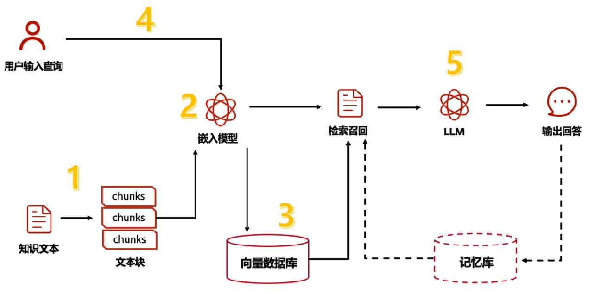

## RAG工作流

一个典型的RAG应用有两个主要组成部分：

**索引(Indexing)**：从数据源获取数据并建立索引的管道(pipeline)。*这通常在离线状态下进行。*

**检索和生成(Retrieval and generation)**：实际的RAG链，在运行时接收用户查询，从索引中检索相关数据，然后将其传递给模型。

从原始数据到答案的最常见完整顺序如下：

### 索引(Indexing) 

1. **加载(Load)**：首先我们需要加载数据。这是通过文档加载器[Document Loaders](https://blog.frognew.com/library/agi/langchain/components/document-loaders.html)完成的。
2. **分割(Split)**：文本分割器[Text splitters](https://python.langchain.com/docs/concepts/#text-splitters)将大型文档(`Documents`)分成更小的块(chunks)。这对于索引数据和将其传递给模型都很有用，因为大块数据更难搜索，而且不适合模型有限的上下文窗口。
3. **存储(Store)**：我们需要一个地方来存储和索引我们的分割(splits)，以便后续可以对其进行搜索。这通常使用向量存储[VectorStore](https://blog.frognew.com/library/agi/langchain/components/vector-stores.html)和嵌入模型[Embeddings model](https://blog.frognew.com/library/agi/langchain/components/embedding-models.html)来完成。


### 检索和生成(Retrieval and generation)  

4检索(Retrieve)：给定用户输入，使用检索器[Retriever](https://blog.frognew.com/library/agi/langchain/components/retrievers.html)从存储中检索相关的文本片段。

5生成(Generate)： [ChatModel](https://blog.frognew.com/library/agi/langchain/components/chat-models.html)使用包含问题和检索到的数据的提示来生成答案。

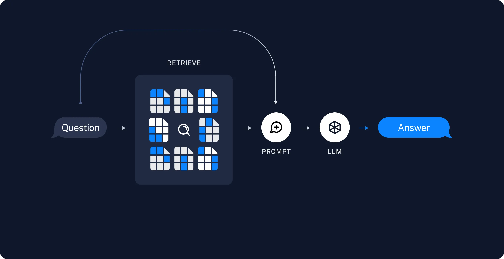

## 文档问答 

### 实现流程 

一个 RAG 程序的 APP 主要有以下流程：

1. 用户在 RAG 客户端上传一个txt文件
2. 服务器端接收客户端文件，存储在服务端
3. 服务器端程序对文件进行读取
4. 对文件内容进行拆分，防止一次性塞给 Embedding 模型超 token 限制
5. 把 Embedding 后的内容存储在向量数据库，生成检索器
6. 程序准备就绪，允许用户进行提问
7. 用户提出问题，大模型调用检索器检索文档，把相关片段找出来后，组织后，回复用户。

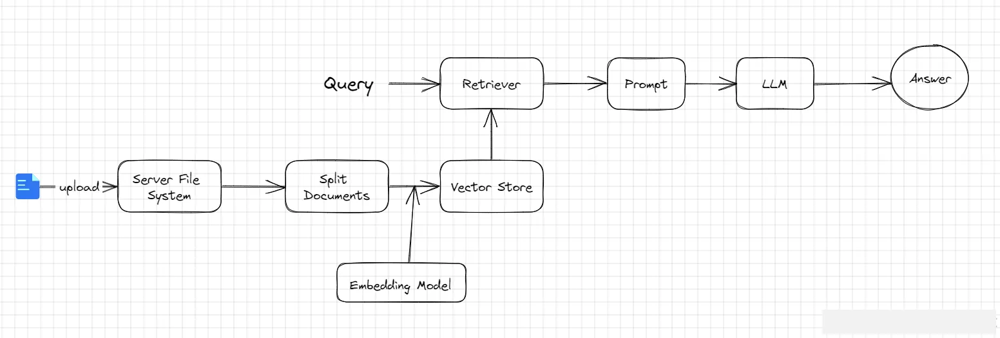

### 代码实现 

使用 Streamlit 实现文件上传，我这里只实现了 txt 文件上传，其实这里可以在 [type](https://so.csdn.net/so/search?q=type&spm=1001.2101.3001.7020) 参数里面设置多个文件类型，在后面的检索器方法里

面针对每个类型进行处理即可。

#### 实现文件上传

```
import streamlit as st

# 上传txt文件，允许上传多个文件
uploaded_files = st.sidebar.file_uploader(
    label="上传txt文件", type=["txt"], accept_multiple_files=True
)
if not uploaded_files:
    st.info("请先上传按TXT文档。")
    st.stop()
```

#### 实现检索器 

注意 chunk_size 最大设置数值取决于 Embedding 模型允许单词的最大字符数限制。

```
import tempfile
import os
from langchain.document_loaders import TextLoader
from langchain_community.embeddings import QianfanEmbeddingsEndpoint
from langchain_chroma import Chroma
from langchain_text_splitters import RecursiveCharacterTextSplitter

# 实现检索器
@st.cache_resource(ttl="1h")
def configure_retriever(uploaded_files):
    # 读取上传的文档，并写入一个临时目录
    docs = []
    temp_dir = tempfile.TemporaryDirectory(dir=r"D:\\")
    for file in uploaded_files:
        temp_filepath = os.path.join(temp_dir.name, file.name)
        with open(temp_filepath, "wb") as f:
            f.write(file.getvalue())
        loader = TextLoader(temp_filepath, encoding="utf-8")
        docs.extend(loader.load())

    # 进行文档分割
    text_splitter = RecursiveCharacterTextSplitter(chunk_size=300, chunk_overlap=30)
    splits = text_splitter.split_documents(docs)

    # 这里使用了OpenAI向量模型
    embeddings = OpenAIEmbeddings()
    vectordb = Chroma.from_documents(splits, embeddings)

    retriever = vectordb.as_retriever()

    return retriever


retriever = configure_retriever(uploaded_files)
```

#### 创建检索工具 

langchain 提供了 create_retriever_tool 工具，可以直接用。

```
# 创建检索工具
from langchain.tools.retriever import create_retriever_tool

tool = create_retriever_tool(
    retriever,
    "文档检索",
    "用于检索用户提出的问题，并基于检索到的文档内容进行回复.",
)
tools = [tool]
```

#### 创建 React Agent 

```
instructions = """您是一个设计用于查询文档来回答问题的代理。
您可以使用文档检索工具，并基于检索内容来回答问题
您可能不查询文档就知道答案，但是您仍然应该查询文档来获得答案。
如果您从文档中找不到任何信息用于回答问题，则只需返回“抱歉，这个问题我还不知道。”作为答案。
"""

base_prompt_template = """
{instructions}

TOOLS:
------

You have access to the following tools:

{tools}

To use a tool, please use the following format:

•```
Thought: Do I need to use a tool? Yes
Action: the action to take, should be one of [{tool_names}]
Action Input: the input to the action
Observation: the result of the action
•```

When you have a response to say to the Human, or if you do not need to use a tool, you MUST use the format:

•```
Thought: Do I need to use a tool? No
Final Answer: [your response here]
•```

Begin!

Previous conversation history:
{chat_history}

New input: {input}
{agent_scratchpad}"""

base_prompt = PromptTemplate.from_template(base_prompt_template)

prompt = base_prompt.partial(instructions=instructions)

# 创建llm
llm = ChatOpenAI()

# 创建react Agent
agent = create_react_agent(llm, tools, prompt)

agent_executor = AgentExecutor(agent=agent, tools=tools, memory=memory, verbose=False)
```

#### 实现 Agent 回复 

获取用户输入，并回复用户，这里使用 StreamlitCallbackHandler 实现了 React 推理回调，可以让模型的推理过程可见。

```
# 创建聊天输入框
user_query = st.chat_input(placeholder="请开始提问吧!")

if user_query:
    st.session_state.messages.append({"role": "user", "content": user_query})
    st.chat_message("user").write(user_query)

    with st.chat_message("assistant"):
        st_cb = StreamlitCallbackHandler(st.container())
        config = {"callbacks": [st_cb]}
        response = agent_executor.invoke({"input": user_query}, config=config)
        st.session_state.messages.append({"role": "assistant", "content": response["output"]})
        st.write(response["output"])
```

#### 效果

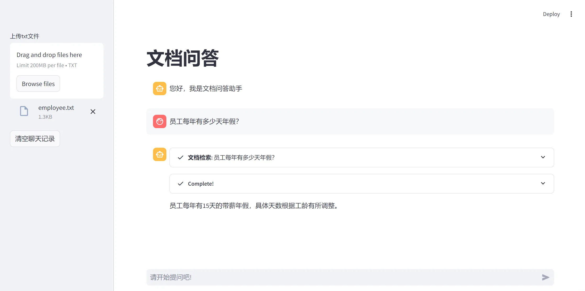

# LangGraph快速入门与底层原理剖析

## LangGraph

🦜🕸️LangGraph ⚡ 以图的方式构建语言代理 ⚡

官方文档地址：https://langchain-ai.github.io/langgraph/

LangGraph 是一个用于构建具有 LLMs 的有状态、多角色应用程序的库，用于创建代理和多代理工作流。与其他 LLM 框架相比，它提供了以下核心优势：循环、可控性和持久性。

LangGraph 允许您定义涉及循环的流程，这对于大多数代理架构至关重要。作为一种非常底层的框架，它提供了对应用程序的流程和状态的精细控制，这对创建可靠的代理至关重要。此外，LangGraph 包含内置的持久性，可以实现高级的“人机交互”和内存功能。

LangGraph 是 LangChain 的高级库，为大型语言模型（LLM）带来循环[计算能力](https://so.csdn.net/so/search?q=计算能力&spm=1001.2101.3001.7020)。它超越了 LangChain 的线性工作流，通过循环支持复杂的任务处理。

- **状态**：维护计算过程中的上下文，实现基于累积数据的动态决策。
- **节点**：代表计算步骤，执行特定任务，可定制以适应不同工作流。
- **边**：连接节点，定义计算流程，支持条件逻辑，实现复杂工作流

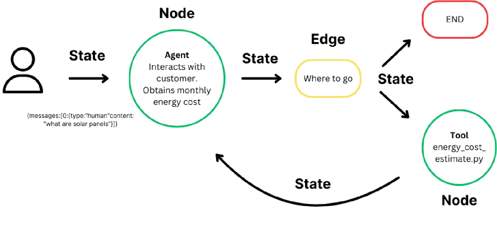

### 主要功能

- **循环和分支**：在您的应用程序中实现循环和条件语句。
- **持久性**：在图中的每个步骤之后自动保存状态。在任何时候暂停和恢复图执行以支持错误恢复、“人机交互”工作流、时间旅行等等。
- **“人机交互”**：中断图执行以批准或编辑代理计划的下一个动作。
- **流支持**：在每个节点产生输出时流式传输输出（包括令牌流式传输）。
- **与 LangChain 集成**：LangGraph 与 [LangChain](https://github.com/langchain-ai/langchain/) 和 [LangSmith](https://docs.smith.langchain.com/) 无缝集成（但不需要它们）。

### 安装

```plain
pip install -U langgraph
```

### 示例

LangGraph 的一个核心概念是状态。每次图执行都会创建一个状态，该状态在图中的节点执行时传递，每个节点在执行后使用其返回值更新此内部状态。图更新其内部状态的方式由所选图类型或自定义函数定义。

让我们看一个可以使用搜索工具的简单代理示例。

```python
pip install langchain-openai
setx OPENAI_BASE_URL "https://api.openai.com/v1"
setx OPENAI_API_KEY "sk-xxxxxxxxxxxxxxxxxxxxxxxxxxxxxxxxxxxxxxxxxxxxxxxx"
```

可以选择设置 [LangSmith](https://docs.smith.langchain.com/) 以实现最佳的可观察性。

```plain
setx LANGSMITH_TRACING "true"
setx LANGSMITH_API_KEY "xxxxxxxxxxxxxxxx"
#示例：langgraph_hello.py
from typing import Literal
from langchain_core.messages import HumanMessage
from langchain_core.tools import tool
from langchain_openai import ChatOpenAI
# pip install langgraph
from langgraph.checkpoint.memory import MemorySaver
from langgraph.graph import END, StateGraph, MessagesState
from langgraph.prebuilt import ToolNode

# 定义工具函数，用于代理调用外部工具
@tool
def search(query: str):
    """模拟一个搜索工具"""
    if "上海" in query.lower() or "Shanghai" in query.lower():
        return "现在30度，有雾."
    return "现在是35度，阳光明媚。"


# 将工具函数放入工具列表
tools = [search]

# 创建工具节点
tool_node = ToolNode(tools)

# 1.初始化模型和工具，定义并绑定工具到模型
model = ChatOpenAI(model="gpt-4o", temperature=0).bind_tools(tools)

# 定义函数，决定是否继续执行
def should_continue(state: MessagesState) -> Literal["tools", END]:
    messages = state['messages']
    last_message = messages[-1]
    # 如果LLM调用了工具，则转到“tools”节点
    if last_message.tool_calls:
        return "tools"
    # 否则，停止（回复用户）
    return END


# 定义调用模型的函数
def call_model(state: MessagesState):
    messages = state['messages']
    response = model.invoke(messages)
    # 返回列表，因为这将被添加到现有列表中
    return {"messages": [response]}

# 2.用状态初始化图，定义一个新的状态图
workflow = StateGraph(MessagesState)
# 3.定义图节点，定义我们将循环的两个节点
workflow.add_node("agent", call_model)
workflow.add_node("tools", tool_node)

# 4.定义入口点和图边
# 设置入口点为“agent”
# 这意味着这是第一个被调用的节点
workflow.set_entry_point("agent")

# 添加条件边
workflow.add_conditional_edges(
    # 首先，定义起始节点。我们使用`agent`。
    # 这意味着这些边是在调用`agent`节点后采取的。
    "agent",
    # 接下来，传递决定下一个调用节点的函数。
    should_continue,
)

# 添加从`tools`到`agent`的普通边。
# 这意味着在调用`tools`后，接下来调用`agent`节点。
workflow.add_edge("tools", 'agent')

# 初始化内存以在图运行之间持久化状态
checkpointer = MemorySaver()

# 5.编译图
# 这将其编译成一个LangChain可运行对象，
# 这意味着你可以像使用其他可运行对象一样使用它。
# 注意，我们（可选地）在编译图时传递内存
app = workflow.compile(checkpointer=checkpointer)

# 6.执行图，使用可运行对象
final_state = app.invoke(
    {"messages": [HumanMessage(content="上海的天气怎么样?")]},
    config={"configurable": {"thread_id": 42}}
)
# 从 final_state 中获取最后一条消息的内容
result = final_state["messages"][-1].content
print(result)
final_state = app.invoke(
    {"messages": [HumanMessage(content="我问的那个城市?")]},
    config={"configurable": {"thread_id": 42}}
)
result = final_state["messages"][-1].content
print(result)
上海现在的天气是30度，有雾。
```

现在，当我们传递相同的 `"thread_id"` 时，对话上下文将通过保存的状态（即存储的消息列表）保留下来。

```python
final_state = app.invoke(
    {"messages": [HumanMessage(content="我问的那个城市?")]},
    config={"configurable": {"thread_id": 42}}
)
result = final_state["messages"][-1].content
print(result)
你问的是上海的天气。上海现在的天气是30度，有雾。
```

### 逐步分解

#### 1. 初始化模型和工具

- 我们使用 `ChatOpenAI` 作为我们的 LLM。**注意：**我们需要确保模型知道可以使用哪些工具。我们可以通过将 LangChain 工具转换为 OpenAI 工具调用格式来完成此操作，方法是使用 `.bind_tools()` 方法。
- 我们定义要使用的工具——在本例中是搜索工具。创建自己的工具非常容易——请参阅此处的文档了解如何操作 [此处](http://python.langchain.ac.cn/docs/modules/agents/tools/custom_tools)。

#### 2. 用状态初始化图

- 我们通过传递状态模式（在本例中为 `MessagesState`）来初始化图（`StateGraph`）。
- `MessagesState` 是一个预构建的状态模式，它具有一个属性，一个 LangChain `Message` 对象列表，以及将每个节点的更新合并到状态中的逻辑。

#### 3. 定义图节点

我们需要两个主要节点

- `agent` 节点：负责决定采取什么（如果有）行动。
- 调用工具的 `tools` 节点：如果代理决定采取行动，此节点将执行该行动。

#### 4. 定义入口点和图边

首先，我们需要设置图执行的入口点——`agent` 节点。

然后，我们定义一个普通边和一个条件边。条件边意味着目的地取决于图状态（`MessageState`）的内容。在本例中，目的地在代理（LLM）决定之前是未知的。

- 条件边：调用代理后，我们应该要么

- a. 如果代理说要采取行动，则运行工具
- b. 如果代理没有要求运行工具，则完成（回复用户）。

- 普通边：调用工具后，图应该始终返回到代理以决定下一步操作。

#### 5. 编译图

- 当我们编译图时，我们将其转换为 LangChain Runnable，这会自动启用使用您的输入调用 `.invoke()`、`.stream()` 和 `.batch()`。
- 我们还可以选择传递检查点对象以在图运行之间持久化状态，并启用内存、“人机交互”工作流、时间旅行等等。在本例中，我们使用 `MemorySaver`——一个简单的内存中检查点。

#### 6. 执行图

1. LangGraph 将输入消息添加到内部状态，然后将状态传递给入口点节点 `"agent"`。
2. `"agent"` 节点执行，调用聊天模型。
3. 聊天模型返回 `AIMessage`。LangGraph 将其添加到状态中。
4. 图循环以下步骤，直到 `AIMessage` 上不再有 `tool_calls`。
   - 如果 `AIMessage` 具有 `tool_calls`，则 `"tools"` 节点执行。
   - `"agent"` 节点再次执行并返回 `AIMessage`。
5. 执行进度到特殊的 `END` 值，并输出最终状态。因此，我们得到所有聊天消息的列表作为输出。

# LangGraph快速构建Agent工作流应用

## Agent工作流 

下面展示了如何创建一个“计划并执行”风格的代理。 这在很大程度上借鉴了 [计划和解决](https://arxiv.org/abs/2305.04091) 论文以及 [Baby-AGI](https://github.com/yoheinakajima/babyagi) 项目。

核心思想是先制定一个多步骤计划，然后逐项执行。 完成一项特定任务后，您可以重新审视计划并根据需要进行修改。

一般的计算图如下所示

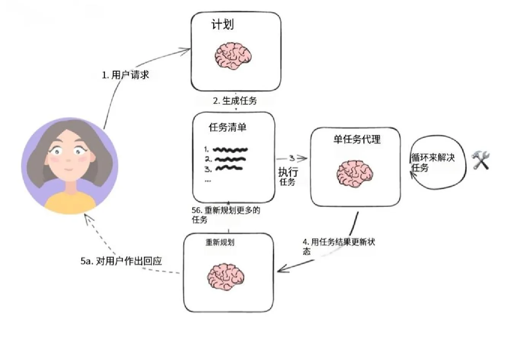

这与典型的 [ReAct](https://arxiv.org/abs/2210.03629) 风格的代理进行了比较，在该代理中，您一次思考一步。 这种“计划并执行”风格代理的优势在于

1. 明确的长期规划（即使是真正强大的 LLM 也可能难以做到）
2. 能够使用更小/更弱的模型来执行步骤，仅在规划步骤中使用更大/更好的模型

以下演练演示了如何在 LangGraph 中实现这一点。 生成的代理将留下类似以下示例的轨迹： ([链接](https://smith.langchain.com/public/d46e24d3-dda6-44d5-9550-b618fca4e0d4/r)).

### 设置 

首先，我们需要安装所需的软件包。

```
pip install --quiet -U langgraph langchain-community langchain-openai tavily-python
```

接下来，我们需要为 OpenAI（我们将使用的 LLM）和 Tavily（我们将使用的搜索工具）设置 API 密钥

可以选择设置 LangSmith 跟踪的 API 密钥，这将为我们提供一流的可观察性。

```
setx TAVILY_API_KEY ""
# Optional, add tracing in LangSmith
setx LANGCHAIN_TRACING_V2 "true"
setx LANGCHAIN_API_KEY ""
```

### 定义工具 

我们将首先定义要使用的工具。 对于这个简单的示例，我们将使用 Tavily 内置的搜索工具。 但是，创建自己的工具非常容易 - 请参阅有关如何操作的文档 [此处](http://python.langchain.ac.cn/v0.2/docs/how_to/custom_tools)。

```
#示例：plan_execute.py
from langchain_community.tools.tavily_search import TavilySearchResults
# 创建TavilySearchResults工具，设置最大结果数为1
tools = [TavilySearchResults(max_results=1)]
```

### 定义我们的执行代理 

现在我们将创建要用于执行任务的执行代理。 请注意，对于此示例，我们将对每个任务使用相同的执行代理，但这并非必须如此。

```python
from langchain_community.tools import TavilySearchResults
from langgraph.prebuilt import create_react_agent
from docs.S.LangChain学习记录.demo.getchat import get_key, get_chat

LANGSMITH_API_KEY = get_chat('LANGSMITH_API_KEY')

# 工具
tools = [TavilySearchResults(tavily_api_key=get_key("tavily_api_key"))]

# 模型
llm = get_chat("gpt-4o")

# 创建 agent
agent_executor = create_react_agent(llm, tools)

response = agent_executor.invoke(
    {
        "messages": [("user", "世界首富有多少钱")]
    }
)

print(response)
```

```
{'messages': [HumanMessage(content='世界首富有多少钱', additional_kwargs={}, response_metadata={}, id='d2271b42-957b-4c3d-9a2b-5f019c5c9517'), AIMessage(content='', additional_kwargs={'tool_calls': [{'id': 'call_ak7YG4vLPT2ylQCXCscWEJ0B', 'function': {'arguments': '{"query":"current net worth of the richest person in the world"}', 'name': 'tavily_search_results_json', 'parameters': None}, 'type': 'function'}], 'refusal': None}, response_metadata={'token_usage': {'completion_tokens': 28, 'prompt_tokens': 84, 'total_tokens': 112, 'completion_tokens_details': {'accepted_prediction_tokens': 0, 'audio_tokens': 0, 'reasoning_tokens': 0, 'rejected_prediction_tokens': 0}, 'prompt_tokens_details': {'audio_tokens': 0, 'cached_tokens': 0}, 'input_tokens': 0, 'output_tokens': 0, 'input_tokens_details': None}, 'model_name': 'gpt-4o', 'system_fingerprint': 'fp_ee1d74bde0', 'id': 'chatcmpl-BiteZffzxaHDnbxOBQwJfrD5FhKrU', 'service_tier': None, 'finish_reason': 'tool_calls', 'logprobs': None}, id='run--f8397354-3cc6-41e7-bbcd-a676deed5731-0', tool_calls=[{'name': 'tavily_search_results_json', 'args': {'query': 'current net worth of the richest person in the world'}, 'id': 'call_ak7YG4vLPT2ylQCXCscWEJ0B', 'type': 'tool_call'}], usage_metadata={'input_tokens': 84, 'output_tokens': 28, 'total_tokens': 112, 'input_token_details': {'audio': 0, 'cache_read': 0}, 'output_token_details': {'audio': 0, 'reasoning': 0}}), ToolMessage(content='[{"title": "Who is the richest person in the world? See Elon Musk\'s net worth", "url": "https://www.statesman.com/story/news/state/2025/04/14/who-is-the-richest-person-in-the-world-wealthiest-forbes-ranking-list-2025-net-worth-elon-musk/83042795007/", "content": "## Who is the richest person in the world? Hint: He\'s a Texan\\n\\n\\n\\n**Elon Musk** holds the title of the world\'s richest person . He has a net worth of $365.3 billion as of April 2025, [according to the latest Forbes data](https://www.forbes.com/real-time-billionaires/#310717713d78). [...] |  |  |  |  |  |\\n| --- | --- | --- | --- | --- |\\n| **Rank** | **Name** | **Total net worth** | **Entity** | **Country/Region** |\\n| 1 | Elon Musk | $365.3B | Tesla, SpaceX | United States |\\n| 2 | Jeff Bezos | $198.3B | Amazon | United States |\\n| 3 | Mark Zuckerberg | $185.5B | Facebook | United States |\\n| 4 | Larry Ellison | $164.7B | Oracle | United States |\\n| 5 | Warren Buffett | $160.0B | Berkshire Hathaway | United States |\\n| 6 | Bernard Arnault & family | $150.8B | LVMH | France | [...] In 2023, Bettencourt Meyers once again surpassed Walton, who dropped to the third-place spot due to American socialite Julia Koch, who inherited Koch, Inc. ownership stakes from her late husband David Koch. Koch, 62, was estimated to be worth $74.2 billion in the latest Forbes ranking.\\n\\n## LIST: World\'s 10 wealthiest people\\n\\nAll but one of Earth\'s 10 richest people reside in the U.S. Here\'s their rankings and net worth as of April 11, as reported by Forbes:", "score": 0.8649622}, {"title": "Richest people in the world 2025 - Statista", "url": "https://www.statista.com/statistics/272047/top-25-global-billionaires/", "content": "As of March 2025, Elon Musk had a net worth valued at 328.5 billion US dollars, making him the richest man in the world.", "score": 0.850382}, {"title": "Top 10 Richest People in the World 2025: Elon Musk, Jeff Bezos ...", "url": "https://www.indmoney.com/blog/us-stocks/top-10-richest-people-in-the-world", "content": "Tesla founder Elon Musk is the richest man in the world with a net worth of $420 billion, closely followed by Jeff Bezos at $266 billion.", "score": 0.81630427}, {"title": "World\'s 10 Richest People: List Of The Wealthiest Billionaires", "url": "https://www.bankrate.com/investing/worlds-richest-people/", "content": "These billionaires reached their lofty heights through hard work, great ideas, serendipity and plenty of careful planning along the way.\\n\\nHere are the world’s 10 richest people and some of their key investments, according to the [Bloomberg Billionaires Index](https://www.bloomberg.com/billionaires/), as of June 11, 2025.\\n\\n## 1. Elon Musk: $369 billion [...] ### Editorial disclosure\\n\\nAll reviews are prepared by our staff. Opinions expressed are solely\\nthose of the reviewer and have not been reviewed or approved by any\\nadvertiser. The information, including any rates, terms and fees\\nassociated with financial products, presented in the review is accurate\\nas of the date of publication.\\n\\n# The world’s 10 richest people: The wealthiest have $100 billion or more [...] | Person | Wealth | Key investments |\\n| --- | --- | --- |\\n| **1. Elon Musk** | $369 billion | Tesla, SpaceX, Twitter (since renamed X) |\\n| **2. Mark Zuckerberg** | $245 billion | Meta Platforms |\\n| **3. Jeff Bezos** | $234 billion | Amazon, Blue Origin |\\n| **4. Larry Ellison** | $200 billion | Oracle |\\n| **5. Bill Gates** | $177 billion | Microsoft |\\n| **6. Steve Ballmer** | $163 billion | Microsoft |\\n| **7. Larry Page** | $160 billion | Alphabet |", "score": 0.7050753}, {"title": "The Top 10 Richest People In The World In 2025 - Forbes India", "url": "https://www.forbesindia.com/article/explainers/top-10-richest-people-world/85541/1", "content": "| **Name & Rank** | **Net Worth (in $ Billions)** | **Companies/ Source of Wealth** | **Country** |\\n| --- | --- | --- | --- |\\n| #1 Elon Musk | $356.7 | Tesla, SpaceX, X | United States |\\n| #2 Jeff Bezos | $221.0 | Amazon, Blue Origin, The Washington Post, IMDB, Audible | United States |\\n| #3 Mark Zuckerberg | $216.4 | Meta Platforms, Inc. (Facebook, Instagram, WhatsApp) | United States |\\n| #4 Larry Ellison | $191.4 | Oracle Corporation | United States | [...] | **Name & Rank** | **Net Worth (in $ Billions)** | **Companies/ Source of Wealth** | **Country** |\\n| --- | --- | --- | --- |\\n| #1 Elon Musk | $356.7 | Tesla, SpaceX, X | United States |\\n| #2 Jeff Bezos | $221.0 | Amazon, Blue Origin, The Washington Post, IMDB, Audible | United States |\\n| #3 Mark Zuckerberg | $216.4 | Meta Platforms, Inc. (Facebook, Instagram, WhatsApp) | United States |\\n| #4 Larry Ellison | $191.4 | Oracle Corporation | United States | [...] | **Name & Rank** | **Net Worth (in $ Billions)** | **Companies/ Source of Wealth** | **Country** |\\n| --- | --- | --- | --- |\\n| #1 Elon Musk | $356.7 | Tesla, SpaceX, X | United States |\\n| #2 Jeff Bezos | $221.0 | Amazon, Blue Origin, The Washington Post, IMDB, Audible | United States |\\n| #3 Mark Zuckerberg | $216.4 | Meta Platforms, Inc. (Facebook, Instagram, WhatsApp) | United States |\\n| #4 Larry Ellison | $191.4 | Oracle Corporation | United States |", "score": 0.7011614}]', name='tavily_search_results_json', id='32c7e94f-3742-436f-8286-274cca874131', tool_call_id='call_ak7YG4vLPT2ylQCXCscWEJ0B', artifact={'query': 'current net worth of the richest person in the world', 'follow_up_questions': None, 'answer': None, 'images': [], 'results': [{'url': 'https://www.statesman.com/story/news/state/2025/04/14/who-is-the-richest-person-in-the-world-wealthiest-forbes-ranking-list-2025-net-worth-elon-musk/83042795007/', 'title': "Who is the richest person in the world? See Elon Musk's net worth", 'content': "## Who is the richest person in the world? Hint: He's a Texan\n\n\n\n**Elon Musk** holds the title of the world's richest person . He has a net worth of $365.3 billion as of April 2025, [according to the latest Forbes data](https://www.forbes.com/real-time-billionaires/#310717713d78). [...] |  |  |  |  |  |\n| --- | --- | --- | --- | --- |\n| **Rank** | **Name** | **Total net worth** | **Entity** | **Country/Region** |\n| 1 | Elon Musk | $365.3B | Tesla, SpaceX | United States |\n| 2 | Jeff Bezos | $198.3B | Amazon | United States |\n| 3 | Mark Zuckerberg | $185.5B | Facebook | United States |\n| 4 | Larry Ellison | $164.7B | Oracle | United States |\n| 5 | Warren Buffett | $160.0B | Berkshire Hathaway | United States |\n| 6 | Bernard Arnault & family | $150.8B | LVMH | France | [...] In 2023, Bettencourt Meyers once again surpassed Walton, who dropped to the third-place spot due to American socialite Julia Koch, who inherited Koch, Inc. ownership stakes from her late husband David Koch. Koch, 62, was estimated to be worth $74.2 billion in the latest Forbes ranking.\n\n## LIST: World's 10 wealthiest people\n\nAll but one of Earth's 10 richest people reside in the U.S. Here's their rankings and net worth as of April 11, as reported by Forbes:", 'score': 0.8649622, 'raw_content': None}, {'url': 'https://www.statista.com/statistics/272047/top-25-global-billionaires/', 'title': 'Richest people in the world 2025 - Statista', 'content': 'As of March 2025, Elon Musk had a net worth valued at 328.5 billion US dollars, making him the richest man in the world.', 'score': 0.850382, 'raw_content': None}, {'url': 'https://www.indmoney.com/blog/us-stocks/top-10-richest-people-in-the-world', 'title': 'Top 10 Richest People in the World 2025: Elon Musk, Jeff Bezos ...', 'content': 'Tesla founder Elon Musk is the richest man in the world with a net worth of $420 billion, closely followed by Jeff Bezos at $266 billion.', 'score': 0.81630427, 'raw_content': None}, {'url': 'https://www.bankrate.com/investing/worlds-richest-people/', 'title': "World's 10 Richest People: List Of The Wealthiest Billionaires", 'content': 'These billionaires reached their lofty heights through hard work, great ideas, serendipity and plenty of careful planning along the way.\n\nHere are the world’s 10 richest people and some of their key investments, according to the [Bloomberg Billionaires Index](https://www.bloomberg.com/billionaires/), as of June 11, 2025.\n\n## 1. Elon Musk: $369 billion [...] ### Editorial disclosure\n\nAll reviews are prepared by our staff. Opinions expressed are solely\nthose of the reviewer and have not been reviewed or approved by any\nadvertiser. The information, including any rates, terms and fees\nassociated with financial products, presented in the review is accurate\nas of the date of publication.\n\n# The world’s 10 richest people: The wealthiest have $100 billion or more [...] | Person | Wealth | Key investments |\n| --- | --- | --- |\n| **1. Elon Musk** | $369 billion | Tesla, SpaceX, Twitter (since renamed X) |\n| **2. Mark Zuckerberg** | $245 billion | Meta Platforms |\n| **3. Jeff Bezos** | $234 billion | Amazon, Blue Origin |\n| **4. Larry Ellison** | $200 billion | Oracle |\n| **5. Bill Gates** | $177 billion | Microsoft |\n| **6. Steve Ballmer** | $163 billion | Microsoft |\n| **7. Larry Page** | $160 billion | Alphabet |', 'score': 0.7050753, 'raw_content': None}, {'url': 'https://www.forbesindia.com/article/explainers/top-10-richest-people-world/85541/1', 'title': 'The Top 10 Richest People In The World In 2025 - Forbes India', 'content': '| **Name & Rank** | **Net Worth (in $ Billions)** | **Companies/ Source of Wealth** | **Country** |\n| --- | --- | --- | --- |\n| #1 Elon Musk | $356.7 | Tesla, SpaceX, X | United States |\n| #2 Jeff Bezos | $221.0 | Amazon, Blue Origin, The Washington Post, IMDB, Audible | United States |\n| #3 Mark Zuckerberg | $216.4 | Meta Platforms, Inc. (Facebook, Instagram, WhatsApp) | United States |\n| #4 Larry Ellison | $191.4 | Oracle Corporation | United States | [...] | **Name & Rank** | **Net Worth (in $ Billions)** | **Companies/ Source of Wealth** | **Country** |\n| --- | --- | --- | --- |\n| #1 Elon Musk | $356.7 | Tesla, SpaceX, X | United States |\n| #2 Jeff Bezos | $221.0 | Amazon, Blue Origin, The Washington Post, IMDB, Audible | United States |\n| #3 Mark Zuckerberg | $216.4 | Meta Platforms, Inc. (Facebook, Instagram, WhatsApp) | United States |\n| #4 Larry Ellison | $191.4 | Oracle Corporation | United States | [...] | **Name & Rank** | **Net Worth (in $ Billions)** | **Companies/ Source of Wealth** | **Country** |\n| --- | --- | --- | --- |\n| #1 Elon Musk | $356.7 | Tesla, SpaceX, X | United States |\n| #2 Jeff Bezos | $221.0 | Amazon, Blue Origin, The Washington Post, IMDB, Audible | United States |\n| #3 Mark Zuckerberg | $216.4 | Meta Platforms, Inc. (Facebook, Instagram, WhatsApp) | United States |\n| #4 Larry Ellison | $191.4 | Oracle Corporation | United States |', 'score': 0.7011614, 'raw_content': None}], 'response_time': 4.06}), AIMessage(content='截至2025年4月，埃隆·马斯克（Elon Musk）是世界首富，他的净资产为3653亿美元。', additional_kwargs={'refusal': None}, response_metadata={'token_usage': {'completion_tokens': 33, 'prompt_tokens': 1621, 'total_tokens': 1654, 'completion_tokens_details': {'accepted_prediction_tokens': 0, 'audio_tokens': 0, 'reasoning_tokens': 0, 'rejected_prediction_tokens': 0}, 'prompt_tokens_details': {'audio_tokens': 0, 'cached_tokens': 0}, 'input_tokens': 0, 'output_tokens': 0, 'input_tokens_details': None}, 'model_name': 'gpt-4o', 'system_fingerprint': 'fp_ee1d74bde0', 'id': 'chatcmpl-BitefbZ2ju6whsNWfeHSlRRBYy2cC', 'service_tier': None, 'finish_reason': 'stop', 'logprobs': None}, id='run--5f377fa5-4e40-4639-b94d-70b8880366ec-0', usage_metadata={'input_tokens': 1621, 'output_tokens': 33, 'total_tokens': 1654, 'input_token_details': {'audio': 0, 'cache_read': 0}, 'output_token_details': {'audio': 0, 'reasoning': 0}})]}
```

### 定义状态 

定义要跟踪此代理的状态开始。首先，需要跟踪当前计划。 将其表示为字符串列表。接下来，应该跟踪先前执行的步骤。 让其表示为元

组列表（这些元组将包含步骤及其结果）最后，需要一些状态来表示最终响应以及原始输入。

```python
import operator
from typing import Annotated, List, Tuple, TypedDict

# 定义类 用于存储输入、计划、过去的步骤和响应
class PlanExecute(TypedDict):
    input: str
    plan: List[str]
    past_steps: Annotated[List[Tuple], operator.add]
    response: str
```

### 规划步骤 

现在让考虑创建规划步骤。 这将使用函数调用来创建计划。

```python
# 定义plan模型
class Plan(BaseModel):
    """未来要执行的计划"""
    steps: List[str] = Field(
        description="需要执行的不同步骤，应该按顺序排序"
    )

# 创建计划生成模版
planner_prompt = ChatPromptTemplate.from_messages(
    [
        (
            "system",
            """对于给定的目标，提出一个简单的逐步计划。这个计划应该包含独立的任务，如果正确执行将得出正确的答案。不要添加任何多余的步骤。最后一步的结果应该是最终答案。确保每一步都有所有必要的信息 - 不要跳过步骤。""",
        ),
        ("placeholder", "{messages}"),
    ]
)

planner = planner_prompt | llm.with_structured_output(Plan)

response = planner.invoke(
    {
        "messages": [
            ("user", "马云的家乡是哪")
        ]
    }
)

print(response)
```

```
steps=['查找马云的出生地信息。', '确认马云的出生地是中国浙江省杭州市。', '得出结论：马云的家乡是浙江省杭州市。']
```

### 重新规划步骤 

现在，创建一个根据上一步结果重新制定计划的步骤。

```python
# 定义plan模型
class Plan(BaseModel):
    """未来要执行的计划"""
    steps: List[str] = Field(
        description="需要执行的不同步骤，应该按顺序排序"
    )

# 定义响应模型
class Response(BaseModel):
    """用户响应"""
    response: str

# 定义要执行的行为
class Act(BaseModel):
    """要执行的行为"""
    action: Union[Response, Plan] = Field(
        description="要执行的行为。如果要回应用户，使用Response。如果需要进一步使用工具获取答案，使用Plan。"
    )

# 创建一个重新计划的提示词模版
replanner_prompt = ChatPromptTemplate.from_template(
    """
    对于给定的目标，提出一个简单的逐步计划。这个计划应该包含独立的任务，如果正确执行将得出正确的答案。不要添加任何多余的步骤。最后一步的结果应该是最终答案。确保每一步都有所有必要的信息 - 不要跳过步骤。
    
    你的目标是：
    {input}
    
    你的原计划是：
    {plan}
    
    你目前已完成的步骤是：
    {past_steps}
    
    相应地更新你的计划。如果不需要更多步骤并且可以返回给用户，那么就这样回应。如果需要，填写计划。只添加仍然需要完成的步骤。不要返回已完成的步骤作为计划的一部分。
    """
)

# 使用指定提示词创建一个重新计划生成器
replanner = replanner_prompt | llm.with_structured_output(Act)
```

### 创建图 

```python
# 定义主函数
async def main():
    # 定义执行步骤函数
    async def execute_step(state: PlanExecute):
        plan = state["plan"]
        plan_str = "\n".join(f"P{i + 1}. {step}" for i, step in enumerate(plan))
        task = plan[0]
        task_formatted = f"""
        对于以下计划
        {plan_str}\n\n 你的任务是执行第{1}步，{task}.
        """
        agent_response = await agent_executor.ainvoke(
            {"messages": [("user", task_formatted)]}
        )
        return {
            "past_steps": state["past_steps"] + [(task, agent_response["messages"][-1].content)]
        }

    # 定义生成计划函数
    async def plan_step(state: PlanExecute):
        plan = await planner.ainvoke(
            {"messages": [("user", state["input"])]}
        )
        return {"plan": plan.steps}

    # 定义重新生成计划步骤
    async def replan_step(state: PlanExecute):
        output = await planner.ainvoke(state)
        if isinstance(output.action, Response):
            return {"response": output.action.response}
        else:
            return {"plan": output.action.steps}

    # 定义判断函数
    def should_end(state: PlanExecute) -> Literal["agent", "__end__"]:
        if "response" in state and state["response"]:
            return "__end__"
        else:
            return "agent"

    # 创建一个状态图
    workflow = StateGraph(PlanExecute)

    # 添加计划节点
    workflow.add_node("planner", plan_step)

    # 添加一个步骤节点
    workflow.add_node("agent", execute_step)

    # 添加重新计划生成节点
    workflow.add_node("replan", replan_step)

    # 添加开始和计划节点的边
    workflow.add_edge(START, "planner")

    # 添加计划和agent的边
    workflow.add_edge("planner", "agent")

    # 添加agent和重新计划节点的边
    workflow.add_edge("agent", "replan")

    # 添加条件变
    workflow.add_conditional_edges(
        "replan",
        should_end
    )

    # 编译状态图，生成可运行对象
    app = workflow.compile()

    # 保存生成的图片
    graph_png = app.get_graph().draw_mermaid_png()
    with open("plan.png", "wb") as f:
        f.write(graph_png)

asyncio.run(main())
```

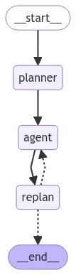

```python
# 设置递归限制
    config = {"recursion_limit": 50}

    # 定义输入
    inputs = {"input": "xtransfer的创始人的家乡是哪？用中文回复"}

    # 执行
    async for event in app.astream(inputs, config=config):
        for k, v in event.items():
            if k != "__end__":
                print(v)
```

```
{'plan': ['访问xTransfer的官方网站或相关的公司介绍页面。', '查找关于公司创始人的信息，通常在“关于我们”或“团队介绍”部分。', '阅读创始人的个人简介，寻找有关其家乡的信息。', '如果官方网站没有提供详细信息，可以搜索相关新闻报道或采访，通常会提到创始人的背景。', '确认创始人的家乡信息后，用中文记录下来。']}
{'past_steps': [('访问xTransfer的官方网站或相关的公司介绍页面。', '你可以访问 [XTransfer 的官方网站](https://www.xtransfer.cn/) 来获取更多关于公司的信息。')]}
{'plan': ['查找关于公司创始人的信息，通常在“关于我们”或“团队介绍”部分。', '阅读创始人的个人简介，寻找有关其家乡的信息。', '如果官方网站没有提供详细信息，可以搜索相关新闻报道或采访，通常会提到创始人的背景。', '确认创始人的家乡信息后，用中文记录下来。']}
{'past_steps': [('访问xTransfer的官方网站或相关的公司介绍页面。', '你可以访问 [XTransfer 的官方网站](https://www.xtransfer.cn/) 来获取更多关于公司的信息。'), ('查找关于公司创始人的信息，通常在“关于我们”或“团队介绍”部分。', '请提供公司名称或官方网站的链接，以便我可以帮助您查找关于公司创始人的信息。')]}
{'plan': ['阅读创始人的个人简介，寻找有关其家乡的信息。', '如果官方网站没有提供详细信息，可以搜索相关新闻报道或采访，通常会提到创始人的背景。', '确认创始人的家乡信息后，用中文记录下来。']}
{'past_steps': [('访问xTransfer的官方网站或相关的公司介绍页面。', '你可以访问 [XTransfer 的官方网站](https://www.xtransfer.cn/) 来获取更多关于公司的信息。'), ('访问xTransfer的官方网站或相关的公司介绍页面。', '你可以访问 [XTransfer 的官方网站](https://www.xtransfer.cn/) 来获取更多关于公司的信息。'), ('查找关于公司创始人的信息，通常在“关于我们”或“团队介绍”部分。', '请提供公司名称或官方网站的链接，以便我可以帮助您查找关于公司创始人的信息。'), ('阅读创始人的个人简介，寻找有关其家乡的信息。', '请提供创始人的姓名或相关信息，以便我可以帮助您查找其个人简介。')]}
{'plan': ['如果官方网站没有提供详细信息，可以搜索相关新闻报道或采访，通常会提到创始人的背景。', '确认创始人的家乡信息后，用中文记录下来。']}
{'past_steps': [('访问xTransfer的官方网站或相关的公司介绍页面。', '你可以访问 [XTransfer 的官方网站](https://www.xtransfer.cn/) 来获取更多关于公司的信息。'), ('访问xTransfer的官方网站或相关的公司介绍页面。', '你可以访问 [XTransfer 的官方网站](https://www.xtransfer.cn/) 来获取更多关于公司的信息。'), ('查找关于公司创始人的信息，通常在“关于我们”或“团队介绍”部分。', '请提供公司名称或官方网站的链接，以便我可以帮助您查找关于公司创始人的信息。'), ('访问xTransfer的官方网站或相关的公司介绍页面。', '你可以访问 [XTransfer 的官方网站](https://www.xtransfer.cn/) 来获取更多关于公司的信息。'), ('访问xTransfer的官方网站或相关的公司介绍页面。', '你可以访问 [XTransfer 的官方网站](https://www.xtransfer.cn/) 来获取更多关于公司的信息。'), ('查找关于公司创始人的信息，通常在“关于我们”或“团队介绍”部分。', '请提供公司名称或官方网站的链接，以便我可以帮助您查找关于公司创始人的信息。'), ('阅读创始人的个人简介，寻找有关其家乡的信息。', '请提供创始人的姓名或相关信息，以便我可以帮助您查找其个人简介。'), ('如果官方网站没有提供详细信息，可以搜索相关新闻报道或采访，通常会提到创始人的背景。', '请提供创始人的姓名或相关信息，以便我可以帮助您查找他们的背景信息。')]}
{'plan': ['搜索xTransfer创始人的姓名。', '使用创始人的姓名在搜索引擎中查找相关新闻报道或采访，寻找有关其家乡的信息。', '确认创始人的家乡信息后，用中文记录下来。']}
{'past_steps': [('访问xTransfer的官方网站或相关的公司介绍页面。', '你可以访问 [XTransfer 的官方网站](https://www.xtransfer.cn/) 来获取更多关于公司的信息。'), ('访问xTransfer的官方网站或相关的公司介绍页面。', '你可以访问 [XTransfer 的官方网站](https://www.xtransfer.cn/) 来获取更多关于公司的信息。'), ('查找关于公司创始人的信息，通常在“关于我们”或“团队介绍”部分。', '请提供公司名称或官方网站的链接，以便我可以帮助您查找关于公司创始人的信息。'), ('访问xTransfer的官方网站或相关的公司介绍页面。', '你可以访问 [XTransfer 的官方网站](https://www.xtransfer.cn/) 来获取更多关于公司的信息。'), ('访问xTransfer的官方网站或相关的公司介绍页面。', '你可以访问 [XTransfer 的官方网站](https://www.xtransfer.cn/) 来获取更多关于公司的信息。'), ('查找关于公司创始人的信息，通常在“关于我们”或“团队介绍”部分。', '请提供公司名称或官方网站的链接，以便我可以帮助您查找关于公司创始人的信息。'), ('阅读创始人的个人简介，寻找有关其家乡的信息。', '请提供创始人的姓名或相关信息，以便我可以帮助您查找其个人简介。'), ('访问xTransfer的官方网站或相关的公司介绍页面。', '你可以访问 [XTransfer 的官方网站](https://www.xtransfer.cn/) 来获取更多关于公司的信息。'), ('访问xTransfer的官方网站或相关的公司介绍页面。', '你可以访问 [XTransfer 的官方网站](https://www.xtransfer.cn/) 来获取更多关于公司的信息。'), ('查找关于公司创始人的信息，通常在“关于我们”或“团队介绍”部分。', '请提供公司名称或官方网站的链接，以便我可以帮助您查找关于公司创始人的信息。'), ('访问xTransfer的官方网站或相关的公司介绍页面。', '你可以访问 [XTransfer 的官方网站](https://www.xtransfer.cn/) 来获取更多关于公司的信息。'), ('访问xTransfer的官方网站或相关的公司介绍页面。', '你可以访问 [XTransfer 的官方网站](https://www.xtransfer.cn/) 来获取更多关于公司的信息。'), ('查找关于公司创始人的信息，通常在“关于我们”或“团队介绍”部分。', '请提供公司名称或官方网站的链接，以便我可以帮助您查找关于公司创始人的信息。'), ('阅读创始人的个人简介，寻找有关其家乡的信息。', '请提供创始人的姓名或相关信息，以便我可以帮助您查找其个人简介。'), ('如果官方网站没有提供详细信息，可以搜索相关新闻报道或采访，通常会提到创始人的背景。', '请提供创始人的姓名或相关信息，以便我可以帮助您查找他们的背景信息。'), ('搜索xTransfer创始人的姓名。', 'xTransfer的创始人是邓国标。')]}
{'plan': ['使用创始人邓国标的姓名在搜索引擎中查找相关新闻报道或采访，寻找有关其家乡的信息。', '确认邓国标的家乡信息后，用中文记录下来。']}
{'past_steps': [('访问xTransfer的官方网站或相关的公司介绍页面。', '你可以访问 [XTransfer 的官方网站](https://www.xtransfer.cn/) 来获取更多关于公司的信息。'), ('访问xTransfer的官方网站或相关的公司介绍页面。', '你可以访问 [XTransfer 的官方网站](https://www.xtransfer.cn/) 来获取更多关于公司的信息。'), ('查找关于公司创始人的信息，通常在“关于我们”或“团队介绍”部分。', '请提供公司名称或官方网站的链接，以便我可以帮助您查找关于公司创始人的信息。'), ('访问xTransfer的官方网站或相关的公司介绍页面。', '你可以访问 [XTransfer 的官方网站](https://www.xtransfer.cn/) 来获取更多关于公司的信息。'), ('访问xTransfer的官方网站或相关的公司介绍页面。', '你可以访问 [XTransfer 的官方网站](https://www.xtransfer.cn/) 来获取更多关于公司的信息。'), ('查找关于公司创始人的信息，通常在“关于我们”或“团队介绍”部分。', '请提供公司名称或官方网站的链接，以便我可以帮助您查找关于公司创始人的信息。'), ('阅读创始人的个人简介，寻找有关其家乡的信息。', '请提供创始人的姓名或相关信息，以便我可以帮助您查找其个人简介。'), ('访问xTransfer的官方网站或相关的公司介绍页面。', '你可以访问 [XTransfer 的官方网站](https://www.xtransfer.cn/) 来获取更多关于公司的信息。'), ('访问xTransfer的官方网站或相关的公司介绍页面。', '你可以访问 [XTransfer 的官方网站](https://www.xtransfer.cn/) 来获取更多关于公司的信息。'), ('查找关于公司创始人的信息，通常在“关于我们”或“团队介绍”部分。', '请提供公司名称或官方网站的链接，以便我可以帮助您查找关于公司创始人的信息。'), ('访问xTransfer的官方网站或相关的公司介绍页面。', '你可以访问 [XTransfer 的官方网站](https://www.xtransfer.cn/) 来获取更多关于公司的信息。'), ('访问xTransfer的官方网站或相关的公司介绍页面。', '你可以访问 [XTransfer 的官方网站](https://www.xtransfer.cn/) 来获取更多关于公司的信息。'), ('查找关于公司创始人的信息，通常在“关于我们”或“团队介绍”部分。', '请提供公司名称或官方网站的链接，以便我可以帮助您查找关于公司创始人的信息。'), ('阅读创始人的个人简介，寻找有关其家乡的信息。', '请提供创始人的姓名或相关信息，以便我可以帮助您查找其个人简介。'), ('如果官方网站没有提供详细信息，可以搜索相关新闻报道或采访，通常会提到创始人的背景。', '请提供创始人的姓名或相关信息，以便我可以帮助您查找他们的背景信息。'), ('访问xTransfer的官方网站或相关的公司介绍页面。', '你可以访问 [XTransfer 的官方网站](https://www.xtransfer.cn/) 来获取更多关于公司的信息。'), ('访问xTransfer的官方网站或相关的公司介绍页面。', '你可以访问 [XTransfer 的官方网站](https://www.xtransfer.cn/) 来获取更多关于公司的信息。'), ('查找关于公司创始人的信息，通常在“关于我们”或“团队介绍”部分。', '请提供公司名称或官方网站的链接，以便我可以帮助您查找关于公司创始人的信息。'), ('访问xTransfer的官方网站或相关的公司介绍页面。', '你可以访问 [XTransfer 的官方网站](https://www.xtransfer.cn/) 来获取更多关于公司的信息。'), ('访问xTransfer的官方网站或相关的公司介绍页面。', '你可以访问 [XTransfer 的官方网站](https://www.xtransfer.cn/) 来获取更多关于公司的信息。'), ('查找关于公司创始人的信息，通常在“关于我们”或“团队介绍”部分。', '请提供公司名称或官方网站的链接，以便我可以帮助您查找关于公司创始人的信息。'), ('阅读创始人的个人简介，寻找有关其家乡的信息。', '请提供创始人的姓名或相关信息，以便我可以帮助您查找其个人简介。'), ('访问xTransfer的官方网站或相关的公司介绍页面。', '你可以访问 [XTransfer 的官方网站](https://www.xtransfer.cn/) 来获取更多关于公司的信息。'), ('访问xTransfer的官方网站或相关的公司介绍页面。', '你可以访问 [XTransfer 的官方网站](https://www.xtransfer.cn/) 来获取更多关于公司的信息。'), ('查找关于公司创始人的信息，通常在“关于我们”或“团队介绍”部分。', '请提供公司名称或官方网站的链接，以便我可以帮助您查找关于公司创始人的信息。'), ('访问xTransfer的官方网站或相关的公司介绍页面。', '你可以访问 [XTransfer 的官方网站](https://www.xtransfer.cn/) 来获取更多关于公司的信息。'), ('访问xTransfer的官方网站或相关的公司介绍页面。', '你可以访问 [XTransfer 的官方网站](https://www.xtransfer.cn/) 来获取更多关于公司的信息。'), ('查找关于公司创始人的信息，通常在“关于我们”或“团队介绍”部分。', '请提供公司名称或官方网站的链接，以便我可以帮助您查找关于公司创始人的信息。'), ('阅读创始人的个人简介，寻找有关其家乡的信息。', '请提供创始人的姓名或相关信息，以便我可以帮助您查找其个人简介。'), ('如果官方网站没有提供详细信息，可以搜索相关新闻报道或采访，通常会提到创始人的背景。', '请提供创始人的姓名或相关信息，以便我可以帮助您查找他们的背景信息。'), ('搜索xTransfer创始人的姓名。', 'xTransfer的创始人是邓国标。'), ('使用创始人邓国标的姓名在搜索引擎中查找相关新闻报道或采访，寻找有关其家乡的信息。', '在搜索结果中，没有找到明确提到邓国标家乡的信息。搜索结果主要涉及邓国标的职业生涯和公司活动。如果需要进一步确认邓国标的家乡信息，可能需要更深入的调查或访问其他来源。')]}
{'plan': ['联系xTransfer的公共关系或媒体联系人，询问邓国标的家乡信息。', '访问社交媒体平台，查看邓国标的个人资料或发布的内容，寻找有关其家乡的线索。', '如果以上方法无效，考虑联系相关行业的专业人士或记者，询问他们是否有关于邓国标家乡的信息。']}
{'past_steps': [('访问xTransfer的官方网站或相关的公司介绍页面。', '你可以访问 [XTransfer 的官方网站](https://www.xtransfer.cn/) 来获取更多关于公司的信息。'), ('访问xTransfer的官方网站或相关的公司介绍页面。', '你可以访问 [XTransfer 的官方网站](https://www.xtransfer.cn/) 来获取更多关于公司的信息。'), ('查找关于公司创始人的信息，通常在“关于我们”或“团队介绍”部分。', '请提供公司名称或官方网站的链接，以便我可以帮助您查找关于公司创始人的信息。'), ('访问xTransfer的官方网站或相关的公司介绍页面。', '你可以访问 [XTransfer 的官方网站](https://www.xtransfer.cn/) 来获取更多关于公司的信息。'), ('访问xTransfer的官方网站或相关的公司介绍页面。', '你可以访问 [XTransfer 的官方网站](https://www.xtransfer.cn/) 来获取更多关于公司的信息。'), ('查找关于公司创始人的信息，通常在“关于我们”或“团队介绍”部分。', '请提供公司名称或官方网站的链接，以便我可以帮助您查找关于公司创始人的信息。'), ('阅读创始人的个人简介，寻找有关其家乡的信息。', '请提供创始人的姓名或相关信息，以便我可以帮助您查找其个人简介。'), ('访问xTransfer的官方网站或相关的公司介绍页面。', '你可以访问 [XTransfer 的官方网站](https://www.xtransfer.cn/) 来获取更多关于公司的信息。'), ('访问xTransfer的官方网站或相关的公司介绍页面。', '你可以访问 [XTransfer 的官方网站](https://www.xtransfer.cn/) 来获取更多关于公司的信息。'), ('查找关于公司创始人的信息，通常在“关于我们”或“团队介绍”部分。', '请提供公司名称或官方网站的链接，以便我可以帮助您查找关于公司创始人的信息。'), ('访问xTransfer的官方网站或相关的公司介绍页面。', '你可以访问 [XTransfer 的官方网站](https://www.xtransfer.cn/) 来获取更多关于公司的信息。'), ('访问xTransfer的官方网站或相关的公司介绍页面。', '你可以访问 [XTransfer 的官方网站](https://www.xtransfer.cn/) 来获取更多关于公司的信息。'), ('查找关于公司创始人的信息，通常在“关于我们”或“团队介绍”部分。', '请提供公司名称或官方网站的链接，以便我可以帮助您查找关于公司创始人的信息。'), ('阅读创始人的个人简介，寻找有关其家乡的信息。', '请提供创始人的姓名或相关信息，以便我可以帮助您查找其个人简介。'), ('如果官方网站没有提供详细信息，可以搜索相关新闻报道或采访，通常会提到创始人的背景。', '请提供创始人的姓名或相关信息，以便我可以帮助您查找他们的背景信息。'), ('访问xTransfer的官方网站或相关的公司介绍页面。', '你可以访问 [XTransfer 的官方网站](https://www.xtransfer.cn/) 来获取更多关于公司的信息。'), ('访问xTransfer的官方网站或相关的公司介绍页面。', '你可以访问 [XTransfer 的官方网站](https://www.xtransfer.cn/) 来获取更多关于公司的信息。'), ('查找关于公司创始人的信息，通常在“关于我们”或“团队介绍”部分。', '请提供公司名称或官方网站的链接，以便我可以帮助您查找关于公司创始人的信息。'), ('访问xTransfer的官方网站或相关的公司介绍页面。', '你可以访问 [XTransfer 的官方网站](https://www.xtransfer.cn/) 来获取更多关于公司的信息。'), ('访问xTransfer的官方网站或相关的公司介绍页面。', '你可以访问 [XTransfer 的官方网站](https://www.xtransfer.cn/) 来获取更多关于公司的信息。'), ('查找关于公司创始人的信息，通常在“关于我们”或“团队介绍”部分。', '请提供公司名称或官方网站的链接，以便我可以帮助您查找关于公司创始人的信息。'), ('阅读创始人的个人简介，寻找有关其家乡的信息。', '请提供创始人的姓名或相关信息，以便我可以帮助您查找其个人简介。'), ('访问xTransfer的官方网站或相关的公司介绍页面。', '你可以访问 [XTransfer 的官方网站](https://www.xtransfer.cn/) 来获取更多关于公司的信息。'), ('访问xTransfer的官方网站或相关的公司介绍页面。', '你可以访问 [XTransfer 的官方网站](https://www.xtransfer.cn/) 来获取更多关于公司的信息。'), ('查找关于公司创始人的信息，通常在“关于我们”或“团队介绍”部分。', '请提供公司名称或官方网站的链接，以便我可以帮助您查找关于公司创始人的信息。'), ('访问xTransfer的官方网站或相关的公司介绍页面。', '你可以访问 [XTransfer 的官方网站](https://www.xtransfer.cn/) 来获取更多关于公司的信息。'), ('访问xTransfer的官方网站或相关的公司介绍页面。', '你可以访问 [XTransfer 的官方网站](https://www.xtransfer.cn/) 来获取更多关于公司的信息。'), ('查找关于公司创始人的信息，通常在“关于我们”或“团队介绍”部分。', '请提供公司名称或官方网站的链接，以便我可以帮助您查找关于公司创始人的信息。'), ('阅读创始人的个人简介，寻找有关其家乡的信息。', '请提供创始人的姓名或相关信息，以便我可以帮助您查找其个人简介。'), ('如果官方网站没有提供详细信息，可以搜索相关新闻报道或采访，通常会提到创始人的背景。', '请提供创始人的姓名或相关信息，以便我可以帮助您查找他们的背景信息。'), ('搜索xTransfer创始人的姓名。', 'xTransfer的创始人是邓国标。'), ('访问xTransfer的官方网站或相关的公司介绍页面。', '你可以访问 [XTransfer 的官方网站](https://www.xtransfer.cn/) 来获取更多关于公司的信息。'), ('访问xTransfer的官方网站或相关的公司介绍页面。', '你可以访问 [XTransfer 的官方网站](https://www.xtransfer.cn/) 来获取更多关于公司的信息。'), ('查找关于公司创始人的信息，通常在“关于我们”或“团队介绍”部分。', '请提供公司名称或官方网站的链接，以便我可以帮助您查找关于公司创始人的信息。'), ('访问xTransfer的官方网站或相关的公司介绍页面。', '你可以访问 [XTransfer 的官方网站](https://www.xtransfer.cn/) 来获取更多关于公司的信息。'), ('访问xTransfer的官方网站或相关的公司介绍页面。', '你可以访问 [XTransfer 的官方网站](https://www.xtransfer.cn/) 来获取更多关于公司的信息。'), ('查找关于公司创始人的信息，通常在“关于我们”或“团队介绍”部分。', '请提供公司名称或官方网站的链接，以便我可以帮助您查找关于公司创始人的信息。'), ('阅读创始人的个人简介，寻找有关其家乡的信息。', '请提供创始人的姓名或相关信息，以便我可以帮助您查找其个人简介。'), ('访问xTransfer的官方网站或相关的公司介绍页面。', '你可以访问 [XTransfer 的官方网站](https://www.xtransfer.cn/) 来获取更多关于公司的信息。'), ('访问xTransfer的官方网站或相关的公司介绍页面。', '你可以访问 [XTransfer 的官方网站](https://www.xtransfer.cn/) 来获取更多关于公司的信息。'), ('查找关于公司创始人的信息，通常在“关于我们”或“团队介绍”部分。', '请提供公司名称或官方网站的链接，以便我可以帮助您查找关于公司创始人的信息。'), ('访问xTransfer的官方网站或相关的公司介绍页面。', '你可以访问 [XTransfer 的官方网站](https://www.xtransfer.cn/) 来获取更多关于公司的信息。'), ('访问xTransfer的官方网站或相关的公司介绍页面。', '你可以访问 [XTransfer 的官方网站](https://www.xtransfer.cn/) 来获取更多关于公司的信息。'), ('查找关于公司创始人的信息，通常在“关于我们”或“团队介绍”部分。', '请提供公司名称或官方网站的链接，以便我可以帮助您查找关于公司创始人的信息。'), ('阅读创始人的个人简介，寻找有关其家乡的信息。', '请提供创始人的姓名或相关信息，以便我可以帮助您查找其个人简介。'), ('如果官方网站没有提供详细信息，可以搜索相关新闻报道或采访，通常会提到创始人的背景。', '请提供创始人的姓名或相关信息，以便我可以帮助您查找他们的背景信息。'), ('访问xTransfer的官方网站或相关的公司介绍页面。', '你可以访问 [XTransfer 的官方网站](https://www.xtransfer.cn/) 来获取更多关于公司的信息。'), ('访问xTransfer的官方网站或相关的公司介绍页面。', '你可以访问 [XTransfer 的官方网站](https://www.xtransfer.cn/) 来获取更多关于公司的信息。'), ('查找关于公司创始人的信息，通常在“关于我们”或“团队介绍”部分。', '请提供公司名称或官方网站的链接，以便我可以帮助您查找关于公司创始人的信息。'), ('访问xTransfer的官方网站或相关的公司介绍页面。', '你可以访问 [XTransfer 的官方网站](https://www.xtransfer.cn/) 来获取更多关于公司的信息。'), ('访问xTransfer的官方网站或相关的公司介绍页面。', '你可以访问 [XTransfer 的官方网站](https://www.xtransfer.cn/) 来获取更多关于公司的信息。'), ('查找关于公司创始人的信息，通常在“关于我们”或“团队介绍”部分。', '请提供公司名称或官方网站的链接，以便我可以帮助您查找关于公司创始人的信息。'), ('阅读创始人的个人简介，寻找有关其家乡的信息。', '请提供创始人的姓名或相关信息，以便我可以帮助您查找其个人简介。'), ('访问xTransfer的官方网站或相关的公司介绍页面。', '你可以访问 [XTransfer 的官方网站](https://www.xtransfer.cn/) 来获取更多关于公司的信息。'), ('访问xTransfer的官方网站或相关的公司介绍页面。', '你可以访问 [XTransfer 的官方网站](https://www.xtransfer.cn/) 来获取更多关于公司的信息。'), ('查找关于公司创始人的信息，通常在“关于我们”或“团队介绍”部分。', '请提供公司名称或官方网站的链接，以便我可以帮助您查找关于公司创始人的信息。'), ('访问xTransfer的官方网站或相关的公司介绍页面。', '你可以访问 [XTransfer 的官方网站](https://www.xtransfer.cn/) 来获取更多关于公司的信息。'), ('访问xTransfer的官方网站或相关的公司介绍页面。', '你可以访问 [XTransfer 的官方网站](https://www.xtransfer.cn/) 来获取更多关于公司的信息。'), ('查找关于公司创始人的信息，通常在“关于我们”或“团队介绍”部分。', '请提供公司名称或官方网站的链接，以便我可以帮助您查找关于公司创始人的信息。'), ('阅读创始人的个人简介，寻找有关其家乡的信息。', '请提供创始人的姓名或相关信息，以便我可以帮助您查找其个人简介。'), ('如果官方网站没有提供详细信息，可以搜索相关新闻报道或采访，通常会提到创始人的背景。', '请提供创始人的姓名或相关信息，以便我可以帮助您查找他们的背景信息。'), ('搜索xTransfer创始人的姓名。', 'xTransfer的创始人是邓国标。'), ('使用创始人邓国标的姓名在搜索引擎中查找相关新闻报道或采访，寻找有关其家乡的信息。', '在搜索结果中，没有找到明确提到邓国标家乡的信息。搜索结果主要涉及邓国标的职业生涯和公司活动。如果需要进一步确认邓国标的家乡信息，可能需要更深入的调查或访问其他来源。'), ('联系xTransfer的公共关系或媒体联系人，询问邓国标的家乡信息。', "To contact xTransfer's public relations or media contact, you can reach out to Maggie Ng, the Public Relations Director. Here are her contact details:\n\n- **Email**: [maggie.ng@xtransfer.com](mailto:maggie.ng@xtransfer.com)\n- **Phone**: +852 6287 2989\n\nYou can use this information to inquire about Deng Guobiao's hometown.")]}
{'plan': ['联系xTransfer的公共关系或媒体联系人，询问邓国标的家乡信息。']}
{'past_steps': [('访问xTransfer的官方网站或相关的公司介绍页面。', '你可以访问 [XTransfer 的官方网站](https://www.xtransfer.cn/) 来获取更多关于公司的信息。'), ('访问xTransfer的官方网站或相关的公司介绍页面。', '你可以访问 [XTransfer 的官方网站](https://www.xtransfer.cn/) 来获取更多关于公司的信息。'), ('查找关于公司创始人的信息，通常在“关于我们”或“团队介绍”部分。', '请提供公司名称或官方网站的链接，以便我可以帮助您查找关于公司创始人的信息。'), ('访问xTransfer的官方网站或相关的公司介绍页面。', '你可以访问 [XTransfer 的官方网站](https://www.xtransfer.cn/) 来获取更多关于公司的信息。'), ('访问xTransfer的官方网站或相关的公司介绍页面。', '你可以访问 [XTransfer 的官方网站](https://www.xtransfer.cn/) 来获取更多关于公司的信息。'), ('查找关于公司创始人的信息，通常在“关于我们”或“团队介绍”部分。', '请提供公司名称或官方网站的链接，以便我可以帮助您查找关于公司创始人的信息。'), ('阅读创始人的个人简介，寻找有关其家乡的信息。', '请提供创始人的姓名或相关信息，以便我可以帮助您查找其个人简介。'), ('访问xTransfer的官方网站或相关的公司介绍页面。', '你可以访问 [XTransfer 的官方网站](https://www.xtransfer.cn/) 来获取更多关于公司的信息。'), ('访问xTransfer的官方网站或相关的公司介绍页面。', '你可以访问 [XTransfer 的官方网站](https://www.xtransfer.cn/) 来获取更多关于公司的信息。'), ('查找关于公司创始人的信息，通常在“关于我们”或“团队介绍”部分。', '请提供公司名称或官方网站的链接，以便我可以帮助您查找关于公司创始人的信息。'), ('访问xTransfer的官方网站或相关的公司介绍页面。', '你可以访问 [XTransfer 的官方网站](https://www.xtransfer.cn/) 来获取更多关于公司的信息。'), ('访问xTransfer的官方网站或相关的公司介绍页面。', '你可以访问 [XTransfer 的官方网站](https://www.xtransfer.cn/) 来获取更多关于公司的信息。'), ('查找关于公司创始人的信息，通常在“关于我们”或“团队介绍”部分。', '请提供公司名称或官方网站的链接，以便我可以帮助您查找关于公司创始人的信息。'), ('阅读创始人的个人简介，寻找有关其家乡的信息。', '请提供创始人的姓名或相关信息，以便我可以帮助您查找其个人简介。'), ('如果官方网站没有提供详细信息，可以搜索相关新闻报道或采访，通常会提到创始人的背景。', '请提供创始人的姓名或相关信息，以便我可以帮助您查找他们的背景信息。'), ('访问xTransfer的官方网站或相关的公司介绍页面。', '你可以访问 [XTransfer 的官方网站](https://www.xtransfer.cn/) 来获取更多关于公司的信息。'), ('访问xTransfer的官方网站或相关的公司介绍页面。', '你可以访问 [XTransfer 的官方网站](https://www.xtransfer.cn/) 来获取更多关于公司的信息。'), ('查找关于公司创始人的信息，通常在“关于我们”或“团队介绍”部分。', '请提供公司名称或官方网站的链接，以便我可以帮助您查找关于公司创始人的信息。'), ('访问xTransfer的官方网站或相关的公司介绍页面。', '你可以访问 [XTransfer 的官方网站](https://www.xtransfer.cn/) 来获取更多关于公司的信息。'), ('访问xTransfer的官方网站或相关的公司介绍页面。', '你可以访问 [XTransfer 的官方网站](https://www.xtransfer.cn/) 来获取更多关于公司的信息。'), ('查找关于公司创始人的信息，通常在“关于我们”或“团队介绍”部分。', '请提供公司名称或官方网站的链接，以便我可以帮助您查找关于公司创始人的信息。'), ('阅读创始人的个人简介，寻找有关其家乡的信息。', '请提供创始人的姓名或相关信息，以便我可以帮助您查找其个人简介。'), ('访问xTransfer的官方网站或相关的公司介绍页面。', '你可以访问 [XTransfer 的官方网站](https://www.xtransfer.cn/) 来获取更多关于公司的信息。'), ('访问xTransfer的官方网站或相关的公司介绍页面。', '你可以访问 [XTransfer 的官方网站](https://www.xtransfer.cn/) 来获取更多关于公司的信息。'), ('查找关于公司创始人的信息，通常在“关于我们”或“团队介绍”部分。', '请提供公司名称或官方网站的链接，以便我可以帮助您查找关于公司创始人的信息。'), ('访问xTransfer的官方网站或相关的公司介绍页面。', '你可以访问 [XTransfer 的官方网站](https://www.xtransfer.cn/) 来获取更多关于公司的信息。'), ('访问xTransfer的官方网站或相关的公司介绍页面。', '你可以访问 [XTransfer 的官方网站](https://www.xtransfer.cn/) 来获取更多关于公司的信息。'), ('查找关于公司创始人的信息，通常在“关于我们”或“团队介绍”部分。', '请提供公司名称或官方网站的链接，以便我可以帮助您查找关于公司创始人的信息。'), ('阅读创始人的个人简介，寻找有关其家乡的信息。', '请提供创始人的姓名或相关信息，以便我可以帮助您查找其个人简介。'), ('如果官方网站没有提供详细信息，可以搜索相关新闻报道或采访，通常会提到创始人的背景。', '请提供创始人的姓名或相关信息，以便我可以帮助您查找他们的背景信息。'), ('搜索xTransfer创始人的姓名。', 'xTransfer的创始人是邓国标。'), ('访问xTransfer的官方网站或相关的公司介绍页面。', '你可以访问 [XTransfer 的官方网站](https://www.xtransfer.cn/) 来获取更多关于公司的信息。'), ('访问xTransfer的官方网站或相关的公司介绍页面。', '你可以访问 [XTransfer 的官方网站](https://www.xtransfer.cn/) 来获取更多关于公司的信息。'), ('查找关于公司创始人的信息，通常在“关于我们”或“团队介绍”部分。', '请提供公司名称或官方网站的链接，以便我可以帮助您查找关于公司创始人的信息。'), ('访问xTransfer的官方网站或相关的公司介绍页面。', '你可以访问 [XTransfer 的官方网站](https://www.xtransfer.cn/) 来获取更多关于公司的信息。'), ('访问xTransfer的官方网站或相关的公司介绍页面。', '你可以访问 [XTransfer 的官方网站](https://www.xtransfer.cn/) 来获取更多关于公司的信息。'), ('查找关于公司创始人的信息，通常在“关于我们”或“团队介绍”部分。', '请提供公司名称或官方网站的链接，以便我可以帮助您查找关于公司创始人的信息。'), ('阅读创始人的个人简介，寻找有关其家乡的信息。', '请提供创始人的姓名或相关信息，以便我可以帮助您查找其个人简介。'), ('访问xTransfer的官方网站或相关的公司介绍页面。', '你可以访问 [XTransfer 的官方网站](https://www.xtransfer.cn/) 来获取更多关于公司的信息。'), ('访问xTransfer的官方网站或相关的公司介绍页面。', '你可以访问 [XTransfer 的官方网站](https://www.xtransfer.cn/) 来获取更多关于公司的信息。'), ('查找关于公司创始人的信息，通常在“关于我们”或“团队介绍”部分。', '请提供公司名称或官方网站的链接，以便我可以帮助您查找关于公司创始人的信息。'), ('访问xTransfer的官方网站或相关的公司介绍页面。', '你可以访问 [XTransfer 的官方网站](https://www.xtransfer.cn/) 来获取更多关于公司的信息。'), ('访问xTransfer的官方网站或相关的公司介绍页面。', '你可以访问 [XTransfer 的官方网站](https://www.xtransfer.cn/) 来获取更多关于公司的信息。'), ('查找关于公司创始人的信息，通常在“关于我们”或“团队介绍”部分。', '请提供公司名称或官方网站的链接，以便我可以帮助您查找关于公司创始人的信息。'), ('阅读创始人的个人简介，寻找有关其家乡的信息。', '请提供创始人的姓名或相关信息，以便我可以帮助您查找其个人简介。'), ('如果官方网站没有提供详细信息，可以搜索相关新闻报道或采访，通常会提到创始人的背景。', '请提供创始人的姓名或相关信息，以便我可以帮助您查找他们的背景信息。'), ('访问xTransfer的官方网站或相关的公司介绍页面。', '你可以访问 [XTransfer 的官方网站](https://www.xtransfer.cn/) 来获取更多关于公司的信息。'), ('访问xTransfer的官方网站或相关的公司介绍页面。', '你可以访问 [XTransfer 的官方网站](https://www.xtransfer.cn/) 来获取更多关于公司的信息。'), ('查找关于公司创始人的信息，通常在“关于我们”或“团队介绍”部分。', '请提供公司名称或官方网站的链接，以便我可以帮助您查找关于公司创始人的信息。'), ('访问xTransfer的官方网站或相关的公司介绍页面。', '你可以访问 [XTransfer 的官方网站](https://www.xtransfer.cn/) 来获取更多关于公司的信息。'), ('访问xTransfer的官方网站或相关的公司介绍页面。', '你可以访问 [XTransfer 的官方网站](https://www.xtransfer.cn/) 来获取更多关于公司的信息。'), ('查找关于公司创始人的信息，通常在“关于我们”或“团队介绍”部分。', '请提供公司名称或官方网站的链接，以便我可以帮助您查找关于公司创始人的信息。'), ('阅读创始人的个人简介，寻找有关其家乡的信息。', '请提供创始人的姓名或相关信息，以便我可以帮助您查找其个人简介。'), ('访问xTransfer的官方网站或相关的公司介绍页面。', '你可以访问 [XTransfer 的官方网站](https://www.xtransfer.cn/) 来获取更多关于公司的信息。'), ('访问xTransfer的官方网站或相关的公司介绍页面。', '你可以访问 [XTransfer 的官方网站](https://www.xtransfer.cn/) 来获取更多关于公司的信息。'), ('查找关于公司创始人的信息，通常在“关于我们”或“团队介绍”部分。', '请提供公司名称或官方网站的链接，以便我可以帮助您查找关于公司创始人的信息。'), ('访问xTransfer的官方网站或相关的公司介绍页面。', '你可以访问 [XTransfer 的官方网站](https://www.xtransfer.cn/) 来获取更多关于公司的信息。'), ('访问xTransfer的官方网站或相关的公司介绍页面。', '你可以访问 [XTransfer 的官方网站](https://www.xtransfer.cn/) 来获取更多关于公司的信息。'), ('查找关于公司创始人的信息，通常在“关于我们”或“团队介绍”部分。', '请提供公司名称或官方网站的链接，以便我可以帮助您查找关于公司创始人的信息。'), ('阅读创始人的个人简介，寻找有关其家乡的信息。', '请提供创始人的姓名或相关信息，以便我可以帮助您查找其个人简介。'), ('如果官方网站没有提供详细信息，可以搜索相关新闻报道或采访，通常会提到创始人的背景。', '请提供创始人的姓名或相关信息，以便我可以帮助您查找他们的背景信息。'), ('搜索xTransfer创始人的姓名。', 'xTransfer的创始人是邓国标。'), ('使用创始人邓国标的姓名在搜索引擎中查找相关新闻报道或采访，寻找有关其家乡的信息。', '在搜索结果中，没有找到明确提到邓国标家乡的信息。搜索结果主要涉及邓国标的职业生涯和公司活动。如果需要进一步确认邓国标的家乡信息，可能需要更深入的调查或访问其他来源。'), ('访问xTransfer的官方网站或相关的公司介绍页面。', '你可以访问 [XTransfer 的官方网站](https://www.xtransfer.cn/) 来获取更多关于公司的信息。'), ('访问xTransfer的官方网站或相关的公司介绍页面。', '你可以访问 [XTransfer 的官方网站](https://www.xtransfer.cn/) 来获取更多关于公司的信息。'), ('查找关于公司创始人的信息，通常在“关于我们”或“团队介绍”部分。', '请提供公司名称或官方网站的链接，以便我可以帮助您查找关于公司创始人的信息。'), ('访问xTransfer的官方网站或相关的公司介绍页面。', '你可以访问 [XTransfer 的官方网站](https://www.xtransfer.cn/) 来获取更多关于公司的信息。'), ('访问xTransfer的官方网站或相关的公司介绍页面。', '你可以访问 [XTransfer 的官方网站](https://www.xtransfer.cn/) 来获取更多关于公司的信息。'), ('查找关于公司创始人的信息，通常在“关于我们”或“团队介绍”部分。', '请提供公司名称或官方网站的链接，以便我可以帮助您查找关于公司创始人的信息。'), ('阅读创始人的个人简介，寻找有关其家乡的信息。', '请提供创始人的姓名或相关信息，以便我可以帮助您查找其个人简介。'), ('访问xTransfer的官方网站或相关的公司介绍页面。', '你可以访问 [XTransfer 的官方网站](https://www.xtransfer.cn/) 来获取更多关于公司的信息。'), ('访问xTransfer的官方网站或相关的公司介绍页面。', '你可以访问 [XTransfer 的官方网站](https://www.xtransfer.cn/) 来获取更多关于公司的信息。'), ('查找关于公司创始人的信息，通常在“关于我们”或“团队介绍”部分。', '请提供公司名称或官方网站的链接，以便我可以帮助您查找关于公司创始人的信息。'), ('访问xTransfer的官方网站或相关的公司介绍页面。', '你可以访问 [XTransfer 的官方网站](https://www.xtransfer.cn/) 来获取更多关于公司的信息。'), ('访问xTransfer的官方网站或相关的公司介绍页面。', '你可以访问 [XTransfer 的官方网站](https://www.xtransfer.cn/) 来获取更多关于公司的信息。'), ('查找关于公司创始人的信息，通常在“关于我们”或“团队介绍”部分。', '请提供公司名称或官方网站的链接，以便我可以帮助您查找关于公司创始人的信息。'), ('阅读创始人的个人简介，寻找有关其家乡的信息。', '请提供创始人的姓名或相关信息，以便我可以帮助您查找其个人简介。'), ('如果官方网站没有提供详细信息，可以搜索相关新闻报道或采访，通常会提到创始人的背景。', '请提供创始人的姓名或相关信息，以便我可以帮助您查找他们的背景信息。'), ('访问xTransfer的官方网站或相关的公司介绍页面。', '你可以访问 [XTransfer 的官方网站](https://www.xtransfer.cn/) 来获取更多关于公司的信息。'), ('访问xTransfer的官方网站或相关的公司介绍页面。', '你可以访问 [XTransfer 的官方网站](https://www.xtransfer.cn/) 来获取更多关于公司的信息。'), ('查找关于公司创始人的信息，通常在“关于我们”或“团队介绍”部分。', '请提供公司名称或官方网站的链接，以便我可以帮助您查找关于公司创始人的信息。'), ('访问xTransfer的官方网站或相关的公司介绍页面。', '你可以访问 [XTransfer 的官方网站](https://www.xtransfer.cn/) 来获取更多关于公司的信息。'), ('访问xTransfer的官方网站或相关的公司介绍页面。', '你可以访问 [XTransfer 的官方网站](https://www.xtransfer.cn/) 来获取更多关于公司的信息。'), ('查找关于公司创始人的信息，通常在“关于我们”或“团队介绍”部分。', '请提供公司名称或官方网站的链接，以便我可以帮助您查找关于公司创始人的信息。'), ('阅读创始人的个人简介，寻找有关其家乡的信息。', '请提供创始人的姓名或相关信息，以便我可以帮助您查找其个人简介。'), ('访问xTransfer的官方网站或相关的公司介绍页面。', '你可以访问 [XTransfer 的官方网站](https://www.xtransfer.cn/) 来获取更多关于公司的信息。'), ('访问xTransfer的官方网站或相关的公司介绍页面。', '你可以访问 [XTransfer 的官方网站](https://www.xtransfer.cn/) 来获取更多关于公司的信息。'), ('查找关于公司创始人的信息，通常在“关于我们”或“团队介绍”部分。', '请提供公司名称或官方网站的链接，以便我可以帮助您查找关于公司创始人的信息。'), ('访问xTransfer的官方网站或相关的公司介绍页面。', '你可以访问 [XTransfer 的官方网站](https://www.xtransfer.cn/) 来获取更多关于公司的信息。'), ('访问xTransfer的官方网站或相关的公司介绍页面。', '你可以访问 [XTransfer 的官方网站](https://www.xtransfer.cn/) 来获取更多关于公司的信息。'), ('查找关于公司创始人的信息，通常在“关于我们”或“团队介绍”部分。', '请提供公司名称或官方网站的链接，以便我可以帮助您查找关于公司创始人的信息。'), ('阅读创始人的个人简介，寻找有关其家乡的信息。', '请提供创始人的姓名或相关信息，以便我可以帮助您查找其个人简介。'), ('如果官方网站没有提供详细信息，可以搜索相关新闻报道或采访，通常会提到创始人的背景。', '请提供创始人的姓名或相关信息，以便我可以帮助您查找他们的背景信息。'), ('搜索xTransfer创始人的姓名。', 'xTransfer的创始人是邓国标。'), ('访问xTransfer的官方网站或相关的公司介绍页面。', '你可以访问 [XTransfer 的官方网站](https://www.xtransfer.cn/) 来获取更多关于公司的信息。'), ('访问xTransfer的官方网站或相关的公司介绍页面。', '你可以访问 [XTransfer 的官方网站](https://www.xtransfer.cn/) 来获取更多关于公司的信息。'), ('查找关于公司创始人的信息，通常在“关于我们”或“团队介绍”部分。', '请提供公司名称或官方网站的链接，以便我可以帮助您查找关于公司创始人的信息。'), ('访问xTransfer的官方网站或相关的公司介绍页面。', '你可以访问 [XTransfer 的官方网站](https://www.xtransfer.cn/) 来获取更多关于公司的信息。'), ('访问xTransfer的官方网站或相关的公司介绍页面。', '你可以访问 [XTransfer 的官方网站](https://www.xtransfer.cn/) 来获取更多关于公司的信息。'), ('查找关于公司创始人的信息，通常在“关于我们”或“团队介绍”部分。', '请提供公司名称或官方网站的链接，以便我可以帮助您查找关于公司创始人的信息。'), ('阅读创始人的个人简介，寻找有关其家乡的信息。', '请提供创始人的姓名或相关信息，以便我可以帮助您查找其个人简介。'), ('访问xTransfer的官方网站或相关的公司介绍页面。', '你可以访问 [XTransfer 的官方网站](https://www.xtransfer.cn/) 来获取更多关于公司的信息。'), ('访问xTransfer的官方网站或相关的公司介绍页面。', '你可以访问 [XTransfer 的官方网站](https://www.xtransfer.cn/) 来获取更多关于公司的信息。'), ('查找关于公司创始人的信息，通常在“关于我们”或“团队介绍”部分。', '请提供公司名称或官方网站的链接，以便我可以帮助您查找关于公司创始人的信息。'), ('访问xTransfer的官方网站或相关的公司介绍页面。', '你可以访问 [XTransfer 的官方网站](https://www.xtransfer.cn/) 来获取更多关于公司的信息。'), ('访问xTransfer的官方网站或相关的公司介绍页面。', '你可以访问 [XTransfer 的官方网站](https://www.xtransfer.cn/) 来获取更多关于公司的信息。'), ('查找关于公司创始人的信息，通常在“关于我们”或“团队介绍”部分。', '请提供公司名称或官方网站的链接，以便我可以帮助您查找关于公司创始人的信息。'), ('阅读创始人的个人简介，寻找有关其家乡的信息。', '请提供创始人的姓名或相关信息，以便我可以帮助您查找其个人简介。'), ('如果官方网站没有提供详细信息，可以搜索相关新闻报道或采访，通常会提到创始人的背景。', '请提供创始人的姓名或相关信息，以便我可以帮助您查找他们的背景信息。'), ('访问xTransfer的官方网站或相关的公司介绍页面。', '你可以访问 [XTransfer 的官方网站](https://www.xtransfer.cn/) 来获取更多关于公司的信息。'), ('访问xTransfer的官方网站或相关的公司介绍页面。', '你可以访问 [XTransfer 的官方网站](https://www.xtransfer.cn/) 来获取更多关于公司的信息。'), ('查找关于公司创始人的信息，通常在“关于我们”或“团队介绍”部分。', '请提供公司名称或官方网站的链接，以便我可以帮助您查找关于公司创始人的信息。'), ('访问xTransfer的官方网站或相关的公司介绍页面。', '你可以访问 [XTransfer 的官方网站](https://www.xtransfer.cn/) 来获取更多关于公司的信息。'), ('访问xTransfer的官方网站或相关的公司介绍页面。', '你可以访问 [XTransfer 的官方网站](https://www.xtransfer.cn/) 来获取更多关于公司的信息。'), ('查找关于公司创始人的信息，通常在“关于我们”或“团队介绍”部分。', '请提供公司名称或官方网站的链接，以便我可以帮助您查找关于公司创始人的信息。'), ('阅读创始人的个人简介，寻找有关其家乡的信息。', '请提供创始人的姓名或相关信息，以便我可以帮助您查找其个人简介。'), ('访问xTransfer的官方网站或相关的公司介绍页面。', '你可以访问 [XTransfer 的官方网站](https://www.xtransfer.cn/) 来获取更多关于公司的信息。'), ('访问xTransfer的官方网站或相关的公司介绍页面。', '你可以访问 [XTransfer 的官方网站](https://www.xtransfer.cn/) 来获取更多关于公司的信息。'), ('查找关于公司创始人的信息，通常在“关于我们”或“团队介绍”部分。', '请提供公司名称或官方网站的链接，以便我可以帮助您查找关于公司创始人的信息。'), ('访问xTransfer的官方网站或相关的公司介绍页面。', '你可以访问 [XTransfer 的官方网站](https://www.xtransfer.cn/) 来获取更多关于公司的信息。'), ('访问xTransfer的官方网站或相关的公司介绍页面。', '你可以访问 [XTransfer 的官方网站](https://www.xtransfer.cn/) 来获取更多关于公司的信息。'), ('查找关于公司创始人的信息，通常在“关于我们”或“团队介绍”部分。', '请提供公司名称或官方网站的链接，以便我可以帮助您查找关于公司创始人的信息。'), ('阅读创始人的个人简介，寻找有关其家乡的信息。', '请提供创始人的姓名或相关信息，以便我可以帮助您查找其个人简介。'), ('如果官方网站没有提供详细信息，可以搜索相关新闻报道或采访，通常会提到创始人的背景。', '请提供创始人的姓名或相关信息，以便我可以帮助您查找他们的背景信息。'), ('搜索xTransfer创始人的姓名。', 'xTransfer的创始人是邓国标。'), ('使用创始人邓国标的姓名在搜索引擎中查找相关新闻报道或采访，寻找有关其家乡的信息。', '在搜索结果中，没有找到明确提到邓国标家乡的信息。搜索结果主要涉及邓国标的职业生涯和公司活动。如果需要进一步确认邓国标的家乡信息，可能需要更深入的调查或访问其他来源。'), ('联系xTransfer的公共关系或媒体联系人，询问邓国标的家乡信息。', "To contact xTransfer's public relations or media contact, you can reach out to Maggie Ng, the Public Relations Director. Here are her contact details:\n\n- **Email**: [maggie.ng@xtransfer.com](mailto:maggie.ng@xtransfer.com)\n- **Phone**: +852 6287 2989\n\nYou can use this information to inquire about Deng Guobiao's hometown."), ('联系xTransfer的公共关系或媒体联系人，询问邓国标的家乡信息。', "To contact xTransfer's public relations or media contact, you can reach out to Maggie Ng, the Public Relations Director. Here are her contact details:\n\n- **Email**: [maggie.ng@xtransfer.com](mailto:maggie.ng@xtransfer.com)\n- **Phone**: +852 6287 2989\n\nYou can use this information to inquire about Deng Guobiao's hometown.")]}
{'response': '邓国标的家乡是中国广东省潮州市。'}
```

# LangGraph基于RAG构建智能客服应用

AI 领域正从基础的 RAG 系统向更智能的 AI 智能体进化，后者能处理更复杂的任务并适应新信息。LangGraph 作为 LangChain 库的扩

展，助力开发者构建具有[状态管理](https://so.csdn.net/so/search?q=状态管理&spm=1001.2101.3001.7020)和循环计算能力的先进 AI 系统。

## LangGraph流程 

LangGraph 是 LangChain 的高级库，为大型语言模型（LLM）带来循环[计算能力](https://so.csdn.net/so/search?q=计算能力&spm=1001.2101.3001.7020)。它超越了 LangChain 的线性工作流，通过循环支持复

杂的任务处理。

- 状态：维护计算过程中的上下文，实现基于累积数据的动态决策。
- 节点：代表计算步骤，执行特定任务，可定制以适应不同工作流。
- 边：连接节点，定义计算流程，支持条件逻辑，实现复杂工作流。


LangGraph 简化了 AI 开发，自动管理状态，保持上下文，使 AI 能智能响应变化。它让开发者专注于创新，而非技术细节，同时确保应

用程序的高性能和可靠性。

## RAG流程 


一个典型的RAG应用有两个主要组成部分：

索引(Indexing)：从数据源获取数据并建立索引的管道(pipeline)。这通常在离线状态下进行。

检索和生成(Retrieval and generation)：实际的RAG链，在运行时接收用户查询，从索引中检索相关数据，然后将其传递给模型。

从原始数据到答案的最常见完整顺序如下：

## 索引(Indexing)  

1. 加载(Load)：首先我们需要加载数据。这是通过文档加载器[Document Loaders](https://blog.frognew.com/library/agi/langchain/components/document-loaders.html)完成的。
2. 分割(Split)：文本分割器[Text splitters](https://python.langchain.com/docs/concepts/#text-splitters)将大型文档(Documents)分成更小的块(chunks)。这对于索引数据和将其传递给模型都很有用，因为大块数据更难搜索，而且不适合模型有限的上下文窗口。
3. 存储(Store)：我们需要一个地方来存储和索引我们的分割(splits)，以便后续可以对其进行搜索。这通常使用向量存储[VectorStore](https://blog.frognew.com/library/agi/langchain/components/vector-stores.html)和嵌入模型[Embeddings model](https://blog.frognew.com/library/agi/langchain/components/embedding-models.html)来完成。

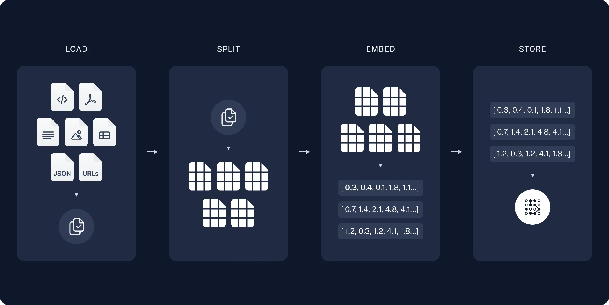

## 检索和生成(Retrieval and generation)  

1. 检索(Retrieve)：给定用户输入，使用检索器[Retriever](https://blog.frognew.com/library/agi/langchain/components/retrievers.html)从存储中检索相关的文本片段。
2. 生成(Generate)： [ChatModel](https://blog.frognew.com/library/agi/langchain/components/chat-models.html)使用包含问题和检索到的数据的提示来生成答案。


## LangGraph基于RAG构建智能客服 

### 客服界面 


### 运行环境 

建议使用 Python>=3.10

可参考如下命令进行环境创建

```
conda create -n agent python=3.10 -y
conda activate agent
```

### 安装依赖 

```
pip install -r requirements.txt
```

### 配置OpenAI 环境变量 

#### Mac 导入环境变量 

```
export OPENAI_BASE_URL='https://api.openai.com/v1'
export OPENAI_API_KEY='sk-xxxxxxxxxxxxxxxxxxxxxxxxxxxxxxxxxxxxxxxxxxxxxxxx'
```

### 运行项目 

使用以下命令行运行webui

```
streamlit run rag.py
```

### 验证效果 

如何查询账户余额？

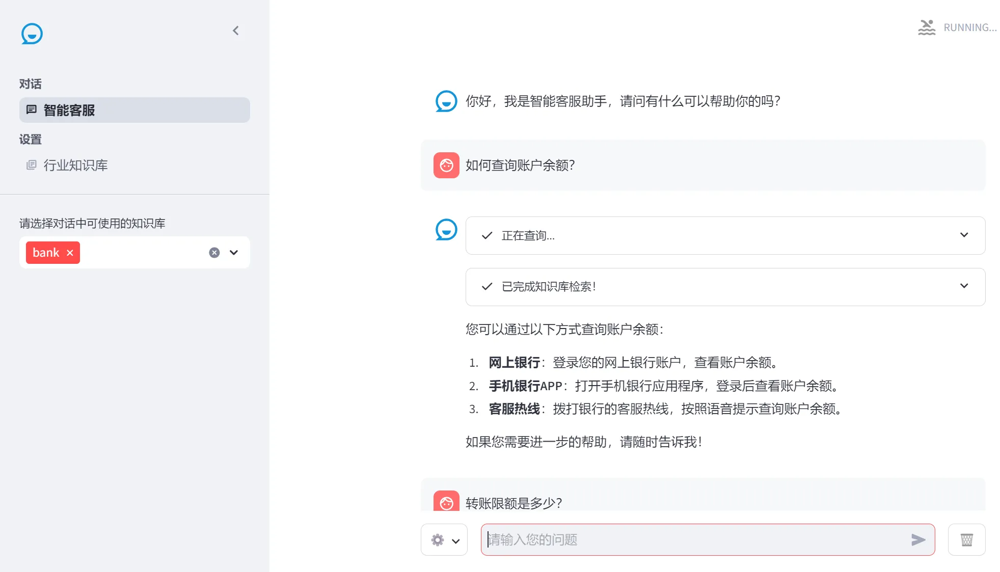

# HuggingFace 核心组件及应用实战

## 一、Hugging Face 简介

官网：https://huggingface.co/

Hugging Face 是一个开源的 AI 社区网站，站内几乎囊括了所有常见的 AI 开源模型，号称：一网打尽，应有尽有，全部开源。


在 Hugging Face 中可以下载到众多开源的预训练大模型，模型本身包含相关信息和参数，可以拿来做微调和重新训练，非常方便。


## 二、Hugging Face 核心组件

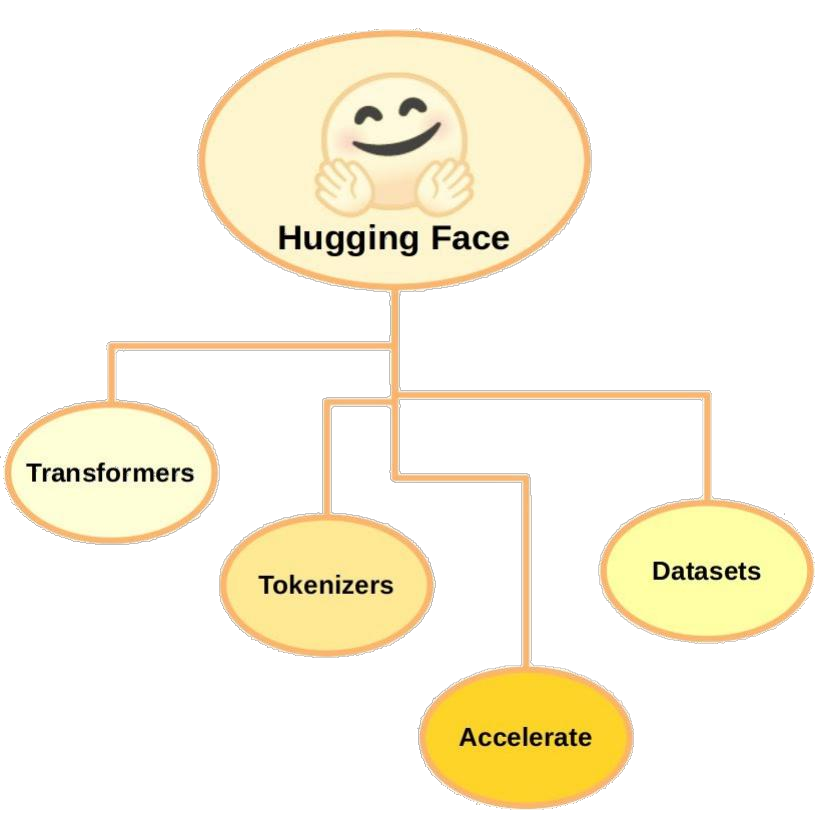

Hugging Face 核心组件包括 **Transformers、Dataset、Tokenizer**，此外还有一些辅助工具，如 **Accelerate**，用于加速深度学习训练

过程。

更多内容可以去 Hugging Face 官网上发掘，下面重点介绍下它的三个核心组件。

### 1、Hugging Face Transformers

Transformers 是 Hugging Face 的核心组件，主要用于自然语言处理，提供了预训练的语言模型和相关工具，使得研究者和工程师能够

轻松的训练和使用海量的 NLP 模型。

常用的模型包括 BERT、GPT、XLNet、RoBERTa 等，并提供了模型的各种版本。

通过 Transformers 库，开发人员可以用这些预训练模型进行文本分类、命名实体识别、机器翻译、问答系统等 NLP 任务。

Transformers 库本身还提供方便的 API、实例代码、文档，让开发者学习和使用这些模型都变得非常简单，同时开发者也可以上传自己

的预训练模型和 API。

```python
# 首先通过 pip 下载相关库：pip install transformers

# 导入 transformers 相关库
from transformers import AutoModelForSequenceClassification

# 初始化分词器和模型
model_name = "bert-base-cased"
model = AutoModelForSequenceClassification.from_pretrained(model_name, num_labels=2)

# 将编码后的张量输入模型进行预测
outputs = model(**inputs)

# 获取预测结果和标签
predictions = outputs.logits.argmax(dim=-1)
```

### 2、Hugging Face Dataset

Dataset 是 Hugging Face 的公共数据集仓库，以下是常用的一些数据集（欢迎补充）：

1. SQuAD：Stanford 大学发布的问答数据集
2. IMBDB：电影评论数据集
3. CoNLL-2003：NER 命名实体识别数据集
4. GLUE：公共基准测试集

Hugging Face Dataset 简化了数据集的下载、预处理过程，并具备数据集分割、采样和迭代器等功能。

```python
# 首先通过 pip 下载相关库：pip install datasets

# 导入数据集
from datasets import load_dataset

# 下载数据集并打乱数据
dataset_name = "imdb"
dataset = load_dataset(dataset_name)
```

### 3、Hugging Face Tokenizer

Tokenizer 是 Hugging Face 的分词器，它的任务是将输入文本转换为一个个标记（tokens），它还能对文本序列进行清洗、截断和填充

等预处理，以满足模型的输入要求。它的主要功能是将文本分解为更小的单元（通常是词或子词），并将这些单元映射到数值表示。

以下是分词器的简单解释：

1. **文本分割**：分词器首先将输入的文本分割成更小的单元。例如，对于句子 "I love NLP"，分词器可能会将其分割为 `["I", "love", "NLP"]`。
2. **词汇映射**：分词器会将每个单元映射到一个唯一的数值索引，这些索引通常来自一个预定义的词汇表。例如，假设词汇表中 "I" 的索引是 1，"love" 的索引是 2，"NLP" 的索引是 3，那么分词器会将句子转换为 `[1, 2, 3]`。
3. **处理特殊标记**：分词器还会处理一些特殊的标记，比如句子开头的 `[CLS]` 标记和句子结尾的 `[SEP]` 标记，这些标记在某些模型中是必需的。
4. **填充和截断**：为了使输入的长度一致，分词器可以对较短的序列进行填充（添加特殊的填充标记）或对较长的序列进行截断。

通过这些步骤，分词器将文本转换为模型可以理解的数值格式，使得模型能够进行进一步的处理和预测。希望这个解释能帮助你理解分词

器的作用！

```python
# 首先通过 pip 下载相关库：pip install transformers

# 导入分词器
from transformers import AutoTokenizer

# 初始化分词器和模型
tokenizer = AutoTokenizer.from_pretrained(model_name)

# 将文本编码为模型期望的张量格式
inputs = tokenizer(dataset["train"]["text"][:10], 
                   padding=True, truncation=True, return_tensors="pt")
```

#### 张量概念

在机器学习和深度学习中，"张量"（Tensor）是一个多维数组的通用术语。它是数据的基本结构，类似于标量、向量和矩阵，但可以扩展

到更高的维度。

以下是张量的简单解释：

1. **标量（0维张量）**：一个单一的数值。例如，`3` 或 `-1.5`。
2. **向量（1维张量）**：一组有序的数值。例如，`[1, 2, 3]`。
3. **矩阵（2维张量）**：一个二维数组。例如：

```plain
[[1, 2, 3],
 [4, 5, 6]]
```

1. **高维张量（3维及以上）**：可以想象成多层的矩阵。例如，一个3维张量可以是一个矩阵的集合。

在你的代码中，`inputs` 是一个张量，它是通过分词器将文本数据转换为模型可以理解的格式。这个张量通常是一个二维的，形状为 

`[batch_size, sequence_length]`，其中 `batch_size` 是批处理的样本数量，`sequence_length` 是每个样本的最大长度。这个张量

包含了文本的数值化表示，通常是词汇表中每个词的索引。

通过这种方式，模型可以处理文本数据并进行预测。

#### [CLS] [SEP]标记作用

在一些自然语言处理模型（如BERT）中，特殊标记 `[CLS]` 和 `[SEP]` 被用来帮助模型理解输入的结构和上下文。以下是它们的作用和简

单解释：

1. `[CLS]` **标记**：

[CLS] 的英文全称是 "Classification"。在中文中，它通常被翻译为“分类”。这个标记在模型中用于表示整个输入序列的聚合信息，特别是

在分类任务中。

- **作用**：`[CLS]` 标记通常放在输入序列的开头，用于表示整个序列的聚合信息。对于分类任务，模型会使用与 `[CLS]` 标记对应的输出向量来进行最终的分类。
- **例子**：假设你有一个句子 "I love NLP"，在输入到模型之前，分词器会将其转换为 `["[CLS]", "I", "love", "NLP"]`。模型会特别关注 `[CLS]` 的输出，因为它代表了整个句子的语义。

1. `[SEP]` **标记**：

[SEP] 的英文全称是 "Separator"。在中文中，它通常被翻译为“分隔符”。这个标记用于分隔不同的句子或段落，帮助模型理解句子之间的

边界。

- **作用**：`[SEP]` 标记用于分隔不同的句子或段落，帮助模型理解句子之间的边界。在句子对任务（如问答或句子对分类）中，`[SEP]` 标记用于分隔两个句子。
- **例子**：如果你有两个句子 "I love NLP" 和 "It is fascinating"，在输入到模型之前，分词器会将其转换为 `["[CLS]", "I", "love", "NLP", "[SEP]", "It", "is", "fascinating", "[SEP]"]`。这样，模型就能识别出两个句子之间的分界。

通过使用这些特殊标记，模型能够更好地理解输入的结构和上下文，从而提高处理和预测的准确性。

## 三、Hugging Face 应用实战

该应用实战是通过 Hugging Face Transformers 完成一个很简单的文本分类任务（预测影评是正面还是负面），完整代码如下：

```python
# 1. 导入必要的库
from transformers import AutoTokenizer, AutoModelForSequenceClassification
from datasets import load_dataset

# 2. 定义数据集名称和任务类型：使用的是 imdb 影评数据集
dataset_name = "imdb"
task = "sentiment-analysis"

# 3. 下载数据集并打乱数据
dataset = load_dataset(dataset_name)
dataset = dataset.shuffle()

# 4. 初始化分词器和模型
model_name = "bert-base-cased"
tokenizer = AutoTokenizer.from_pretrained(model_name)
model = AutoModelForSequenceClassification.from_pretrained(model_name, num_labels=2)

# 5. 将文本编码为模型期望的张量格式
inputs = tokenizer(dataset["train"]["text"][:10], padding=True, truncation=True, return_tensors="pt")

# 6. 将编码后的张量输入模型进行预测
outputs = model(**inputs)

# 7. 获取预测结果和标签
predictions = outputs.logits.argmax(dim=-1)
labels = dataset["train"]["label"][:10]

# 8. 打印预测结果和标签
for i, (prediction, label) in enumerate(zip(predictions, labels)):
    prediction_label = "正面评论" if prediction == 1 else "负面评论"
    true_label = "正面评论" if label == 1 else "负面评论"
    print(f"Example {i+1}: Prediction: {prediction_label}, True label: {true_label}")
```

注意：要运行代码，需要安装最新的 pytorch 、transformers 和 datasets。

将代码文件保存为：huggingface.py，运行后结果如下（第一次运行需要从 Hugging Face 上下载数据集和模型，需要一点时间）：

```plain
C:\Users\Lenovo\anaconda3\envs\pytorch211\python.exe "huggingface.py"
Downloading readme: 100%|██████████| 7.81k/7.81k [00:00<?, ?B/s]
Downloading data: 100%|██████████| 21.0M/21.0M [00:27<00:00, 753kB/s]
Downloading data: 100%|██████████| 20.5M/20.5M [00:07<00:00, 2.88MB/s]
Downloading data: 100%|██████████| 42.0M/42.0M [00:08<00:00, 5.13MB/s]
Generating train split: 100%|██████████| 25000/25000 [00:00<00:00, 347815.24 examples/s]
Generating test split: 100%|██████████| 25000/25000 [00:00<00:00, 481791.57 examples/s]
Generating unsupervised split: 100%|██████████| 50000/50000 [00:00<00:00, 450755.18 examples/s]
C:\Users\Lenovo\anaconda3\envs\pytorch211\Lib\site-packages\huggingface_hub\file_download.py:149: UserWarning: `huggingface_hub` cache-system uses symlinks by default to efficiently store duplicated files but your machine does not support them in C:\Users\Lenovo\.cache\huggingface\hub\models--bert-base-cased. Caching files will still work but in a degraded version that might require more space on your disk. This warning can be disabled by setting the `HF_HUB_DISABLE_SYMLINKS_WARNING` environment variable. For more details, see https://huggingface.co/docs/huggingface_hub/how-to-cache#limitations.
To support symlinks on Windows, you either need to activate Developer Mode or to run Python as an administrator. In order to see activate developer mode, see this article: https://docs.microsoft.com/en-us/windows/apps/get-started/enable-your-device-for-development
  warnings.warn(message)
Some weights of BertForSequenceClassification were not initialized from the model checkpoint at bert-base-cased and are newly initialized: ['classifier.bias', 'classifier.weight']
You should probably TRAIN this model on a down-stream task to be able to use it for predictions and inference.
Example 1: Prediction: 正面评论, True label: 正面评论
Example 2: Prediction: 正面评论, True label: 正面评论
Example 3: Prediction: 正面评论, True label: 负面评论
Example 4: Prediction: 正面评论, True label: 正面评论
Example 5: Prediction: 正面评论, True label: 正面评论
Example 6: Prediction: 正面评论, True label: 正面评论
Example 7: Prediction: 正面评论, True label: 负面评论
Example 8: Prediction: 正面评论, True label: 负面评论
Example 9: Prediction: 正面评论, True label: 负面评论
Example 10: Prediction: 正面评论, True label: 负面评论

Process finished with exit code 0
```

该实战主要演示如何使用 HuggingFace，预测结果并不是那么准确（准确率 50%），因为模型本身还未做过电影评论相关的微调。

Hugging Face 也提醒我们，可能需要用一些下游任务重新训练这个模型（即微调），再用它来做预测和推理：You should probably 

TRAIN this model on a down-stream task to be able to use it for predictions and inference。

## 四、总结

Hugging Face 是当前最知名的 Transformer 工具库和 AI 开源模型网站，它的目标是让人们更方便地使用和开发 AI 模型。

1. 什么是 Hugging Face？它的目标是什么？

- Hugging Face Hugging Face 是一个 AI 社区网站，站内几乎囊括了所有的 AI 开源模型。Hugging Face 是当前最知名的 

  Transformer 工具库和 AI 开源模型网站，它的目标是让人们更方便地使用和开发 AI 模型。

1. Hugging Face 中包含哪些知名的预训练模型?

- 如 BERT、GPT、XLNet、RoBERTa

1. 如果我要在 Hugging Face 中下载 BERT，那么

- 只有一种版本，还是有多种版本可以选择？

- 多版本

- 每一种版本的 BERT 中，只有一种格式还是有多种格式可以适应多种下游任务？

- 多种格式

1. Hugging Face 库中有哪些有用的组件？

- 核心组件包括：Transformers、Dataset、Tokenizer，此外还有一些辅助工具，如 Accelerate 等
